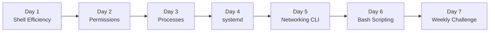

# Week 1 — Linux Command Line

> Make the terminal feel like home. From shell streams to systemd, Week 1 is the foundation every later week assumes.

## Roadmap

## Index

- [Day 1 — Shell Efficiency (pipes, redirection, control operators)](day1_shell-efficiency.md)
- [Day 2 — File Permissions (chmod, chown, umask)](day2_permissions.md)
- [Day 3 — Process Management (ps, top, signals, nice)](day3_process.md)
- [Day 4 — systemd (services, timers, logs)](day4_systemd.md)
- [Day 5 — Networking CLI (ss, ip, dig, curl, tcpdump)](day5_network.md)
- [Day 6 — Bash Scripting (variables, conditionals, loops, functions)](day6_bash-scripting.md)
- [Day 7 — Weekly Challenge: The Backup Script](day7_weekly-challenge.md)

## Related resources

Code for the weekly challenge lives in [`Resources/Week1/weekly_challenge/`](../../Resources/Week1/weekly_challenge/).
