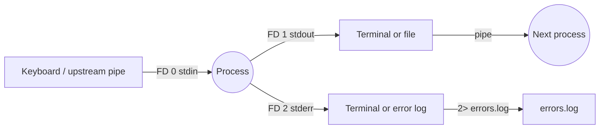

# Day 1: Shell Efficiency — Streams, Pipes & Control Operators

> **Goal**: learn how to compose small Unix commands into powerful one-liners using I/O streams, redirection, pipes and logical chaining.
> **Prereqs**: a Linux/macOS shell (bash or zsh), basic familiarity with `ls`, `cat`, `grep`, `echo`.

## 1. Scenario & Why It Matters

As a full-stack developer, the terminal is where you run `npm start` or `python manage.py runserver`. As a DevOps/SRE engineer, the terminal is the operating table. Production servers do not have a GUI. When a 3 a.m. pager goes off, you SSH in and you have exactly one interface: a shell and a handful of commands. Being fluent here is the difference between resolving an incident in 5 minutes and still typing commands when the post-mortem starts.

The Unix philosophy is built on three ideas: every program does one small thing well, every program reads/writes plain text, and programs can be composed by piping their outputs together. Mastering redirection (`>`, `>>`, `2>`, `<`) and control operators (`|`, `&&`, `||`, `;`) lets you replace dozens of bespoke tools with short pipelines that you can write and audit on the spot.

Real examples from the field: summarising NGINX 5xx errors per hour, extracting the top memory consumers from a `ps` dump, wiring a script so that a deploy only happens if tests pass. None of these need Python — they need a confident shell user.

## 2. Concept Deep-Dive

### 2.1 The three standard streams

Every Linux process is born with three file descriptors (FDs) open:

| FD | Name   | Default source/sink | Purpose                           |
|----|--------|---------------------|-----------------------------------|
| 0  | stdin  | keyboard / terminal | Input data                        |
| 1  | stdout | terminal            | Normal program output             |
| 2  | stderr | terminal            | Errors, warnings, diagnostic logs |

`stdout` and `stderr` are kept separate on purpose: you can capture useful output while still seeing errors on screen (or the other way around).



### 2.2 Redirection operators

| Operator   | Meaning                                           | Example                                  |
|------------|---------------------------------------------------|------------------------------------------|
| `>`        | Redirect stdout, **truncate** target file         | `date > now.txt`                         |
| `>>`       | Redirect stdout, **append** to target             | `date >> history.txt`                    |
| `2>`       | Redirect stderr only                              | `make 2> build-errors.log`               |
| `2>&1`     | Merge stderr into stdout                          | `cmd > all.log 2>&1`                     |
| `&>`       | Bash shortcut for `> ... 2>&1`                    | `cmd &> all.log`                         |
| `<`        | Read stdin from a file                            | `mysql mydb < schema.sql`                |
| `<<EOF`    | Here-doc: feed a literal block as stdin           | `cat <<EOF > file` ... `EOF`             |

Gotcha: `>` truncates the target *before* the command runs. `cmd > file` where `file` is also the input of `cmd` will destroy it. Use `sponge` (from `moreutils`) or write to a temp file.

### 2.3 Pipes

`|` connects stdout of the left process to stdin of the right process *in parallel* — both processes run concurrently, data flows through a kernel pipe buffer.

```
ps aux | grep nginx | awk '{print $2}' | xargs -r kill
```

This pipeline is four independent processes cooperating. If any fails, by default only the exit code of the **last** command is visible as `$?`. Use `set -o pipefail` in scripts to fail the whole pipeline if any stage fails.

### 2.4 Control / chaining operators

| Operator | Behavior                                                       |
|----------|----------------------------------------------------------------|
| `;`      | Run next command unconditionally                               |
| `&&`     | Run next only if previous exited **0** (success)               |
| `\|\|`   | Run next only if previous exited **non-zero** (failure)        |
| `&`      | Run the preceding command in the background                    |

Classic idiom: `mkdir -p build && cd build && cmake .. && make`. If any step fails, the chain stops — you never end up running `make` in the wrong directory.

## 3. Hands-On Mission

```bash
mkdir devops_day1 && cd devops_day1
touch app.log error.log config.json

ls
ls | grep '\.log'

ls | grep '\.log' > incident_report.txt
cat incident_report.txt

ls nonexistent 2> err.log || echo "command failed, see err.log"
```

Try `echo "line1" > file && echo "line2" >> file && cat file` and then re-run the first `>` to see the file get truncated.

## 4. Your Task — Answer

**Q:** Inside a folder containing `app.log`, `error.log` and `config.json`, write **one** single-line command that lists the files, keeps only those ending in `.log`, and saves the result into `incident_report.txt`.

**Sample answer**:

```bash
ls | grep '\.log$' > incident_report.txt
```

Resulting `incident_report.txt`:

```
app.log
error.log
```

**Why it works**: `ls` prints filenames on stdout, `|` feeds that stream as stdin to `grep`, the regex `\.log$` anchors the match to the end of the line so `config.json` is dropped, and `>` redirects the final stdout to the report file (creating or truncating it). Escaping the dot with `\.` prevents `grep` from treating it as "any character".

## 5. Q&A (Concepts Check)

**Q: Why use `\.log$` instead of just `.log`?**
A: In a regex, `.` matches any character, so `.log` would also match `blog` or `zlog`. Escaping (`\.`) forces a literal dot, and `$` anchors to end-of-line so `log.tmp` is excluded. In a shell glob you'd write `*.log`, but `grep` uses regex by default.

**Q: What is the difference between `cmd > out 2>&1` and `cmd 2>&1 > out`?**
A: Order matters. In the first form, stdout is redirected to `out`, then stderr is duplicated to whatever stdout now points at — so both end up in `out`. In the second form, stderr is duplicated to the terminal first, then stdout is redirected to `out`; stderr still hits the terminal. Always put `2>&1` **after** the stdout redirect.

**Q: My pipeline `grep ERROR app.log | wc -l` returns `0` but I know errors exist. What could be wrong?**
A: The errors are probably on **stderr**, not stdout, so `grep` never sees them. Pipes only carry stdout. Fix it with `grep ERROR app.log 2>&1 | wc -l` or redirect stderr upstream.

**Q: Why is `ls | wc -l` unreliable for counting files in a script?**
A: Filenames can contain newlines, and `ls` may alias to colored/columnar output in interactive shells. Prefer `find . -maxdepth 1 -type f -printf . | wc -c` or `ls -1 | wc -l` at a minimum. Better still: use globbing — `set -- *; echo $#`.

**Q: When should I prefer `&&` over `;`?**
A: Nearly always in automation. `;` hides failures — subsequent steps run even if an earlier one exploded, which can corrupt state or mask the real error. `&&` short-circuits on failure, which is what you want for "build, then test, then deploy" pipelines. Reserve `;` for cleanup sequences you want to run no matter what.

**Q: What does `set -o pipefail` do and why do scripts set it?**
A: By default a pipeline's exit code is the exit code of the **last** command. `pipefail` makes it the first non-zero exit from any stage. Without it, `curl bad-url | grep ok` would look "successful" because `grep` exited 0 despite `curl` failing. Combine with `set -euo pipefail` as the standard bash "strict mode" header.

## 6. Further Reading

- `man bash` — the REDIRECTION and Pipelines sections
- [GNU Bash Reference Manual — Redirections](https://www.gnu.org/software/bash/manual/html_node/Redirections.html)
- Next: [Day 2 — Permissions](day2_permissions.md)
