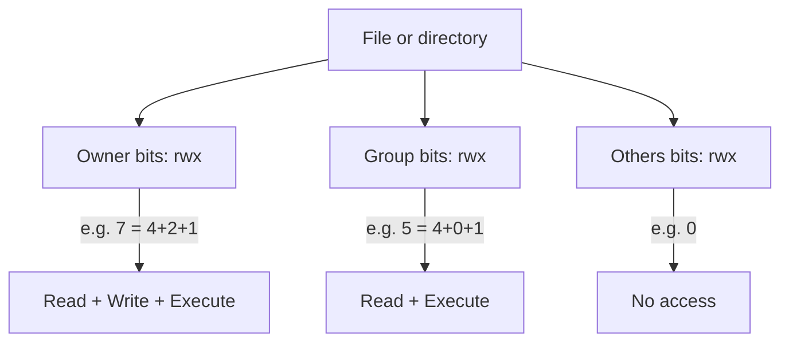

# Day 2: Permissions — The Gatekeeper

> **Goal**: read, reason about and change Unix file permissions fluently using both octal and symbolic notation.
> **Prereqs**: Day 1 (shell fluency), a writable working directory, `chmod`, `chown`, `ls -l`.

## 1. Scenario & Why It Matters

"Permission denied" is the most common error a DevOps engineer sees. Your CI pipeline can't execute a deploy script, your web server can't read a config, your new user can't write to `/var/log`. Every one of those tickets comes down to one thing: Unix permissions.

Permissions are a security model *and* a correctness model. An SSH private key with `chmod 644` will be silently refused by OpenSSH — the tool assumes it's been leaked. A shell script uploaded from Windows without the execute bit set will fail the deploy, not the test. A world-writable `/etc/passwd` is an instant root escalation. Knowing these rules cold is table stakes.

In production you will routinely need to: lock down secrets so only the service user can read them, allow a group of engineers to tail logs without giving them write access, and set up a "sticky" shared directory where each user can only delete their own files (like `/tmp`). All of that is three permission concepts and a handful of numbers.

## 2. Concept Deep-Dive

### 2.1 The three classes, three bits model

Every file has permissions split across three *classes*:

- **u** = **user** (the owner)
- **g** = **group** (the file's group)
- **o** = **others** (everyone else)

For each class there are three bits: **r** (read = 4), **w** (write = 2), **x** (execute = 1). Sum them per class and you get a single octal digit (0-7). A full permission string is three octal digits, e.g. `755`.



### 2.2 What rwx actually means

| Bit | On a file                              | On a directory                                      |
|-----|----------------------------------------|-----------------------------------------------------|
| r   | Read the file's contents               | List the names inside the directory                 |
| w   | Modify the file's contents             | Create, rename, delete entries in the directory     |
| x   | Execute the file as a program          | "Enter" the directory (traverse into it, `cd`)      |

A common gotcha: you can have `r` on a directory (you can see names via `ls`) but no `x` (you can't `cd` in or stat files). That's why `ls -l somedir` sometimes shows names but "Permission denied" for details.

### 2.3 Reading `ls -l`

```
-rwxr-x---  1 alice devops  128 Apr 18 10:03 deploy.sh
```

1. `-` or `d` or `l` — file type (regular, directory, symlink).
2. `rwx` — owner bits (alice).
3. `r-x` — group bits (devops).
4. `---` — others bits.
5. `1` — hard link count.
6. `alice devops` — owner and group.

`chmod` in octal (`chmod 750 deploy.sh`) sets all nine bits at once. Symbolic form (`chmod u+x,go-rwx file`) is additive and easier for surgical changes.

### 2.4 Common permission recipes

| Octal | Use case                                                      |
|-------|---------------------------------------------------------------|
| 600   | Private file — SSH keys, secrets, `.env`                      |
| 644   | Normal text/config readable by everyone                       |
| 700   | Private executable / script, only owner can touch             |
| 750   | Group can read & execute, others locked out                   |
| 755   | Public executable, scripts in `$PATH`, world-readable dirs    |
| 777   | Everyone can do everything — almost always wrong              |

### 2.5 Special bits you'll see eventually

- **Setuid (4000)** — binary runs as its owner (used by `passwd`, `sudo`).
- **Setgid (2000)** — on a directory, new files inherit the group.
- **Sticky (1000)** — on a directory, only the file's owner can delete it (how `/tmp` works; shows as `t` in `ls`).

These are why you sometimes see four octal digits (`chmod 4755 /usr/bin/passwd`).

## 3. Hands-On Mission

```bash
echo 'echo "Deploying to Production..."' > deploy.sh

./deploy.sh

ls -l deploy.sh

chmod +x deploy.sh
./deploy.sh

chmod 700 deploy.sh
ls -l deploy.sh

chmod go-rwx deploy.sh
stat -c '%a %A %n' deploy.sh
```

Try `chmod 000 deploy.sh && cat deploy.sh` and watch even the owner lose access until you `chmod 600` it back.

## 4. Your Task — Answer

**Q:** Create a script `deploy.sh` that prints "Deploying to Production...". Try to run it — it should fail with "Permission denied". Then **(A)** fix the permissions so the owner can execute it, and **(B)** set permissions so that **only** the owner has read/write/execute and everyone else has nothing.

**Sample answer**:

```bash
echo 'echo "Deploying to Production..."' > deploy.sh
./deploy.sh
# bash: ./deploy.sh: Permission denied

# Task A: minimum change so the owner can execute it
chmod u+x deploy.sh
./deploy.sh
# Deploying to Production...

# Task B: strip every bit except owner rwx
chmod 700 deploy.sh
ls -l deploy.sh
# -rwx------ 1 alice alice 35 Apr 18 10:04 deploy.sh
```

**Final permission code**: `700` (owner = 7 = rwx; group = 0; others = 0).

**Why**: `chmod u+x` is a minimal symbolic change that adds execute for the owner and leaves the rest alone — correct for Task A. For Task B, we want three octal digits: owner 4+2+1 = 7, group 0, others 0 → `700`. This is the canonical permission for anything containing secrets or the ability to modify production.

## 5. Q&A (Concepts Check)

**Q: What is the difference between `chmod 700` and `chmod u+rwx,go-rwx` on a fresh file?**
A: The end state is the same, but the mechanism differs. `700` is *absolute* — it overwrites all nine bits. The symbolic form is *relative*: `u+rwx` adds bits for the user and `go-rwx` removes bits from group/others, while leaving any other bits (like setuid) alone. For scripts, always prefer octal for determinism; use symbolic when you only want to tweak one bit.

**Q: I copied an SSH private key and `ssh` complains "UNPROTECTED PRIVATE KEY FILE!" — why?**
A: OpenSSH refuses any identity file whose permissions are more permissive than `600`. If group or others can read the key, it's considered leaked. Fix with `chmod 600 ~/.ssh/id_ed25519` and make sure the `.ssh` directory itself is `700`.

**Q: I `chmod 777`'d a directory "to make it work". What's wrong with that?**
A: Everyone on the host can now create, delete and rename anything inside it, including dropping their own binaries that another user might execute. It also usually masks the real problem (wrong owner, missing group, wrong SELinux/AppArmor label). The correct fix is almost always `chown` + a sane mode like `750` or `770`, not `777`.

**Q: Why can I `ls` a directory but get "Permission denied" when I try `cat` one of the files it lists?**
A: The directory has `r` (listing names) but not `x` (traversal). Without `x` on the directory, the kernel can't resolve the inode of any child even if the child's own permissions allow read. You need `x` on every parent directory in the path.

**Q: What's the practical difference between `chmod` and `chown`?**
A: `chmod` changes the *mode* (the rwx bits). `chown` changes the *owner* and/or *group*. Permissions mean nothing without owners — "owner can read" is useless if the owner is a user that doesn't exist. Common combo when deploying: `chown -R app:app /var/www/app && chmod -R 750 /var/www/app`.

**Q: When would I use the sticky bit?**
A: On shared, writable directories where you don't want users to delete each other's files — `/tmp` is the classic example. `chmod 1777 /tmp` means anyone can create a file but only the file's owner (or root) can unlink it. Setgid on directories is similar but for group inheritance, handy for team project folders.

## 6. Further Reading

- `man chmod`, `man chown`, `man stat`
- [Linux Foundation — File Permissions](https://www.linuxfoundation.org/)
- Next: [Day 3 — Process Management](day3_process.md)
