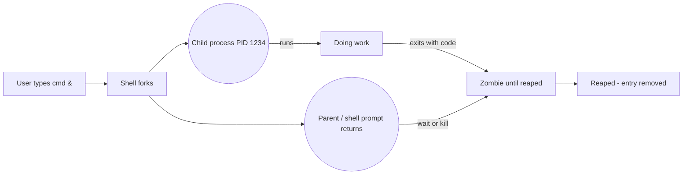

# Day 3: Process Management — Finding and Killing Misbehaving Processes

> **Goal**: list, inspect, background and terminate processes on a live Linux system using `ps`, `jobs`, `kill` and POSIX signals.
> **Prereqs**: Day 1 (pipes/grep), a shell that supports job control (bash, zsh).

## 1. Scenario & Why It Matters

It's 02:17. Your pager fires: "CPU on prod-api-3 stuck at 100%, customer latency through the roof." You SSH in. The service is still technically "running" — systemd says active — but something is hot. You cannot reboot: that's an eight-minute outage. You have to *find* the process, understand *why* it's pegged, and *kill* the right one without taking its siblings down.

Process management is the most reached-for skill in an on-call toolkit. Beyond incident response, it's how you background long-running jobs, clean up after crashed tests in CI, free up a port that a zombie `node` is holding, and debug a memory leak by correlating RSS against time. Every one of these uses the same three primitives: list, signal, wait.

A process is not just a program; it's an OS object with a PID, a parent (PPID), a state (running, sleeping, zombie), a set of open file descriptors, and a cgroup. Linux gives you a very granular set of tools to poke at each of these, but you only need to know a handful well to handle 95% of incidents.

## 2. Concept Deep-Dive

### 2.1 What a process actually is

When you run `python server.py`, the kernel:
1. Forks the current shell process (creating a new PID).
2. `exec()`s the Python interpreter into that new address space.
3. The new process inherits stdin/stdout/stderr, environment, and current working directory from the shell.

The shell (parent) now has two choices: wait for the child (foreground), or return immediately (background, with `&`). A process that finishes but hasn't been reaped by its parent becomes a **zombie** (state `Z`). A process whose parent died before it became an **orphan** and is adopted by PID 1 (init/systemd).



### 2.2 Listing processes

| Command           | What it shows                                                      |
|-------------------|--------------------------------------------------------------------|
| `ps`              | Processes in the current terminal session only                     |
| `ps aux`          | BSD-style: all users, all processes, with CPU/MEM/command          |
| `ps -ef`          | System V-style: full format listing, useful `PPID` column          |
| `ps -o pid,user,%cpu,%mem,comm` | Custom columns                                         |
| `top` / `htop`    | Live, sortable process view                                        |
| `pgrep -a nginx`  | Find PIDs by name, with the full command                           |
| `pidof nginx`     | Just PIDs of exact-name matches                                    |
| `pstree -p`       | Tree of parent/child relationships                                 |

Key columns in `ps aux`: `USER PID %CPU %MEM VSZ RSS TTY STAT START TIME COMMAND`. `STAT` codes to know: `R` running, `S` sleeping, `D` uninterruptible sleep (usually disk I/O — can't even be killed), `Z` zombie, `T` stopped, `+` foreground.

### 2.3 Job control (foreground/background)

- `cmd &` — run in background from the start.
- `Ctrl-Z` — suspend the foreground process (state `T`).
- `jobs` — list jobs belonging to this shell.
- `bg %1` — resume job 1 in the background.
- `fg %1` — bring job 1 to the foreground.
- `disown %1` — detach job 1 from the shell so it survives logout.
- `nohup cmd &` — run immune to SIGHUP, stdout to `nohup.out`.

### 2.4 Signals — the real way you "kill"

`kill` doesn't necessarily terminate anything; it sends a *signal*. The process can catch most signals and decide what to do.

| Signal     | Number | Default action      | Typical use                                                 |
|------------|--------|---------------------|-------------------------------------------------------------|
| `SIGHUP`   | 1      | Terminate           | Tell a daemon to reload its config                          |
| `SIGINT`   | 2      | Terminate           | What `Ctrl-C` sends                                         |
| `SIGQUIT`  | 3      | Terminate + core    | Ctrl-\ — dumps core for debugging                           |
| `SIGKILL`  | 9      | Terminate (forced)  | Cannot be caught or ignored; use as last resort             |
| `SIGTERM`  | 15     | Terminate           | Polite "please exit cleanly" — the default of `kill`        |
| `SIGSTOP`  | 19     | Stop                | Cannot be caught; pauses a process                          |
| `SIGCONT`  | 18     | Continue            | Resumes a stopped process                                   |

Best practice: always try `kill <pid>` (SIGTERM) first. It gives the process a chance to flush buffers, close DB connections, delete temp files. Only escalate to `kill -9` if it ignores you for more than a few seconds.

## 3. Hands-On Mission

```bash
sleep 1000 &
jobs
ps aux | grep '[s]leep 1000'
pgrep -a 'sleep 1000'

PID=$(pgrep -f 'sleep 1000' | head -n1)
echo "Target PID: $PID"

kill "$PID"
sleep 1
ps -p "$PID" || echo "gone"

sleep 1000 &
pkill -9 -f 'sleep 1000'
```

Note the `[s]leep` trick: wrapping the first letter in a bracket class prevents `grep` from matching itself in the process list.

## 4. Your Task — Answer

**Q:** Start a dummy long-running process (`sleep 1000 &`), then pretend you missed the PID. Use `ps aux` (plus `grep`) to find it, kill it, and verify it's gone.

**Sample answer**:

```bash
# 1. Start the zombie-to-be
sleep 1000 &
# [1] 18342

# 2. Find the PID (pretend we missed the number above)
ps aux | grep '[s]leep 1000'
# alice    18342  0.0  0.0   6216   724 pts/0    S    10:12   0:00 sleep 1000

# 3. Kill it politely first, escalate if needed
kill 18342
# or, if it won't exit:
kill -9 18342

# 4. Verify
ps aux | grep '[s]leep 1000' || echo "process is gone"
# process is gone
```

**Why**: `sleep 1000 &` detaches the command into the background and gives back the prompt; the shell prints the PID but you ignored it. `ps aux` dumps every process; piping through `grep '[s]leep 1000'` filters to the target *without* matching the grep itself. `kill <PID>` sends SIGTERM (signal 15), which for `sleep` is sufficient — it has no signal handler, so it terminates. We escalate to `kill -9` (SIGKILL) only if SIGTERM is ignored, because SIGKILL bypasses any cleanup the process would have done.

## 5. Q&A (Concepts Check)

**Q: Why do people keep telling me not to use `kill -9` first?**
A: SIGKILL is uncatchable — the process has **zero** chance to flush file buffers, commit database transactions, remove `.pid` files, or close sockets gracefully. You can corrupt data (think: a database mid-write) and leave the system in a half-shutdown state that makes restart harder. SIGTERM lets the process run its shutdown handlers. Escalate only if SIGTERM is ignored for ~10-30 seconds.

**Q: I killed a process but it still shows `STAT=Z` in `ps`. What's going on?**
A: That's a zombie. The process has exited, but its parent hasn't called `wait()` to reap its exit status yet. Zombies consume a PID slot but no CPU/memory. If zombies accumulate, the parent is buggy (not reaping children). Killing a zombie directly doesn't work — you kill the *parent* (it gets re-parented to init, which reaps automatically) or fix the parent's code.

**Q: `kill -9` doesn't work on a process stuck in state `D`. Why?**
A: `D` is "uninterruptible sleep" — usually waiting on a disk or network I/O syscall inside the kernel. The process literally cannot receive a signal until the syscall returns. Your options are: wait, fix the underlying I/O (reconnect the NFS mount, reset the SAN), or as a last resort, reboot.

**Q: How do I find what's using port 8080?**
A: `lsof -i :8080` or `ss -ltnp 'sport = :8080'`. Both return the PID(s) bound to the port, which you can then `kill`. This is the bread-and-butter of "address already in use" incidents.

**Q: What's the difference between `kill %1` and `kill 18342`?**
A: `%1` is a **job spec** — resolved by your current shell to the first background job. `18342` is a **PID** — a global OS identifier. Job specs only work for processes started in the current shell; PIDs work anywhere, including across SSH sessions.

**Q: Why prefer `pkill -f` over `ps aux | grep … | awk '{print $2}' | xargs kill`?**
A: Fewer moving parts and no race between listing and killing. `pkill -f 'pattern'` does the match and signal in one syscall-friendly flow. It also has `-u user`, `-P ppid`, and pattern-matching flags, so you can be surgical. The `ps | grep | awk | xargs` pipeline is a classic — but also a classic way to kill the wrong PID if two PIDs were recycled between steps.

## 6. Further Reading

- `man 7 signal`, `man ps`, `man kill`
- [The Linux Programming Interface — Process Lifecycle (Kerrisk)](https://man7.org/tlpi/)
- Next: [Day 4 — Systemd](day4_systemd.md)
