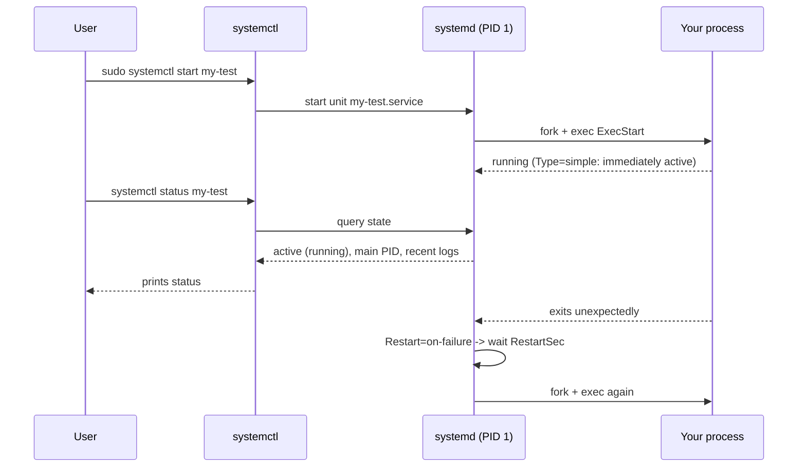

# Day 4: Systemd — Making a Process Survive a Reboot

> **Goal**: write a minimal `.service` unit file and manage it with `systemctl` so a custom program starts on boot, restarts on crash, and is observable via `journalctl`.
> **Prereqs**: Day 3 (processes), a Linux host with `sudo` (VM, VPS, WSL2 with systemd, or a cloud instance). Most minimal Docker containers do **not** run systemd.

## 1. Scenario & Why It Matters

You wrote a beautiful API. You start it with `python app.py &` and go to lunch. Lunch goes well. During lunch, the kernel team ships a security patch, the server reboots overnight, and your API doesn't come back — because nothing told the machine "when you come up, start this". In production, *every* long-running process must be supervised. "Did you `nohup` it?" is not an answer.

Systemd is the init system — the first process (PID 1) — on nearly every modern Linux distribution (Ubuntu, Debian, RHEL/CentOS/Rocky, Fedora, Arch). It replaces the old SysV init + `/etc/init.d/` scripts with a declarative, dependency-aware, parallel-starting framework. Beyond starting services, it also manages timers (a cron replacement), sockets, mounts, user slices, cgroups, and resource limits.

For DevOps work, the three jobs systemd does every day are: (1) start your services on boot, (2) restart them if they crash, (3) collect their stdout/stderr into a structured, searchable journal. Learning the minimum unit file is a career-long multiplier.

## 2. Concept Deep-Dive

### 2.1 Units and unit files

A *unit* is any object systemd manages. Types you'll meet most:

| Suffix        | Purpose                                               |
|---------------|-------------------------------------------------------|
| `.service`    | A long-running process (daemon)                       |
| `.timer`      | Scheduled activation (cron replacement)               |
| `.socket`     | Socket-activated service                              |
| `.target`     | Grouping / milestone (like runlevels)                 |
| `.mount`      | A filesystem mount point                              |

Unit files live in two places:
- `/lib/systemd/system/` — shipped by packages. **Don't edit.**
- `/etc/systemd/system/` — where *you* put yours. Overrides take precedence.

### 2.2 Anatomy of a `.service` file

```ini
[Unit]
Description=My Test Service
After=network-online.target
Wants=network-online.target

[Service]
Type=simple
ExecStart=/usr/bin/python3 /opt/app/myservice.py
Restart=on-failure
RestartSec=5
User=app
Group=app
Environment=LOG_LEVEL=info
WorkingDirectory=/opt/app

[Install]
WantedBy=multi-user.target
```

- `[Unit]` — metadata and ordering (`After=`, `Requires=`, `Wants=`).
- `[Service]` — how to actually run it.
- `[Install]` — what "enable" means (which target pulls this unit in on boot).

Key `[Service]` options worth knowing:

| Directive         | Meaning                                                                     |
|-------------------|-----------------------------------------------------------------------------|
| `Type=simple`     | The process started by `ExecStart` *is* the service (default)               |
| `Type=forking`    | The process double-forks and the parent exits (old-school daemons)          |
| `Type=notify`     | The service tells systemd when it's ready via sd_notify                     |
| `ExecStart=`      | The command (must be absolute path!)                                         |
| `ExecStartPre=`   | Command to run before start (migrations, config checks)                     |
| `ExecStop=`       | How to stop (defaults to SIGTERM to the main PID)                           |
| `Restart=`        | `no`, `on-failure`, `always`, `on-abort`, `on-watchdog`                     |
| `RestartSec=`     | Delay before restart                                                        |
| `User=` / `Group=`| Run as this unprivileged user — don't run apps as root                      |
| `EnvironmentFile=`| Load KEY=VAL pairs from a file (secrets, env vars)                          |

### 2.3 The lifecycle



### 2.4 The `systemctl` cheat sheet

| Command                               | Purpose                                                   |
|---------------------------------------|-----------------------------------------------------------|
| `sudo systemctl daemon-reload`        | Re-read unit files after editing them                     |
| `sudo systemctl start <unit>`         | Start now                                                 |
| `sudo systemctl stop <unit>`          | Stop now                                                  |
| `sudo systemctl restart <unit>`       | Stop + start                                              |
| `sudo systemctl reload <unit>`        | Ask service to reload config (SIGHUP), if supported       |
| `sudo systemctl enable <unit>`        | Start on boot (creates symlink into target's `.wants`)    |
| `sudo systemctl disable <unit>`       | Don't start on boot                                       |
| `sudo systemctl enable --now <unit>`  | Enable + start in one step                                |
| `systemctl status <unit>`             | Human-readable state + tail of logs                       |
| `systemctl is-active <unit>`          | Machine-readable one-word state                           |
| `journalctl -u <unit> -f`             | Tail the service's logs                                   |
| `journalctl -u <unit> --since "1h ago"` | Filter by time                                          |

## 3. Hands-On Mission

Create the "application":

```bash
sudo tee /tmp/myservice.py > /dev/null <<'PY'
import time
while True:
    with open("/tmp/service_log.txt", "a") as f:
        f.write("I am alive\n")
    time.sleep(5)
PY
```

Create the unit file:

```bash
sudo tee /etc/systemd/system/my-test.service > /dev/null <<'EOF'
[Unit]
Description=My Test Service
After=network-online.target

[Service]
Type=simple
ExecStart=/usr/bin/python3 /tmp/myservice.py
Restart=always
RestartSec=2

[Install]
WantedBy=multi-user.target
EOF
```

Activate and inspect:

```bash
sudo systemctl daemon-reload
sudo systemctl enable --now my-test
systemctl status my-test
journalctl -u my-test -n 20 --no-pager
tail -f /tmp/service_log.txt
```

Prove the restart policy works:

```bash
sudo kill -9 "$(systemctl show -p MainPID --value my-test)"
sleep 3
systemctl status my-test
```

You should see a new MainPID — systemd resurrected the process.

## 4. Your Task — Answer

**Q:** Create `/tmp/myservice.py` (an infinite loop that writes to `/tmp/service_log.txt`), define `/etc/systemd/system/my-test.service` to run it with `Restart=always`, reload the daemon and start it. Verify the output of `systemctl status my-test` shows `Active: active (running)`.

**Sample answer** (expected status output):

```
$ systemctl status my-test
* my-test.service - My Test Service
     Loaded: loaded (/etc/systemd/system/my-test.service; enabled; preset: enabled)
     Active: active (running) since Sat 2026-04-18 10:20:11 UTC; 42s ago
   Main PID: 4812 (python3)
      Tasks: 1 (limit: 4691)
     Memory: 6.1M
        CPU: 38ms
     CGroup: /system.slice/my-test.service
             `-4812 /usr/bin/python3 /tmp/myservice.py

Apr 18 10:20:11 host systemd[1]: Started my-test.service - My Test Service.
```

And in a second terminal:

```
$ tail -n 3 /tmp/service_log.txt
I am alive
I am alive
I am alive
```

**Why this works**: `systemctl daemon-reload` is mandatory any time you add or edit a unit file — systemd caches them in memory. `enable --now` both symlinks the unit into `multi-user.target.wants/` (so it starts on boot) **and** starts it immediately. `Restart=always` tells systemd to relaunch the process whenever it exits, for any reason; `RestartSec=2` avoids a tight crash loop. `Type=simple` is the default and works because `python3` stays in the foreground (no double-forking).

## 5. Q&A (Concepts Check)

**Q: I edited the unit file, but `systemctl status` still shows the old config. Why?**
A: Unit files are cached. Run `sudo systemctl daemon-reload` to re-read them, then `sudo systemctl restart <unit>` to actually relaunch the process with the new config. `daemon-reload` alone updates the definition but doesn't bounce the running service.

**Q: What's the difference between `systemctl start` and `systemctl enable`?**
A: `start` launches the unit *right now* but does nothing about boot. `enable` registers it to start on boot but doesn't launch it now. Most of the time you want `enable --now`, which does both. `disable` + `stop` is the inverse.

**Q: Why shouldn't I run my app as root inside a unit file?**
A: If the app is ever exploited (RCE via a bad dependency, SSRF reaching the filesystem, log4shell-style bug), it already has root — it can read `/etc/shadow`, rewrite `/etc/passwd`, install persistence. Use `User=app Group=app` with a dedicated unprivileged account, and `NoNewPrivileges=true`, `ProtectSystem=strict`, `ProtectHome=true` for defense in depth.

**Q: What's the difference between `Restart=on-failure` and `Restart=always`?**
A: `on-failure` only restarts on non-zero exit or crash; a clean `exit(0)` is respected. `always` restarts no matter what, even if the process exits cleanly. Use `on-failure` for services that may have legitimate reasons to exit (job runners), and `always` for servers that should literally never be down.

**Q: Where do my service's `print()` statements go?**
A: Into the systemd journal. Read them with `journalctl -u my-test` (add `-f` to follow, `--since "5m ago"`, `-p err` to filter by priority). Python's stdout buffering can make output lag; set `PYTHONUNBUFFERED=1` or call `print(..., flush=True)` in production.

**Q: How do I check the exit code and restart count of a flapping service?**
A: `systemctl show my-test` dumps all properties. Useful ones: `ExecMainStatus=` (last exit code), `NRestarts=` (how many times systemd restarted it), `Result=` (why it exited). Pair with `journalctl -u my-test` to get the stderr right before each restart.

## 6. Further Reading

- `man systemd.service`, `man systemd.unit`, `man systemctl`, `man journalctl`
- [systemd by example](https://systemd-by-example.com/)
- [Arch Wiki — systemd](https://wiki.archlinux.org/title/Systemd)
- Next: [Day 5 — Networking CLI](day5_network.md)
