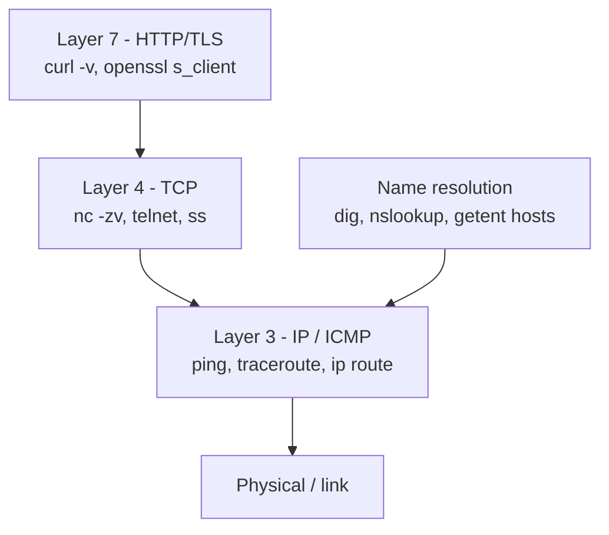

# Day 5: Networking CLI — Is It DNS, TCP, or the App?

> **Goal**: triage a "site is down" incident by walking the network stack layer by layer with `ping`, `dig`, `nc`/`telnet`, and `curl`.
> **Prereqs**: Day 1 (shell fluency), internet access, permission to run outbound connections.

## 1. Scenario & Why It Matters

"The app is down." That's the ticket. It could mean twelve different things: DNS broken, the VM unreachable, a firewall rule rolled out five minutes ago, the load balancer health-checking wrong, TLS cert expired, or the app itself returning 500. The fastest engineers don't guess — they walk the network stack, one layer at a time, with one tool per layer, until they find the first thing that's not working.

This is also how you earn credibility. When a customer says "I can't reach api.example.com from my laptop", you don't open a browser and shrug. You run `dig api.example.com`, `ping`, `nc -zv api.example.com 443`, `curl -v https://api.example.com/healthz`, and in 60 seconds you have a verdict: "it's DNS on their resolver" or "our Security Group blocks 443 from their CIDR".

The OSI/TCP model is abstract on paper. With these four tools, it becomes a checklist you can run in your sleep.

## 2. Concept Deep-Dive

### 2.1 Layer-by-layer troubleshooting



Troubleshooting rule: start at the **bottom** and walk up. The first layer that fails is the real problem. If DNS fails, every higher layer will also "fail" in confusing ways, so check DNS first.

### 2.2 Name resolution

| Tool                    | What it tells you                                                         |
|-------------------------|---------------------------------------------------------------------------|
| `dig example.com`       | A records + TTL + which server answered                                   |
| `dig +short example.com`| Just the IPs — script-friendly                                            |
| `dig @1.1.1.1 example.com` | Ask a specific resolver, bypassing the system one                     |
| `dig example.com MX`    | Different record types (MX, TXT, CNAME, NS, AAAA)                         |
| `getent hosts example.com` | Uses NSS — same path as the system resolver (`/etc/hosts`, glibc)      |

Common gotcha: `curl` says "Could not resolve host" but `dig example.com` works. Cause: `dig` talks to DNS directly, `curl` goes through NSS (which also checks `/etc/hosts`, `/etc/resolv.conf`, systemd-resolved). Always try `getent hosts <name>` to test the *app's* resolution path.

### 2.3 Layer 3 — can I reach the host?

- `ping host` — sends ICMP echo. Works most of the time, but many cloud security groups and corporate firewalls block ICMP; a ping failure does **not** prove the host is down.
- `traceroute host` / `mtr host` — every hop the packet takes, with latency. Use when ping times out to see where the drop happens.
- `ip route get <ip>` — which local interface and gateway this packet will use.

### 2.4 Layer 4 — is the port open?

- `nc -vz host 443` — TCP connect, no data sent, exit 0 if the 3-way handshake succeeded.
- `telnet host 443` — older, interactive; useful when `nc` isn't installed.
- `ss -tlnp` (or legacy `netstat -tlnp`) — which ports **this** host is listening on, and which process owns each.

Interpretation:
- "Connection refused" → host is up, but nothing is listening on that port (app down).
- "Connection timed out" → packets are being dropped — almost always a firewall / security group / network ACL.
- Immediate close → port is open but the server policy rejected (e.g., TLS cert issue, IP not whitelisted).

### 2.5 Layer 7 — is the app actually healthy?

`curl` is the Swiss army knife. The useful flags:

| Flag              | Purpose                                                             |
|-------------------|---------------------------------------------------------------------|
| `-v`              | Verbose — prints DNS, TCP, TLS handshake, request and response headers |
| `-I`              | HEAD request only — fast check, returns only headers                 |
| `-L`              | Follow `3xx` redirects                                               |
| `-H 'Host: foo'`  | Set a header — useful to test a virtual host by IP                   |
| `-o /dev/null -w '%{http_code} %{time_total}\n'` | Scriptable response-time check     |
| `--resolve host:443:1.2.3.4` | Force a specific IP for a hostname (test a new server)    |
| `-k` / `--insecure` | Skip TLS verification — for testing only                           |

Reading `curl -v` output: lines starting with `*` are `curl`'s own trace (DNS, TCP, TLS), `>` are bytes you sent, `<` are bytes the server sent back. The first `< HTTP/...` line is the status; subsequent `<` lines are response headers.

## 3. Hands-On Mission

```bash
dig +short google.com
getent hosts google.com

ping -c 3 google.com

nc -vz google.com 443
nc -vz google.com 81    # should time out or refuse

curl -I https://google.com
curl -v https://google.com 2>&1 | sed -n '1,40p'

curl -v https://google.com 2>&1 | grep -i '^< content-type'
```

Bonus — measure response time scriptably:

```bash
curl -s -o /dev/null -w 'status=%{http_code} dns=%{time_namelookup}s tls=%{time_appconnect}s total=%{time_total}s\n' \
  https://google.com
```

## 4. Your Task — Answer

**Q:** Run a verbose `curl` against `google.com` and inspect the response headers (the lines starting with `<`). What is the specific `content-type` Google returns?

**Sample answer**:

```bash
$ curl -v https://google.com 2>&1 | grep -i '^< content-type'
< content-type: text/html; charset=ISO-8859-1
```

**Answer**: `text/html; charset=ISO-8859-1`.

**Why**: `curl -v` prints the full protocol trace. Response headers come from the server and `curl` marks each with a leading `<`. Google's root page is HTML, so the `Content-Type` header advertises `text/html` as the media type and `charset=ISO-8859-1` as the encoding — that's the content negotiation hint browsers use to pick a decoder. (If you hit `https://www.google.com/` directly or a specific path, the charset may differ, e.g. `UTF-8`; but the root redirector returns `ISO-8859-1` for legacy compatibility.)

## 5. Q&A (Concepts Check)

**Q: `ping` works but `nc -zv host 443` times out. What's going on?**
A: Layer 3 is fine (the host is reachable) but Layer 4 isn't — some firewall between you and the host is dropping TCP SYN packets to port 443. Could be a cloud security group, an on-prem firewall, or the host's own `iptables`/`nftables`. `traceroute -T -p 443 host` can sometimes show which hop drops it.

**Q: `ping` fails but `curl https://host` works. Is the host down?**
A: No. Many cloud providers and hardened hosts block ICMP but happily serve TCP. ICMP is not a reliable reachability test in modern environments — use `nc -vz host 443` or `curl` instead.

**Q: I get "Could not resolve host" from `curl` but `dig example.com @8.8.8.8` returns an IP. What's different?**
A: `dig @8.8.8.8` explicitly asks Google's DNS; `curl` uses the system resolver (glibc / NSS / systemd-resolved / `/etc/resolv.conf`). The system resolver can be misconfigured, the upstream can be dead, or a VPN split-DNS may be intercepting. Test the system path with `getent hosts example.com` or plain `dig example.com` (no `@`).

**Q: What does HTTP status 000 in `-w '%{http_code}'` mean?**
A: That `curl` never got a status line — connection failed or was closed before the server responded. Look at the other timing fields: if `time_connect` is 0, TCP never completed; if `time_appconnect` is 0 but `time_connect` has a value, TLS handshake failed.

**Q: A client says `nc -zv our-api 443` says "Connection refused". What do I check first?**
A: "Refused" means the packet reached the host and got a RST — the OS is up, the port just isn't bound. So the network path is fine; the service is down. SSH to the host and check `systemctl status the-api`, `ss -tlnp | grep 443`, and the app logs.

**Q: When should I use `curl -k`?**
A: Only for debugging TLS issues — e.g., to confirm the server is serving *something* when cert validation fails. Never in production automation. If you need to trust a custom CA, use `--cacert /path/to/ca.pem`. Silently disabling TLS verification hides real security bugs.

## 6. Further Reading

- `man curl`, `man dig`, `man nc`, `man ss`
- [High Performance Browser Networking — Ilya Grigorik](https://hpbn.co/)
- [Julia Evans — Networking zines](https://wizardzines.com/zines/networking/)
- Next: [Day 6 — Bash Scripting](day6_bash-scripting.md)
