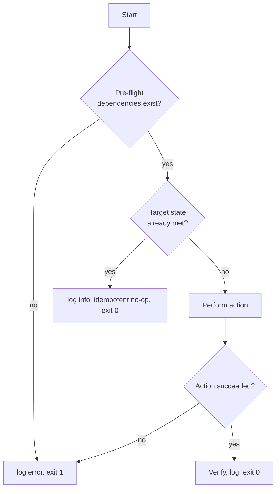

# Day 6: Bash Scripting — Logic in a File

> **Goal**: turn repetitive shell commands into a robust script using variables, conditionals, file tests and idempotent logic.
> **Prereqs**: Days 1-3 (shell, permissions, processes), a text editor, `bash` 4+.

## 1. Scenario & Why It Matters

You log in every morning, run five commands to check your server (disk, services, last deploy log, DB connectivity, cert expiry), interpret the output, and move on. By week two of this ritual you realize: this is not your job, it's the *computer's* job. You move those commands into a file, add `if`/`else` around them, and suddenly one character (`./health.sh`) replaces five minutes of typing — and it never forgets a step.

Bash scripts are the connective tissue of every Linux system. Systemd unit files call them, cron jobs trigger them, CI pipelines shell out to them, Dockerfiles `RUN` them. Even when the main logic is Python or Go, the glue — "make this directory, check if a file exists, if not download it, then call the real tool" — is almost always bash. Writing *good* bash (idempotent, `set -euo pipefail`, quoted variables) is a professional skill.

Bash looks simple but it is quietly the strictest language you'll use: spaces matter in `[ ]`, variables unquoted will word-split, `$(cmd)` is different from `cmd`, and one missing semicolon will silently skip a branch. Getting these fundamentals right saves hours of 2 a.m. debugging.

## 2. Concept Deep-Dive

### 2.1 The shebang and the "strict mode" header

```bash
#!/usr/bin/env bash
set -euo pipefail
IFS=$'\n\t'
```

- `#!/usr/bin/env bash` — portable way to find bash in `$PATH`.
- `set -e` — exit immediately on any command failure.
- `set -u` — treat unset variables as an error (catches typos).
- `set -o pipefail` — a failing stage in a pipe fails the whole pipeline.
- `IFS=$'\n\t'` — limits word-splitting to newlines/tabs (not spaces), safer for filenames.

Treat this block as the non-negotiable header of every new script.

### 2.2 Variables

```bash
NAME="DevOps"          # no spaces around =
GREETING="Hello, $NAME" # double quotes interpolate
LITERAL='Hello, $NAME'  # single quotes do NOT interpolate
COUNT=$(ls | wc -l)    # command substitution
echo "${NAME}er"       # braces to disambiguate
```

**Always quote**: `"$VAR"`, not `$VAR`. Unquoted expansion splits on spaces and does glob expansion, which will break on filenames with spaces or stars. `"$@"` vs `$@` is the same story for arguments.

### 2.3 Conditionals and test expressions

```bash
if [ "$NAME" = "DevOps" ]; then
    echo "Match"
elif [ -z "$NAME" ]; then
    echo "Empty"
else
    echo "No match"
fi
```

Two important points:
- **Spaces inside `[ ]`**: `[ -f file ]` works, `[-f file]` does not. `[` is literally a program.
- **`[[ ]]` is bash-only** and safer — no word splitting inside, supports `&&`/`||`, and `=~` for regex. Prefer it when you know you're on bash: `if [[ "$NAME" =~ ^Dev ]]; then ...`.

Common test flags:

| Flag       | True when                                                     |
|------------|---------------------------------------------------------------|
| `-f FILE`  | Regular file exists                                            |
| `-d DIR`   | Directory exists                                               |
| `-e PATH`  | Path exists (any type)                                         |
| `-r/-w/-x` | Readable / writable / executable                               |
| `-s FILE`  | File exists and is **non-empty**                               |
| `-z STR`   | String is empty                                                |
| `-n STR`   | String is non-empty                                            |
| `A = B`    | String equality (use `==` inside `[[ ]]`)                      |
| `A -eq B`  | Integer equality (also `-ne -lt -le -gt -ge`)                  |

### 2.4 Flow of a defensive script



This "check, then fix, then verify" pattern is the heart of every good automation script. It makes the script safe to run a thousand times in a row — a property called **idempotence**, and the property that makes a script safe for cron, CI, and `Restart=always`.

### 2.5 Exit codes, functions, and traps

```bash
cleanup() { rm -f "$TMP"; }
trap cleanup EXIT

die() { echo "ERROR: $*" >&2; exit 1; }

command -v jq >/dev/null || die "jq not installed"
```

- `trap cleanup EXIT` — always runs `cleanup` when the script ends, even on error.
- `command -v foo` — portable check that `foo` is on `$PATH`.
- `>&2` — write to stderr so error lines stay separate from real output.

## 3. Hands-On Mission

Write `setup.sh`:

```bash
#!/usr/bin/env bash
set -euo pipefail

FILE="config.txt"

if [ -f "$FILE" ]; then
    echo "Success: $FILE exists."
else
    echo "Error: $FILE is missing!"
    echo "Creating it now..."
    touch "$FILE"
fi
```

Run it twice:

```bash
chmod +x setup.sh
./setup.sh        # first run: file missing -> creates it
./setup.sh        # second run: file present -> success
ls -l config.txt
```

Extra credit: rewrite it to also verify the file has the right content, and re-create it only if the content drifted:

```bash
EXPECTED="env=prod"
if [ -f "$FILE" ] && grep -qx "$EXPECTED" "$FILE"; then
    echo "ok: $FILE present with expected content"
else
    echo "fixing: writing expected content to $FILE"
    echo "$EXPECTED" > "$FILE"
fi
```

## 4. Your Task — Answer

**Q:** Create `setup.sh` that checks if `config.txt` exists, creates it if not, and prints a clear status message. Run it twice and show the output of both runs.

**Sample answer**:

```
$ ./setup.sh
Error: config.txt is missing!
Creating it now...

$ ./setup.sh
Success: config.txt exists.

$ ls -l config.txt
-rw-r--r-- 1 alice alice 0 Apr 18 10:30 config.txt
```

**Why it works**: the `-f` test returns true only for *regular files* that exist. On run 1, the test is false, so the `else` branch runs: it logs an error, then creates the file with `touch`. On run 2, `touch` has left a zero-byte `config.txt` behind, so `-f` is true and the `then` branch executes. This is **idempotent** — running the script any number of times converges the system to the same desired state (the file existing), which is the core property that separates automation from "running commands by hand, faster".

## 5. Q&A (Concepts Check)

**Q: Why is quoting `"$FILE"` important?**
A: If the variable ever contains spaces ("my config.txt"), an unquoted `[ -f $FILE ]` expands to `[ -f my config.txt ]` — three arguments to `[`, which is a syntax error or worse, matches the wrong file. Always quote variable expansions unless you have a specific reason not to. `shellcheck` flags every unquoted one.

**Q: What does `set -euo pipefail` actually buy me?**
A: It turns silent failures into loud ones. `-e` stops on any error instead of plowing through, `-u` catches typos in variable names (`$CONFGI` → error instead of empty string), `-o pipefail` makes a failed step in `foo | bar` fail the whole line. Without this header, scripts hide bugs until production.

**Q: What's the difference between `[ ]`, `[[ ]]` and `(( ))`?**
A: `[ ]` is POSIX test — works anywhere (`sh`, `dash`, `bash`) but has sharp edges: needs spaces, needs quoting, `-a`/`-o` are deprecated. `[[ ]]` is bash-only, safer, supports pattern matching and `&&`/`||` inside. `(( ))` is for arithmetic: `if (( count > 5 ))`. Rule of thumb: use `[[ ]]` for tests and `(( ))` for math when you're on bash; fall back to `[ ]` only for strict POSIX shells.

**Q: Why does my script work when I `./run.sh` but fail when cron calls it?**
A: Cron runs with a minimal environment — often no `$PATH` beyond `/usr/bin:/bin`, no `$HOME`, no shell aliases, wrong `cwd`. Scripts should use absolute paths, set their own `$PATH`, and not rely on interactive features. This is also why you'll see `cd "$(dirname "$0")"` at the top of many scripts.

**Q: How do I make a script safely rerunnable?**
A: Write it idempotently: before every change, check whether the target state is already met. Use `mkdir -p` instead of `mkdir` (silent if exists), `useradd -r --home-dir ... || true` guarded by `id -u user`, and `grep -q` before appending to a file. The script should leave the system in the same state whether it's the first run or the fiftieth.

**Q: Why use `#!/usr/bin/env bash` instead of `#!/bin/bash`?**
A: On some systems (notably macOS, some minimal containers) bash is installed under `/usr/local/bin/bash` or `/opt/homebrew/bin/bash`. `env` looks up `bash` in `$PATH`, which works across distros. The trade-off: you lose the ability to pass shebang arguments on some kernels — rarely an issue in practice.

## 6. Further Reading

- [ShellCheck](https://www.shellcheck.net/) — lint your scripts, catch bugs before production
- [Google Shell Style Guide](https://google.github.io/styleguide/shellguide.html)
- [Bash Pitfalls](https://mywiki.wooledge.org/BashPitfalls)
- Next: [Day 7 — Weekly Challenge: Backup Script](day7_weekly-challenge.md)
