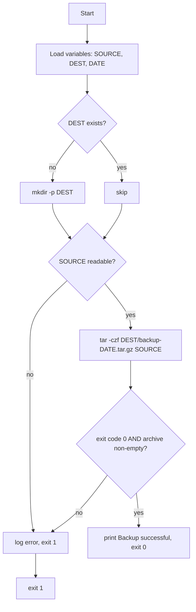

# Day 7: Weekly Challenge — The Backup Script

> **Goal**: combine everything from days 1-6 into a small but professional bash script that takes a dated, compressed snapshot of a directory and verifies the result.
> **Prereqs**: Days 1-6. `tar` and `gzip` installed (default on every Linux distro).

## 1. Scenario & Why It Matters

You own a critical folder — customer uploads, a small SQLite database, an application's data directory. If the host dies tonight, that data is gone. Your manager asks for a simple, reliable policy: every day, take a compressed snapshot of that folder, stamp it with the date, and drop it somewhere safe. Nothing fancy. Just *reliable*.

This is the weekly challenge because it uses every concept from the week: shell pipes (day 1), file permissions (day 2), running as the right user (day 2/4), understanding process exit codes (day 3), potentially running under systemd or cron (day 4), logging and error reporting (day 5 in spirit), and idempotent bash (day 6). It's also the most common "first automation" any DevOps engineer writes in a new job.

In the real world this script grows: rotation (keep 7 daily, 4 weekly, 12 monthly), off-host upload (S3, rsync to a backup server), integrity verification (checksum the archive), encryption (GPG), and monitoring (alert if the script doesn't run or the archive shrinks suspiciously). Today we build the core. The rest comes later when you add a cron schedule or an `OnCalendar=daily` timer.

## 2. Concept Deep-Dive

### 2.1 `tar` + gzip in one step

`tar` bundles many files into one archive; `gzip` compresses. Historically you'd chain them (`tar cf - x | gzip > x.tar.gz`), but `tar` has built-in flags:

| Flag | Meaning                                                                    |
|------|-----------------------------------------------------------------------------|
| `c`  | **Create** an archive                                                       |
| `x`  | **Extract** from an archive                                                 |
| `t`  | List contents without extracting                                            |
| `z`  | Filter through **gzip** (`.tar.gz` / `.tgz`)                                |
| `j`  | Filter through bzip2 (`.tar.bz2`)                                           |
| `J`  | Filter through xz (`.tar.xz`) — best compression, slowest                   |
| `v`  | Verbose — print each file                                                   |
| `f`  | Next argument is the archive **file** name                                  |
| `-C` | Change directory before adding files (controls paths stored in archive)     |

Typical create: `tar -czvf backup.tar.gz -C /srv data/`. The `-C /srv` + relative `data/` trick gives you clean paths inside the archive (`data/foo` instead of `/srv/data/foo`) — crucial when you later extract somewhere else.

### 2.2 Dates as filenames

`$(date +%F)` produces ISO 8601 `YYYY-MM-DD`. Other formats worth knowing:

| Format         | Example              | Use case                              |
|----------------|----------------------|---------------------------------------|
| `%F`           | `2026-04-18`         | Daily backup filenames (sortable)     |
| `%F_%H%M%S`    | `2026-04-18_103045`  | Multiple backups per day              |
| `%s`           | `1745000000`         | Unix epoch for diffing / retention    |
| `%Y%m%d`       | `20260418`           | Filenames where dashes are awkward    |

### 2.3 Verification — did the backup actually happen?

Never trust that `tar` succeeded based on "the command seemed to return". Check:

1. `tar` exit code: `if tar -czf ...; then echo ok; else echo fail; fi`.
2. The archive file exists and is non-empty: `[ -s "$ARCHIVE" ]`.
3. Optional deeper check: `tar -tzf "$ARCHIVE" >/dev/null` actually parses the file.

Silent backup failures are the canonical horror story. The first time you find out your nightly backup has been producing 0-byte files for three months is the day you learn verification is not optional.

### 2.4 Script lifecycle



## 3. Hands-On Mission

Set up the playground:

```bash
mkdir -p ~/backup-lab && cd ~/backup-lab
mkdir -p data backups
echo "customer record 1" > data/customers.txt
echo "order record 1"    > data/orders.txt
```

Then write `backup.sh` (see the sample solution below), make it executable, run it, inspect the result.

```bash
chmod +x backup.sh
./backup.sh
ls -lh backups/
tar -tzf backups/backup-$(date +%F).tar.gz
```

## 4. Your Task — Answer

**Q:** Write a bash script `backup.sh` that:
1. Defines `SOURCE` (a `data/` folder of text files), `DEST` (a `backups/` folder), and `DATE` (today in `YYYY-MM-DD`).
2. Creates a `backup-YYYY-MM-DD.tar.gz` of `SOURCE` inside `DEST`.
3. Verifies the archive was created and prints a success or failure message.

**Sample answer** — `backup.sh`:

```bash
#!/usr/bin/env bash
set -euo pipefail

SOURCE="./data"
DEST="./backups"
DATE="$(date +%F)"
ARCHIVE="${DEST}/backup-${DATE}.tar.gz"

if [ ! -d "$SOURCE" ]; then
    echo "ERROR: source directory '$SOURCE' does not exist" >&2
    exit 1
fi

mkdir -p "$DEST"

echo "Creating backup of $SOURCE -> $ARCHIVE"
if tar -czf "$ARCHIVE" -C "$(dirname "$SOURCE")" "$(basename "$SOURCE")"; then
    if [ -s "$ARCHIVE" ]; then
        SIZE="$(du -h "$ARCHIVE" | cut -f1)"
        echo "Backup successful: $ARCHIVE ($SIZE)"
        exit 0
    fi
fi

echo "Backup failed!" >&2
exit 1
```

Example run:

```
$ ./backup.sh
Creating backup of ./data -> ./backups/backup-2026-04-18.tar.gz
Backup successful: ./backups/backup-2026-04-18.tar.gz (4.0K)

$ tar -tzf backups/backup-2026-04-18.tar.gz
data/
data/customers.txt
data/orders.txt
```

**Why this solution is production-shaped, not just "working"**:

- **Strict mode header**: `set -euo pipefail` stops on any error, catches typos, surfaces failures inside pipes.
- **Pre-flight check**: `[ ! -d "$SOURCE" ]` refuses to continue if the source is missing — a "backup" of a non-existent directory would silently succeed and hide a real outage.
- **Idempotent destination**: `mkdir -p "$DEST"` is safe to re-run; no error if the directory already exists.
- **Clean paths in archive**: `-C "$(dirname "$SOURCE")"` + `"$(basename "$SOURCE")"` produces `data/customers.txt` inside the tarball instead of `./data/customers.txt` or `home/alice/backup-lab/data/...`.
- **Double verification**: both the `tar` exit code (did the command succeed?) *and* `[ -s "$ARCHIVE" ]` (is the file non-empty?) are checked. Either failure prints `Backup failed!` to **stderr** and exits with code 1 — which is what cron/systemd need to know something went wrong.
- **Human + machine output**: stdout has the success message; stderr has errors; the exit code is authoritative.

## 5. Q&A (Concepts Check)

**Q: Why is the exit code important here? Can't the script just `echo` success?**
A: Whatever schedules the script — cron, a systemd timer, a CI job, Kubernetes CronJob — only sees the **exit code**. A script that prints "backup failed" but exits 0 will be counted as a success, no alert fires, and you'll find out at restore time. Always `exit 1` on failure, `exit 0` on success, and print the human message alongside.

**Q: Why `tar -C parent dir` instead of `tar -czf … /absolute/path/to/data`?**
A: `tar` stores paths exactly as given. If you pass `/home/alice/data`, the archive contains `home/alice/data/...`; extracting anywhere else recreates that exact path, which is almost never what you want. `-C parent dir` changes the working directory first so paths inside the archive are relative (`data/...`), and extraction goes where the operator chose.

**Q: How would you make this run every night automatically?**
A: Two mainstream options. **Cron**: `crontab -e`, add `0 2 * * * /opt/backup/backup.sh >> /var/log/backup.log 2>&1`. **Systemd timer**: one `.service` unit that runs the script, paired with a `.timer` unit using `OnCalendar=daily` and `Persistent=true` (catches missed runs after downtime). Timers are preferred in modern setups because they integrate with journalctl and survive reboots cleanly.

**Q: What's wrong with storing backups on the same host as the data?**
A: Everything — if the host dies, the "backup" dies with it. A real backup is off-host: another server via `rsync` or `scp`, S3/GCS/Azure Blob with versioning and lifecycle rules, or a dedicated backup service (restic, borg, duplicity). The local tar file is only useful for "I broke a config, let me revert" — not for disaster recovery.

**Q: How should retention work? The script as written will fill the disk in a year.**
A: Add rotation. Simple: `find "$DEST" -name 'backup-*.tar.gz' -mtime +14 -delete` to drop anything older than 14 days. Better: grandfather-father-son — keep the last 7 daily, 4 weekly, 12 monthly. Tools like `tmpwatch`, `logrotate` or a dedicated backup tool give you this for free. Always run retention **after** verifying the new backup, never before — you want to keep the old one until the new one is proven good.

**Q: My backup works fine interactively, but as a cron job it fails with "tar: data: Cannot open: No such file or directory". Why?**
A: Cron runs with a minimal environment and a working directory of `$HOME` (or `/`). The script uses relative paths like `./data`, which resolves to `$HOME/data`, not `~/backup-lab/data`. Either `cd "$(dirname "$0")"` at the top of the script, or use absolute paths for `SOURCE` and `DEST`. This is one of the most common "works on my machine" bugs.

**Q: Do I need `sudo` for this script?**
A: Only if the source directory isn't readable by your user. As a rule, don't run scripts as root unless a specific step needs it — use a dedicated `backup` user with read access to the source and write access to the destination. If a step needs root (e.g., reading `/etc/`), wrap only that step in `sudo`, not the whole script.

## 6. Further Reading

- `man tar`, `man gzip`, `man date`, `man find`
- [Restic — modern backup tool](https://restic.net/) (once you outgrow `tar`)
- [systemd.timer(5)](https://www.freedesktop.org/software/systemd/man/systemd.timer.html) — proper scheduling
- Next: **Week 2** — version control, Git fundamentals, and collaboration workflows.
