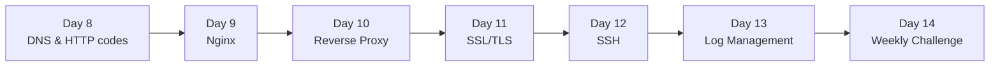

# Week 2 — Networking & Web Servers

> How the internet actually works, and how to run a production web server on a single box. Everything cloudy in later weeks (Docker, K8s, HTTPS) traces back here.

## Roadmap

## Index

- [Day 8 — DNS & HTTP Status Codes](day8_dns-and-http-codes.md)
- [Day 9 — Nginx (install, serve static, config layout)](day9_nginx.md)
- [Day 10 — Reverse Proxy (fronting an app server)](day10_reverse-proxy.md)
- [Day 11 — SSL/TLS (certs, HTTPS, Let's Encrypt)](day11_ssl-tls.md)
- [Day 12 — SSH (keys, agent, config, tunnels)](day12_ssh.md)
- [Day 13 — Log Management (journald, logrotate, tail -f)](day13_log.md)
- [Day 14 — Weekly Challenge: The Reverse Proxy Stack](day14_weekly-challenge.md)

## Related resources

Code for the weekly challenge lives in [`Resources/Week2/weekly_challenge/`](../../Resources/Week2/weekly_challenge/).
