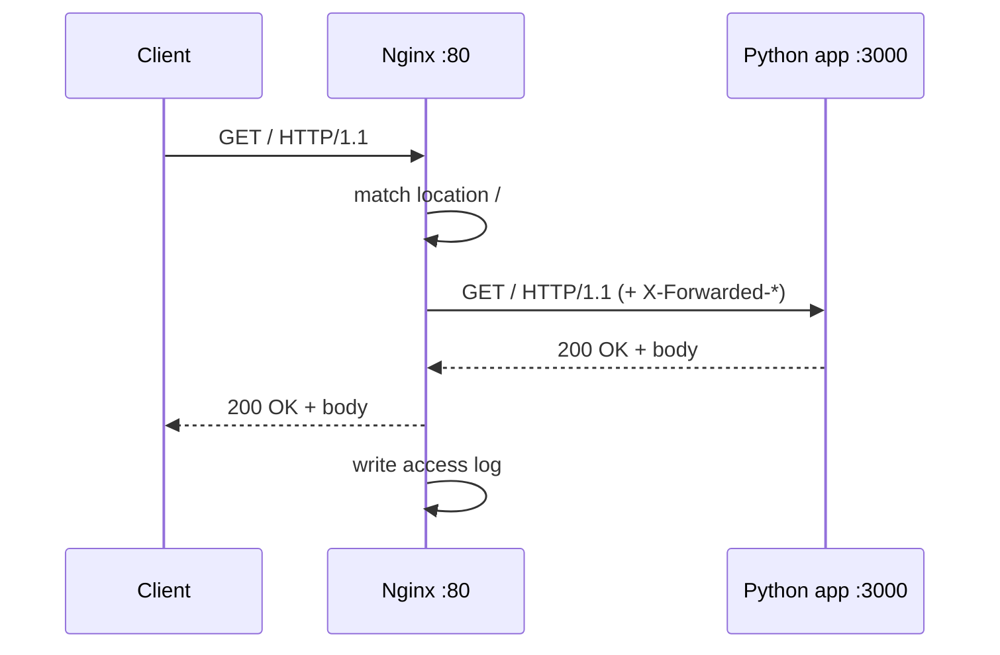

# Day 10: The Reverse Proxy

> **Goal**: Configure Nginx to accept traffic on port 80 and forward it to an application listening on port 3000, using the `proxy_pass` directive.
> **Prereqs**: Day 9 (Nginx installed and a custom page working).

## 1. Scenario & Why It Matters

Static HTML is boring. Real products run an application — Python, Node, Go, Java — that listens on a non-privileged port like 3000 or 8080. Users, however, type a URL that implicitly means port 80 (HTTP) or 443 (HTTPS). Bridging that gap is the single most common architectural pattern in DevOps: a **reverse proxy** at the edge, and the real app somewhere behind it.

Putting Nginx in front of the app buys you a lot for almost no cost: TLS termination, HTTP/2, gzip, header rewriting, request buffering so a slow client cannot tie up an app worker, rate limiting, and a uniform access log across multiple backends. The app process itself stays small and focused, listening on a single plain-HTTP port with no TLS logic of its own.

Today you will stand up a minimal backend using Python's built-in HTTP server, and tell Nginx to forward every request hitting port 80 to that backend. This is the exact shape of production reverse proxies, just with fewer knobs turned.

## 2. Concept Deep-Dive

### Forward proxy vs reverse proxy

A **forward proxy** sits next to the *client* and speaks to the internet on the client's behalf (corporate outbound proxy, VPN, etc.). A **reverse proxy** sits next to the *server* and accepts requests from the internet on the server's behalf. Same TCP mechanics, opposite direction of anonymity.

```mermaid
flowchart LR
  Client[Public client] -->|HTTP :80| Nginx[Nginx reverse proxy]
  Nginx -->|proxy_pass :3000| App[Python app]
  App -->|response| Nginx
  Nginx -->|response| Client
  Nginx -->|access log| Log[/var/log/nginx/access.log]
```

### The `proxy_pass` directive

Inside a `location` block, `proxy_pass http://host:port;` tells Nginx: "for requests matching this location, open a new TCP connection to the target and relay the HTTP exchange." Nginx rewrites hop-by-hop headers (`Connection`, `Keep-Alive`) and passes almost everything else through.

### Headers you almost always need

| Header              | Why                                                                |
| ------------------- | ------------------------------------------------------------------ |
| `Host`              | Preserve the original `Host` so the app can route by domain        |
| `X-Real-IP`         | Give the app the client's real IP (not Nginx's 127.0.0.1)          |
| `X-Forwarded-For`   | Append client IP to the chain — standard for proxy hops            |
| `X-Forwarded-Proto` | Tell the app whether the client used http or https                 |

Without these, the app sees every request as coming from `127.0.0.1` over plain HTTP, which breaks logging, rate-limiting, and any "redirect to HTTPS" logic inside the app.

### Request flow in sequence



## 3. Hands-On Mission

**Start a backend** in a second terminal so Nginx has something to talk to:

```bash
mkdir my_backend && cd my_backend
echo "This is the Backend running on Port 3000" > index.html
python3 -m http.server 3000
```

Leave that terminal running. In your main terminal, edit the default Nginx site:

```bash
sudo nano /etc/nginx/sites-available/default
```

Replace the `location /` block so the final `server` block looks like this:

```nginx
server {
    listen 80 default_server;
    listen [::]:80 default_server;

    root /var/www/html;
    index index.html index.htm index.nginx-debian.html;

    server_name _;

    location / {
        proxy_pass http://localhost:3000;
        proxy_set_header Host $host;
        proxy_set_header X-Real-IP $remote_addr;
        proxy_set_header X-Forwarded-For $proxy_add_x_forwarded_for;
        proxy_set_header X-Forwarded-Proto $scheme;
    }
}
```

Validate and reload:

```bash
sudo nginx -t
sudo systemctl reload nginx
```

## 4. Your Task — Answer

**Q:** Ensure your Python server is still running. Run `curl localhost` (which hits Nginx on port 80). What do you see?

**Sample answer**:

```
$ curl localhost
This is the Backend running on Port 3000
```

**Why**: Nginx received the request on port 80, matched `location /`, opened a TCP connection to `127.0.0.1:3000`, replayed the HTTP request there, read the response from the Python server, and streamed it back to `curl`. The previous static "I am a DevOps Engineer" HTML in `/var/www/html` is no longer served, because `proxy_pass` short-circuits the `root`/`index` file lookup — the location block handed the request off to an upstream instead of reading from disk.

## 5. Q&A (Concepts Check)

**Q: What breaks if you forget `proxy_set_header Host $host;`?**
A: Nginx defaults to sending `Host: localhost:3000` (the proxied target) to the backend. Any app that does virtual-host routing (serving different sites based on the `Host` header, which is the norm in any multi-tenant framework) will route to the wrong site or 404. Preserving the original `Host` is almost never wrong.

**Q: What is the difference between `proxy_pass http://localhost:3000;` and `proxy_pass http://localhost:3000/;` (trailing slash)?**
A: With no trailing slash, Nginx sends the full URI as-is. With a trailing slash, Nginx strips the matching `location` prefix before forwarding. So `location /api/ { proxy_pass http://backend/; }` turns `/api/users` into `/users` at the backend — a very common source of bugs.

**Q: What is an "upstream" block and when do you need it?**
A: `upstream name { server 10.0.0.1:3000; server 10.0.0.2:3000; }` defines a named pool of backends that `proxy_pass http://name;` can target. You need it when you have more than one backend instance (load balancing) or when you want keep-alive connections, health checks, or weighted routing.

**Q: What is a 502 Bad Gateway in this context, and how do you debug it?**
A: The app on port 3000 is not responding — it crashed, never started, or is bound to a different address. Debug: (1) `curl http://localhost:3000` to confirm the app is alive; (2) `sudo tail -f /var/log/nginx/error.log` for the exact Nginx-side error (connection refused vs timeout); (3) `ss -tlnp | grep 3000` to see if anything is actually listening.

**Q: Why do we use `127.0.0.1` or `localhost` for `proxy_pass` instead of the server's public IP?**
A: Security and speed. Binding the app to `127.0.0.1` means only processes on the same host (including Nginx) can reach it — the internet cannot. Traffic also never touches the network stack's public interface. The result: one exposed, hardened entry point (Nginx), and an app that is unreachable from outside by construction.

## 6. Further Reading

- Nginx `ngx_http_proxy_module`: <https://nginx.org/en/docs/http/ngx_http_proxy_module.html>
- DigitalOcean "Understanding Nginx proxy_pass": <https://www.digitalocean.com/community/tutorials/understanding-nginx-http-proxying-load-balancing-buffering-and-caching>
- Next: [Day 11: SSL/TLS](day11_ssl-tls.md)
