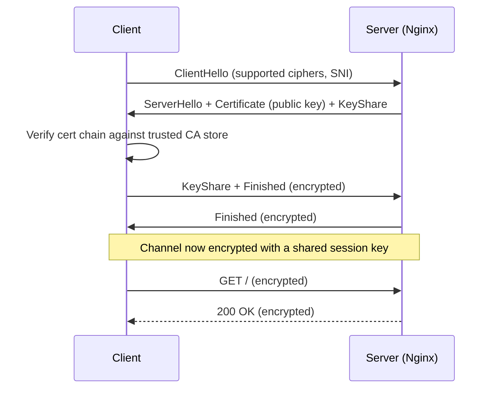
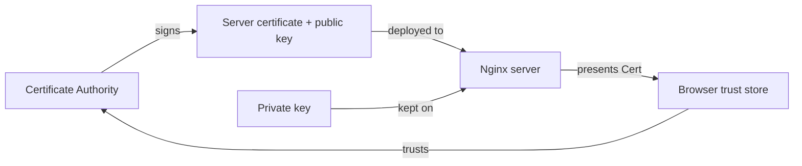

# Day 11: SSL/TLS (The Security Layer)

> **Goal**: Generate a self-signed certificate and configure Nginx to serve the same reverse-proxied app over HTTPS on port 443.
> **Prereqs**: Day 10 (Nginx reverse-proxying a backend on port 3000).

## 1. Scenario & Why It Matters

Your reverse proxy works over plain HTTP. Every byte — including passwords, session cookies, API keys — is visible to anyone between the user and the server: the coffee-shop Wi-Fi, any compromised router, the ISP, a captive portal. In 2026, serving a login form over plain HTTP is professional malpractice. Modern browsers mark HTTP as "Not Secure" and block sensitive features (geolocation, camera, service workers) entirely.

HTTPS solves this with **TLS** (Transport Layer Security, the successor to SSL). TLS does three things at once: (1) **encrypt** the channel so eavesdroppers see only ciphertext, (2) **authenticate** the server so you know you are talking to the real `example.com` and not an impersonator, and (3) **protect integrity** so an attacker cannot flip bytes in flight without detection.

The identity piece requires a **certificate** signed by a **Certificate Authority** (CA) that the browser already trusts — in production that is Let's Encrypt, DigiCert, etc. For learning and internal testing we generate a **self-signed certificate** where we act as our own CA. Clients will warn that they do not trust us, which is exactly correct behavior.

## 2. Concept Deep-Dive

### The TLS handshake (simplified)



The certificate contains the server's *public* key. The matching *private* key never leaves the server. The handshake uses asymmetric crypto to agree on a symmetric session key, which then encrypts the actual data (symmetric crypto is much faster).

### Symmetric vs asymmetric keys

| Property      | Asymmetric (RSA, ECDSA)                 | Symmetric (AES, ChaCha20)             |
| ------------- | --------------------------------------- | ------------------------------------- |
| Keys          | Public + private pair                   | One shared secret                     |
| Speed         | Slow (100x-1000x slower)                | Very fast                             |
| Used for      | Identity, key exchange                  | Bulk data encryption                  |
| In TLS        | Handshake only                          | Every byte after handshake            |

### Who holds which key?



The server holds the private key because the server is the party that must **prove its identity**. In SSH we will see the opposite direction on Day 12.

### Self-signed vs CA-signed

| Aspect           | Self-signed                          | CA-signed (Let's Encrypt etc.)            |
| ---------------- | ------------------------------------ | ----------------------------------------- |
| Trust            | Nobody trusts it by default          | Trusted by all major browsers             |
| Cost             | Free                                 | Free (LE) or paid (commercial CAs)        |
| Setup            | One `openssl` command                | ACME client (certbot), DNS or HTTP-01     |
| Good for         | Localhost, internal services, tests  | Anything public-facing                    |
| Client behavior  | Browser warning, `curl` needs `-k`   | Seamless                                  |

## 3. Hands-On Mission

Generate a self-signed cert (valid 365 days, no passphrase, RSA 2048):

```bash
sudo openssl req -x509 -nodes -days 365 -newkey rsa:2048 \
  -keyout /etc/ssl/private/nginx-selfsigned.key \
  -out    /etc/ssl/certs/nginx-selfsigned.crt
```

Press Enter through the Country/State prompts — they are cosmetic for self-signed.

Add an HTTPS server block alongside your existing port-80 block:

```bash
sudo nano /etc/nginx/sites-available/default
```

Append below the current `server { ... }` block:

```nginx
server {
    listen 443 ssl default_server;
    listen [::]:443 ssl default_server;

    ssl_certificate     /etc/ssl/certs/nginx-selfsigned.crt;
    ssl_certificate_key /etc/ssl/private/nginx-selfsigned.key;

    server_name _;

    location / {
        proxy_pass http://localhost:3000;
        proxy_set_header Host $host;
        proxy_set_header X-Forwarded-Proto $scheme;
    }
}
```

Validate and reload:

```bash
sudo nginx -t
sudo systemctl reload nginx
```

## 4. Your Task — Answer

**Q:** Run `curl -v -k https://localhost`. What does the verbose output tell you about the handshake and the response?

**Sample answer**:

```
* Connected to localhost (127.0.0.1) port 443
* ALPN: offers h2,http/1.1
* TLSv1.3 (OUT), TLS handshake, Client hello (1):
* TLSv1.3 (IN),  TLS handshake, Server hello (2):
* TLSv1.3 (IN),  TLS handshake, Certificate (11):
* Server certificate:
*  subject: CN=...; O=...
*  issuer:  CN=...        <-- same CN as subject = self-signed
*  SSL certificate verify result: self signed certificate (18), continuing anyway.
> GET / HTTP/2
< HTTP/2 200
This is the Backend running on Port 3000
```

**Why**: The `-k` flag tells `curl` to ignore the fact that no CA in its trust store signed this certificate — that is precisely the warning we expect for a self-signed cert. The TLS handshake still completes, the session is still encrypted, and the response body is the same backend text Day 10 returned over HTTP. Notice `subject == issuer` in the cert, which is the defining property of a self-signed certificate.

Further repository reference: [Learn_SSL-TLS](https://github.com/TheTangentLine/Learn_SSL-TLS).

## 5. Q&A (Concepts Check)

**Q: Why does the server hold the private key and only share the public key?**
A: Anyone with the private key can decrypt traffic and impersonate the site. The public key can be handed to the world safely — it can only encrypt *to* the server and verify signatures *from* the server. This asymmetry is the entire point of public-key crypto.

**Q: What is the role of a Certificate Authority?**
A: A CA is a trusted third party that vouches for "this public key really belongs to `example.com`." Browsers ship with a list of root CAs they trust. When Nginx presents a certificate, the browser walks the chain to a trusted root — if the chain is valid and unexpired, it renders the lock icon. A self-signed cert has no chain to a trusted root, hence the warning.

**Q: What is SNI and why does it matter?**
A: **Server Name Indication** is a TLS extension where the client puts the target hostname in the ClientHello *before* the handshake completes. Without SNI, one IP address could host only one HTTPS certificate. With SNI, Nginx can serve many HTTPS sites on a single IP, picking the right certificate per `server_name`. Virtually all modern clients support it.

**Q: Why use TLS 1.3 over TLS 1.2?**
A: TLS 1.3 removes every cipher suite with known weaknesses (RC4, CBC modes, static RSA key exchange), mandates forward secrecy, and cuts the handshake from two round-trips to one (or zero with 0-RTT resumption). The result is faster, safer, and simpler to configure. Disable everything older in production.

**Q: What is "forward secrecy" and why do you want it?**
A: Forward secrecy means the session keys are ephemeral — even if someone records ciphertext today and steals the server's long-term private key a year from now, they still cannot decrypt yesterday's recording. TLS 1.3 mandates it; TLS 1.2 requires explicitly choosing ECDHE cipher suites.

**Q: Why do modern CAs like Let's Encrypt issue only short-lived (90-day) certs?**
A: Short lifetimes limit the damage of a stolen key — the cert expires on its own soon regardless of revocation. Revocation at internet scale is notoriously unreliable (OCSP stapling helps but is not universal). The trade-off is that renewal must be automated, which is exactly why `certbot` and ACME exist.

## 6. Further Reading

- Cloudflare "How does SSL work?": <https://www.cloudflare.com/learning/ssl/how-does-ssl-work/>
- Mozilla SSL Configuration Generator: <https://ssl-config.mozilla.org/>
- RFC 8446 (TLS 1.3): <https://www.rfc-editor.org/rfc/rfc8446>
- Next: [Day 12: SSH Hardening](day12_ssh.md)
