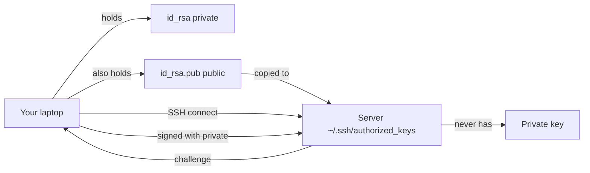
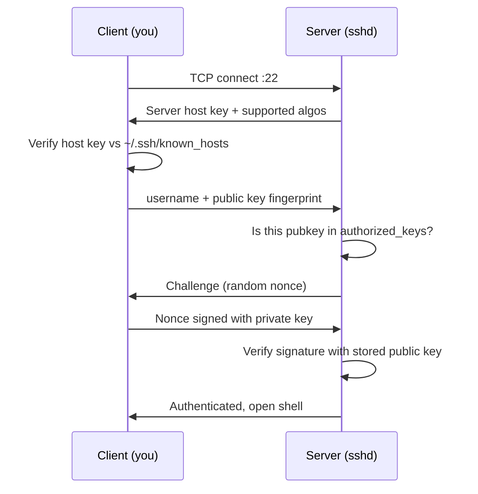

# Day 12: SSH Hardening

> **Goal**: Switch SSH from password authentication to key-based authentication and disable password logins at the daemon level.
> **Prereqs**: Day 11 (public-key cryptography mental model), a Linux machine (or VM) you can safely experiment on.

## 1. Scenario & Why It Matters

The moment a server appears on a public IP, bots start trying `admin/admin`, `root/password123`, and a dictionary of stolen credentials against its SSH port. This is not theoretical — a fresh cloud VM will see brute-force attempts within minutes. Password authentication is fundamentally vulnerable to guessing, to phishing, to keyloggers, and to password-reuse from any unrelated breach.

The industry-standard fix is to **remove passwords as an authentication option entirely** and rely only on SSH keys. A key is a cryptographic secret living on your laptop; the server only stores the corresponding public "lock." Even a leaked `authorized_keys` file is useless to an attacker without the matching private key.

Today you will generate a keypair, install the public half on the server, verify key-based login works, and then disable password auth in `sshd_config` so the attack surface disappears. Every cloud provider's hardening checklist starts with this step.

## 2. Concept Deep-Dive

### The SSH keypair model

In **TLS** (Day 11), the *server* proves its identity to the client. In **SSH**, the *client* (you) proves your identity to the server. The direction is reversed, so the key placement is reversed too: **the private key stays with the party that is proving itself.**



### Handshake in sequence



### Key files

| Path                               | Side    | Purpose                                     |
| ---------------------------------- | ------- | ------------------------------------------- |
| `~/.ssh/id_rsa` or `id_ed25519`    | Client  | Private key — never share, `chmod 600`      |
| `~/.ssh/id_rsa.pub`                | Client  | Public key — safe to share                  |
| `~/.ssh/authorized_keys`           | Server  | List of public keys allowed to log in       |
| `~/.ssh/known_hosts`               | Client  | Host keys of servers you have trusted       |
| `/etc/ssh/sshd_config`             | Server  | Daemon configuration                        |

`chmod` matters: SSH refuses to use files with overly permissive modes. `~/.ssh` must be `700`, `authorized_keys` must be `600`.

### Key algorithm comparison

| Algorithm      | Key size         | Notes                                                |
| -------------- | ---------------- | ---------------------------------------------------- |
| RSA            | 2048 / 4096 bits | Widely supported, large key files                    |
| ECDSA          | 256 / 384 / 521  | Smaller, faster, but relies on curve choice          |
| **Ed25519**    | 256 bits         | Modern default, fast, compact, strong defaults       |

For new keys in 2026, prefer `ssh-keygen -t ed25519`. RSA 4096 remains fine for compatibility with old systems.

## 3. Hands-On Mission

> Warning: on a remote cloud server, a misconfigured `sshd_config` can lock you out permanently. Keep an existing SSH session open as a rescue channel until you have verified key-based login works from a new session.

Generate a keypair on your laptop:

```bash
ssh-keygen -t rsa -b 4096    # or: ssh-keygen -t ed25519
```

Install the public key on the server:

```bash
mkdir -p ~/.ssh
nano ~/.ssh/authorized_keys     # paste contents of id_rsa.pub, save
chmod 600 ~/.ssh/authorized_keys
chmod 700 ~/.ssh
```

Open a **new** terminal and confirm key login works without a password:

```bash
ssh your-user@your-server       # or: ssh localhost
```

Harden the daemon:

```bash
sudo nano /etc/ssh/sshd_config
```

Ensure these two lines exist, are uncommented, and read:

```
PasswordAuthentication no
PubkeyAuthentication   yes
```

Restart sshd:

```bash
sudo systemctl restart ssh      # on some distros: ssh.service or sshd
```

## 4. Your Task — Answer

**Q:** After performing the hardening, run `sudo grep "PasswordAuthentication" /etc/ssh/sshd_config`. What do you expect to see, and what does it prove?

**Sample answer**:

```
$ sudo grep "PasswordAuthentication" /etc/ssh/sshd_config
PasswordAuthentication no
```

(There may be a second commented line like `#PasswordAuthentication yes` from the distro default — ignore it; commented lines have no effect.)

**Why**: The single uncommented line is the active directive. `no` means the SSH daemon will refuse any password-based attempt outright — it never even prompts. Combined with the public key already installed in `~/.ssh/authorized_keys` and a successful key-based login from a new terminal, this proves the server now has exactly one authentication path (keys), and the brute-force attack surface on port 22 is effectively closed.

### Conceptual follow-up: why does the server hold the public key, not the private key?

This is the exact opposite of Day 11's SSL setup, so it is worth spelling out.

**The golden rule**: the party that must *prove its identity* holds the **private** key.

- In SSL (Day 11), the **server** proves identity to the browser → server holds the private key.
- In SSH (Day 12), **you** prove identity to the server → you hold the private key.

Think of the public key as a padlock and the private key as the physical key. You generate both on your laptop, walk up to the server, and hang your padlock on its door (`authorized_keys`). When you try to enter, the server inspects your padlock and says "only someone with the matching key can open this." You unlock it with the private key that never left your laptop. If the server were hacked, the attacker would only have a padlock — useless without the key.

If you instead stored your private key on the server, a single compromised server would let the attacker impersonate you everywhere else you have SSH access. Keeping private keys on your endpoint contains blast radius.

## 5. Q&A (Concepts Check)

**Q: What does `ssh-copy-id` do, and why is it preferred over manual `nano`?**
A: `ssh-copy-id user@host` reads your local public key, SSHes to the server (one last time using the password), and appends the key to `~/.ssh/authorized_keys` with correct permissions. It removes three common mistakes: pasting extra whitespace, corrupting line breaks, and forgetting to `chmod 600`. Use it whenever it is available.

**Q: Why must you keep an active SSH session open while editing `sshd_config`?**
A: If you break the config (typo, wrong option) and restart `sshd`, new sessions may be rejected. Your existing session survives because it was authenticated before the restart — giving you one chance to fix the file. Without that safety net, a mistake on a remote cloud box means rebooting into rescue mode or losing the server.

**Q: What is `~/.ssh/known_hosts` and why does SSH warn about "host key changed"?**
A: On first connect, SSH saves the server's host key. On every later connect, it verifies the server still presents the same key. If the key changes — server reinstalled, or someone is doing a man-in-the-middle — SSH refuses to connect and shouts at you. It is a trust-on-first-use (TOFU) model; the warning exists to catch MITM attempts.

**Q: Should you also disable root login? How?**
A: Yes, as a second hardening step. Set `PermitRootLogin no` in `sshd_config`. Then log in as a normal user and `sudo` for root tasks. This adds a layer: an attacker must both guess a valid username *and* compromise that user's key before even trying to escalate.

**Q: What is an SSH agent, and why should you use one?**
A: `ssh-agent` holds your decrypted private key in memory and lends it to `ssh` on demand, so you type your passphrase once per session instead of once per connection. Combined with `ssh-add -l` and agent forwarding (`-A`, used carefully), it streamlines jumps through bastions. Always passphrase-protect the private key itself; the agent is a convenience, not a replacement for at-rest encryption.

**Q: Ed25519 vs RSA 4096 — which should a new project use?**
A: Ed25519. It is faster, produces tiny 68-byte public keys, has no known implementation pitfalls, and every modern SSH client/server supports it. RSA 4096 is fine for compatibility with legacy systems but is slower and bulkier. Avoid RSA 1024 and DSA entirely.

## 6. Further Reading

- OpenSSH manual: <https://man.openbsd.org/sshd_config>
- Mozilla OpenSSH guidelines: <https://infosec.mozilla.org/guidelines/openssh>
- "SSH Mastery" by Michael W. Lucas (book)
- Next: [Day 13: Log Management](day13_log.md)
