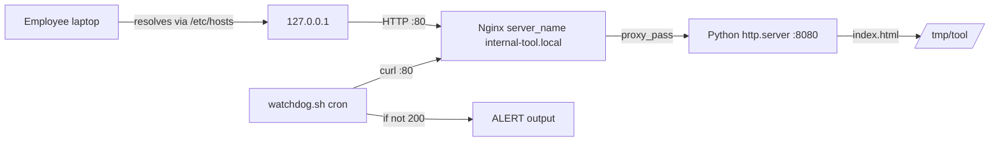

# Day 14: Weekly Challenge — Production Environment

> **Goal**: Build an end-to-end internal service: simulated DNS + Nginx reverse proxy + backend app on port 8080, plus a watchdog script that alerts on downtime.
> **Prereqs**: Days 8-13 (HTTP codes, Nginx, reverse proxy, SSL basics, SSH, log mining).

## 1. Scenario & Why It Matters

You are launching an internal tool at your company. The requirements are concrete and typical of real corporate deployments:

1. The app itself runs on **port 8080** (simulated with a Python HTTP server).
2. Employees must reach it at `http://internal-tool.local` on **standard port 80**.
3. Operations needs a **watchdog** script that checks the site every minute and raises an alert if it is down.

Every piece of this challenge is something you will do for real in week-one of most DevOps jobs: map a friendly hostname to an IP, put a reverse proxy in front of an application, and wire up the simplest possible health check. The watchdog is the seed of the "uptime monitoring" that graduates into Prometheus, Uptime Kuma, or Datadog synthetic checks in later weeks.

This challenge ties Week 2 together: Day 8's status codes inform the watchdog logic, Day 9-10 stand up the proxy, Day 13 gives you the tools to inspect logs when things break.

## 2. Concept Deep-Dive

### End-to-end architecture



### The `/etc/hosts` shortcut

`/etc/hosts` is consulted *before* DNS on almost every OS (governed by `nsswitch.conf`). A single line there lets one machine treat any hostname as pointing to any IP — perfect for local development, for staging overrides, and for this challenge. It only affects the machine you edit it on, which is exactly what we want.

### Watchdog logic

```mermaid
flowchart TD
  Start[Run watchdog.sh] --> Curl[curl -o /dev/null -s -w %{http_code}]
  Curl --> Check{code == 200?}
  Check -- yes --> Ok[Print: System Online]
  Check -- no  --> Fail[Print: ALERT System Down]
  Fail --> Exit1[exit 1 for cron/alerting]
  Ok --> Exit0[exit 0]
```

The `-o /dev/null` discards the body, `-s` silences progress, and `-w "%{http_code}\n"` prints *only* the status code — perfect for consumption by a shell `if`.

### Why we proxy 80 → 8080 instead of running the app on 80

| Reason                  | Detail                                                     |
| ----------------------- | ---------------------------------------------------------- |
| Non-root app            | App runs as an unprivileged user; Nginx owns the low port  |
| TLS upgrade path        | Adding HTTPS later is a config change, not an app change   |
| Multiple sites per host | `server_name` routing across many backends                 |
| Uniform logs            | One `access.log` format regardless of backend language     |
| Graceful reloads        | Nginx `reload` avoids dropping connections on redeploys    |

## 3. Hands-On Mission

### Step 1 — Simulate DNS

```bash
sudo nano /etc/hosts
```

Add:

```
127.0.0.1   internal-tool.local
```

### Step 2 — Start the backend on port 8080

```bash
mkdir -p /tmp/tool
echo "Critical Data" > /tmp/tool/index.html
cd /tmp/tool
python3 -m http.server 8080 &
```

### Step 3 — Create an Nginx vhost

```bash
sudo nano /etc/nginx/sites-available/tool
```

Paste:

```nginx
server {
    listen 80;
    server_name internal-tool.local;

    location / {
        proxy_pass http://localhost:8080;
        proxy_set_header Host $host;
        proxy_set_header X-Real-IP $remote_addr;
        proxy_set_header X-Forwarded-For $proxy_add_x_forwarded_for;
    }
}
```

Enable and reload:

```bash
sudo ln -s /etc/nginx/sites-available/tool /etc/nginx/sites-enabled/tool
sudo nginx -t
sudo systemctl reload nginx
```

Smoke test:

```bash
curl http://internal-tool.local
# expect: Critical Data
```

### Step 4 — Write `watchdog.sh`

```bash
#!/usr/bin/env bash
URL="http://internal-tool.local"
CODE=$(curl -o /dev/null -s -w "%{http_code}\n" "$URL")

if [ "$CODE" = "200" ]; then
  echo "System Online (HTTP $CODE)"
  exit 0
else
  echo "ALERT: System Down! (HTTP $CODE)"
  exit 1
fi
```

Make executable and run:

```bash
chmod +x watchdog.sh
./watchdog.sh
```

### Step 5 — Prove the alert fires

Kill the backend and re-run the watchdog:

```bash
# find and kill the python server
kill %1        # if it is still job 1 in this shell
# or: pkill -f "http.server 8080"

./watchdog.sh
```

## 4. Your Task — Answer

**Q:** Complete the mission above: set up `/etc/hosts`, start the backend on 8080, configure Nginx to proxy `internal-tool.local` (port 80) to `localhost:8080`, write `watchdog.sh`, and finally kill the backend to verify the watchdog reports the outage.

**Sample answer**:

Healthy case:

```
$ curl http://internal-tool.local
Critical Data

$ ./watchdog.sh
System Online (HTTP 200)
```

After `pkill -f "http.server 8080"`:

```
$ ./watchdog.sh
ALERT: System Down! (HTTP 502)
```

**Why the code is 502, not 000**: Nginx is still up and still accepting port-80 traffic, so the TCP handshake with the watchdog succeeds. But when Nginx tries to `proxy_pass` to `localhost:8080`, the backend is gone — the kernel replies `ECONNREFUSED`, Nginx cannot get a valid upstream response, and it translates that into `502 Bad Gateway`. If Nginx itself were also stopped, `curl` would fail to connect at all and the `%{http_code}` would be `000`, which is why the script correctly treats anything that is not `200` as down. This is exactly the behavior you want in a watchdog: conservative — if in doubt, alert.

You have just shipped a miniature production stack: DNS (simulated), Nginx edge, application backend, and uptime monitoring. Adding TLS from Day 11 on top of this is a ten-minute change.

## 5. Q&A (Concepts Check)

**Q: Why edit `/etc/hosts` instead of running a real DNS server for this exercise?**
A: `/etc/hosts` is the minimum viable DNS — it affects only the local machine, takes effect instantly, and needs no extra software. For single-box learning or testing a vhost locally, it is perfect. In a real company you would use internal DNS (BIND, CoreDNS, Route 53 private zones, or Kubernetes DNS) so every machine resolves the name consistently.

**Q: Why does `sudo ln -s sites-available/tool sites-enabled/tool` enable the site?**
A: Nginx's top-level config has `include /etc/nginx/sites-enabled/*;`, so any file (or symlink) in that directory is loaded. The symlink pattern keeps the canonical source in `sites-available` and lets you enable or disable a site by adding or removing a symlink — a one-step revert when a deploy goes bad.

**Q: What does the watchdog miss, and how would you improve it in production?**
A: It checks only the root path and only the HTTP status — not content, not latency, not TLS validity, not dependency health. A real production check would (1) verify a specific string in the body, (2) measure response time and alert on p95 regressions, (3) hit a dedicated `/healthz` endpoint that the app uses to self-report dependency status, and (4) be executed by a monitoring platform with deduplication, paging rules, and historical graphs, not a raw cron.

**Q: The watchdog uses `exit 0` vs `exit 1`. Why does the exit code matter?**
A: Exit codes are how `cron`, `systemd` timers, `monit`, and CI pipelines decide whether to page. `exit 0` = success, anything else = failure. Writing to stdout is for humans; the exit code is for machines. A watchdog that always `exit 0` silently breaks — you would never know it was down.

**Q: How would you schedule the watchdog to run every minute?**
A: `crontab -e` and add `* * * * * /path/to/watchdog.sh >> /var/log/watchdog.log 2>&1`. Redirect both stdout and stderr to a log so you can review it later; cron swallows output otherwise. For production, prefer a systemd timer (better logging via `journalctl`) or a real monitoring tool.

**Q: If you later want HTTPS for `internal-tool.local`, what is the minimum change?**
A: Generate a cert (self-signed as in Day 11, or issue one via an internal CA), add a second `server` block listening on `443 ssl` with `ssl_certificate` + `ssl_certificate_key` directives and the same `proxy_pass`, and reload. The backend on 8080 does not change at all. Optionally, redirect port 80 → 443 for consistency.

## 6. Further Reading

- Nginx "Using Nginx as a reverse proxy": <https://docs.nginx.com/nginx/admin-guide/web-server/reverse-proxy/>
- `curl` exit codes & `-w` format: <https://curl.se/docs/manpage.html>
- `cron` quick reference: <https://man7.org/linux/man-pages/man5/crontab.5.html>
- Next: Week 3 (Configuration Management & Automation)
