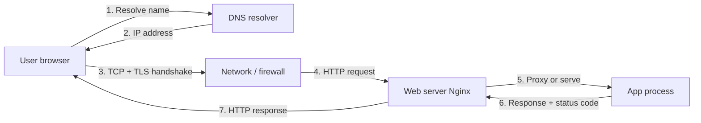
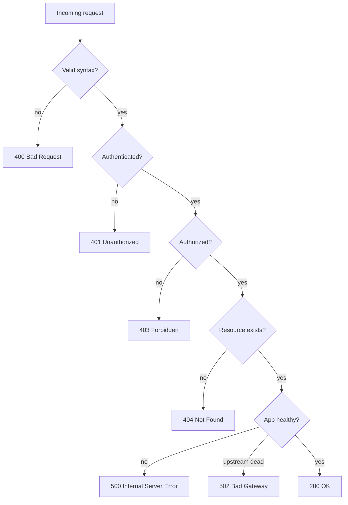

# Day 8: DNS & HTTP Status Codes

> **Goal**: Learn to triage "the site is down" by distinguishing DNS vs network vs application failures, and read HTTP status codes fluently.
> **Prereqs**: Week 1 CLI basics (`curl`, piping), a working terminal with network access.

## 1. Scenario & Why It Matters

At 9:42 AM a support ticket arrives: "Your website is down!" That sentence is almost useless on its own, because "down" can mean five completely different failure modes. A senior engineer's first job is to *localize the fault* before touching any code: is it DNS, is it the network path, is it TLS, is it the web server, or is it the application behind the web server?

DNS is the phonebook of the internet — it maps human-readable names (`example.com`) to IP addresses (`93.184.216.34`). If DNS fails, the request never even leaves the user's machine. HTTP status codes, in contrast, are the *reply* the server sends once the connection has succeeded — they tell you whether the client made a bad request (4xx), or whether the server itself failed (5xx).

Being able to read these two signals (DNS resolution + status code) in under 30 seconds separates a DevOps engineer from someone who reflexively types `sudo reboot`. This day trains that instinct.

## 2. Concept Deep-Dive

### The request lifecycle



Any of steps 1-7 can fail, and the error surface looks different at each step.

### DNS record types (the ones you meet weekly)

| Record | Maps to          | Typical use                                  |
| ------ | ---------------- | -------------------------------------------- |
| A      | IPv4 address     | `example.com -> 93.184.216.34`               |
| AAAA   | IPv6 address     | same, for IPv6                               |
| CNAME  | Another hostname | `www.example.com -> example.com`             |
| MX     | Mail server      | routes email for the domain                 |
| TXT    | Free text        | SPF, DKIM, domain verification               |
| NS     | Name servers     | delegation — who is authoritative for zone   |

### HTTP status code classes

| Class | Meaning       | Examples                                                         |
| ----- | ------------- | ---------------------------------------------------------------- |
| 1xx   | Informational | `100 Continue`, `101 Switching Protocols`                        |
| 2xx   | Success       | `200 OK`, `201 Created`, `204 No Content`                        |
| 3xx   | Redirection   | `301 Moved Permanently`, `302 Found`, `304 Not Modified`         |
| 4xx   | Client error  | `400`, `401`, `403`, `404`, `409`, `422`, `429`                   |
| 5xx   | Server error  | `500`, `502 Bad Gateway`, `503 Service Unavailable`, `504 Timeout` |

The most operationally meaningful split is 4xx vs 5xx: 4xx means *the client sent something bad* (you probably can't fix it from the server), while 5xx means *we broke* (page the on-call).

### A mental model: where does each code come from?



## 3. Hands-On Mission

Trigger three representative codes against `httpbin.org` and `google.com`:

```bash
curl -I https://httpbin.org/status/200
curl -I https://google.com/this-page-is-fake-12345
curl -I http://google.com
```

Inspect a DNS lookup to see resolution before the HTTP request:

```bash
dig google.com +short
dig +trace google.com | head -n 20
```

Watch the full HTTP exchange (headers + TLS steps):

```bash
curl -v http://google.com
```

## 4. Your Task — Answer

**Q:** Run `curl -I http://google.com`. There is a `Location:` header telling you where to go next. What is the exact URL in the `Location` header?

**Sample answer**:

```
HTTP/1.1 301 Moved Permanently
Location: http://www.google.com/
...
```

The `Location` header points to `http://www.google.com/`. **Why**: Google normalizes traffic to the `www` subdomain and then again upgrades to HTTPS. The first `301` is Google saying "I am here, but the canonical host is `www.google.com`." A second request to that URL will then typically redirect again to `https://www.google.com/`. This two-step redirect is very common in production (apex-to-www, then HTTP-to-HTTPS).

## 5. Q&A (Concepts Check)

**Q: What is the difference between a 401 and a 403?**
A: `401 Unauthorized` means "I do not know who you are — send credentials." `403 Forbidden` means "I know exactly who you are, and you are not allowed." 401 is an authentication failure; 403 is an authorization failure. Practically: 401 prompts a login screen; 403 does not.

**Q: A user reports the site is down. You run `curl -v https://site.example` and get `Could not resolve host`. What layer is broken?**
A: DNS. The TCP/TLS/HTTP layers never engaged because the name never turned into an IP. Debug with `dig site.example`, check the registrar/DNS provider, and verify the authoritative NS records.

**Q: What is the difference between a 502 and a 504?**
A: `502 Bad Gateway` means the proxy (e.g. Nginx) got an *invalid* or empty response from the upstream app. `504 Gateway Timeout` means the proxy gave up waiting — the upstream never replied within the timeout. 502 often indicates the app crashed; 504 often indicates the app is slow or hung.

**Q: Why are 301 redirects cached aggressively by browsers but 302 is not?**
A: `301 Moved Permanently` tells the client the new URL is canonical forever, so the browser can skip the old URL next time. `302 Found` (temporary) tells the client "go there for now but keep asking me." Getting this wrong in production is painful — a mis-deployed 301 can stick in users' browsers for months.

**Q: How do you see a DNS response with TTLs and record types (not just the resolved IP)?**
A: `dig example.com` (without `+short`) shows the full answer section with record type and TTL. `dig example.com NS` asks for the name servers. `dig +trace example.com` walks the resolution from the root servers downward, which is invaluable when delegation is misconfigured.

**Q: What status code does a healthy but empty response use?**
A: `204 No Content`. It means "request succeeded, but I have nothing in the body on purpose." Common for `DELETE` responses and for endpoints whose meaningful output is only the status itself.

## 6. Further Reading

- MDN: [HTTP response status codes](https://developer.mozilla.org/en-US/docs/Web/HTTP/Status)
- RFC 9110 (HTTP semantics): <https://www.rfc-editor.org/rfc/rfc9110>
- `dig` manual: `man dig`, or <https://linux.die.net/man/1/dig>
- Next: [Day 9: Nginx](day9_nginx.md)
