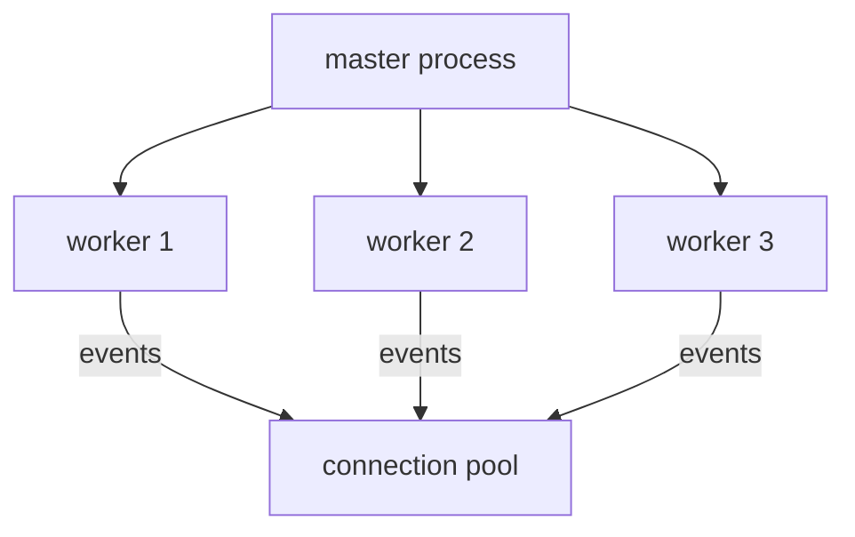

# Day 9: Nginx (The Traffic Controller)

> **Goal**: Install Nginx, serve a custom page from the default web root, and understand Nginx's role at the front door.
> **Prereqs**: Day 8 (HTTP status codes), basic Linux shell (`sudo`, `apt`, `systemctl`).

## 1. Scenario & Why It Matters

Your Node or Python app runs on port 3000. The public internet expects HTTP on port 80 and HTTPS on port 443. You *could* run the app directly on port 80, but that requires root (ports below 1024 are privileged), exposes the raw interpreter to the world, and gives you nothing to absorb attack traffic, terminate TLS, compress responses, or shield slow upstream calls.

The industry-standard answer is to put a **reverse proxy** at the edge. Nginx is the most widely deployed open-source web server and reverse proxy. It is small, fast, event-driven, and battle-tested on millions of sites. It does five jobs extremely well: terminate TLS, serve static files, reverse-proxy to backends, apply rate limits, and write consistent access logs.

Today we do the smallest possible thing — install Nginx, verify it is running, and change what it serves. Every other Nginx exercise this week builds on this foundation.

## 2. Concept Deep-Dive

### Where Nginx sits

```mermaid
flowchart LR
  Client[Browser / curl] -->|Port 80 or 443| Nginx[Nginx edge]
  Nginx -->|static files| FS[/var/www/html]
  Nginx -->|proxy_pass| App1[App on :3000]
  Nginx -->|proxy_pass| App2[App on :4000]
  Nginx -->|logs| Log[/var/log/nginx/access.log]
```

A single Nginx instance can serve static files **and** reverse-proxy to many backends at once, routed by hostname (`server_name`) and path (`location`).

### Key files on Debian/Ubuntu

| Path                                   | Purpose                                       |
| -------------------------------------- | --------------------------------------------- |
| `/etc/nginx/nginx.conf`                | Top-level config (workers, events, http block) |
| `/etc/nginx/sites-available/`          | All site configs (one file per vhost)         |
| `/etc/nginx/sites-enabled/`            | Symlinks to the active subset                 |
| `/var/www/html/`                       | Default document root                         |
| `/var/log/nginx/access.log`            | Request log                                   |
| `/var/log/nginx/error.log`             | Error log (tail this when debugging)          |

### Process model

Nginx uses one master process (reads config, binds ports, spawns workers) and N worker processes (handle connections using `epoll`/`kqueue`). Workers are non-blocking — a single worker handles thousands of concurrent connections, which is why Nginx is fast without being thread-heavy.



### `systemctl` verbs you will use every day

| Command                         | Meaning                              |
| ------------------------------- | ------------------------------------ |
| `systemctl status nginx`        | Is it running? Any crash?            |
| `systemctl reload nginx`        | Re-read config without dropping conns |
| `systemctl restart nginx`       | Full stop/start (drops connections)  |
| `nginx -t`                      | Validate config syntax before reload |

## 3. Hands-On Mission

> Note: On Mac/Windows without a VM, you can run the exercise inside Docker:
> `docker run -it -p 80:80 --name my-nginx ubuntu bash` and then execute the commands inside.

Install and start Nginx:

```bash
sudo apt update
sudo apt install nginx -y
sudo systemctl status nginx
```

Replace the default welcome page (use `tee` so `sudo` applies to the write, not just the pipe):

```bash
echo "<h1>I am a DevOps Engineer</h1>" | sudo tee /var/www/html/index.nginx-debian.html
```

Validate and verify:

```bash
sudo nginx -t
curl localhost
```

## 4. Your Task — Answer

**Q:** Run the commands above. Then verify your work by curling your own local machine: `curl localhost`. What do you see?

**Sample answer**:

```
$ curl localhost
<h1>I am a DevOps Engineer</h1>
```

**Why**: Nginx's default `server` block listens on port 80 and serves files from `/var/www/html`. When you request `/`, Nginx looks for `index.nginx-debian.html` (that name is set by the `index` directive in `/etc/nginx/sites-available/default`). Because you overwrote that file, Nginx returns your custom HTML with a `200 OK`. The `tee` trick was needed because shell redirection `>` runs before `sudo` gets the chance to apply — `sudo echo ... > /var/www/...` would fail with a permission error on the redirect itself.

## 5. Q&A (Concepts Check)

**Q: Why do we use `systemctl reload` instead of `restart` after a config change?**
A: `reload` tells the master process to re-read the config and spawn new workers, while the old workers keep serving their in-flight requests until they finish. `restart` kills everything and starts fresh, dropping active connections. In production, always `reload` unless you changed something reload cannot apply (like the user Nginx runs as).

**Q: What does `nginx -t` actually check?**
A: It parses the full config and verifies syntax and referenced files (e.g. cert paths exist). It does *not* guarantee semantic correctness (e.g. a `proxy_pass` to a dead backend). Always run it before `reload` — a bad config that fails at reload time can take a production site down.

**Q: What is the difference between `sites-available` and `sites-enabled`?**
A: `sites-available` holds every vhost file you have written; `sites-enabled` holds symlinks to the subset currently active. Disabling a site is `sudo rm /etc/nginx/sites-enabled/sitename` plus reload — the source file in `sites-available` stays safe. This pattern comes from the Debian Apache convention.

**Q: Why is running your Node app directly on port 80 a bad idea?**
A: (1) Ports below 1024 require root, so your app runs as root and every bug becomes a root exploit. (2) One app per port means no path-based routing, no TLS termination, no gzip, no rate limit, no easy log format. (3) Swapping the app requires a restart that drops connections, while Nginx in front gives you zero-downtime deploys via config reload.

**Q: Where should you look first when `systemctl status nginx` says "failed"?**
A: `sudo journalctl -u nginx --since "5 min ago"` for systemd context, and `sudo tail -n 50 /var/log/nginx/error.log` for Nginx's own error messages. The single most common cause is a syntax error that would have been caught by `nginx -t` before the reload.

## 6. Further Reading

- Official Nginx beginners guide: <https://nginx.org/en/docs/beginners_guide.html>
- `nginx.conf` full directive index: <https://nginx.org/en/docs/dirindex.html>
- Debian Nginx layout: <https://wiki.debian.org/Nginx>
- Next: [Day 10: Reverse Proxy](day10_reverse-proxy.md)
