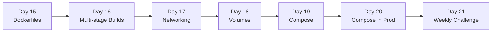

# Week 3 — Docker

> Containers end the "works on my machine" argument. Week 3 takes you from `docker run` to multi-service Compose stacks with production hardening.

## Roadmap

## Index

- [Day 15 — Dockerfiles (FROM, COPY, RUN, CMD)](day15_dockerfiles.md)
- [Day 16 — Multi-Stage Builds (small, secure images)](day16_multi-stage-builds.md)
- [Day 17 — Docker Networking (bridge, host, custom networks)](day17_docker-networking.md)
- [Day 18 — Volumes (named, bind, tmpfs)](day18_volumes.md)
- [Day 19 — Docker Compose (defining a stack)](day19_docker-compose.md)
- [Day 20 — Compose in Production (healthchecks, restart policies, secrets)](day20_compose-production.md)
- [Day 21 — Weekly Challenge: The Multi-Service App](day21_weekly-challenge.md)

## Related resources

Code for the weekly challenge lives in [`Resources/Week3/weekly_challenge/`](../../Resources/Week3/weekly_challenge/).
