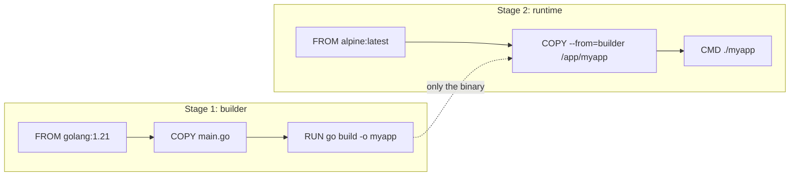

# Day 16: Multi-Stage Builds (The Diet)

> **Goal**: Shrink a production image by 10–100x by separating the *build* environment from the *runtime* environment.
> **Prereqs**: Day 15 (Dockerfile basics, `FROM`, `COPY`, `RUN`).

## 1. Scenario & Why It Matters

A naive `FROM golang:1.21` image weighs ~800 MB. That's fine on your laptop, but in production it means slow pulls on every node scale-up, bloated registries, and — worst — a container that ships the Go compiler, `git`, and dozens of system libraries you never use at runtime. Every one of those is an extra CVE waiting to happen.

The insight behind multi-stage builds is simple: the tools you need to *build* the artifact are not the tools you need to *run* it. A Go binary is statically linked; it doesn't need `go`, `gcc`, or even `glibc`. A Next.js production server doesn't need `devDependencies`, `tsc`, or `webpack`. So: build in a heavy image, copy the single output file into a tiny image, and throw the first one away.

The savings are not marginal. Go programs go from 800 MB → 5 MB on Alpine, or 800 MB → 2 MB on `scratch`. Pull times on a cold node drop from 30 s to under 1 s, which directly improves horizontal scaling latency and cold-start cost on serverless platforms.

## 2. Concept Deep-Dive

A multi-stage Dockerfile contains multiple `FROM` lines. Each starts a new stage with its own filesystem. You name stages with `AS <name>` and pull files from an earlier stage with `COPY --from=<name>`.

| Image type | Size | Has shell? | Has libc? | Use when |
|---|---|---|---|---|
| `golang:1.21` | ~800 MB | yes | yes (glibc) | building |
| `alpine:3.19` | ~7 MB | yes (ash) | yes (musl) | most runtime needs |
| `gcr.io/distroless/static` | ~2 MB | no | no | static Go/Rust binary |
| `scratch` | 0 B | no | no | fully static, no debugging |



Only files you explicitly `COPY --from=builder` cross the boundary. Source code, caches, compilers, test frameworks — all discarded.

## 3. Hands-On Mission

`main.go`:

```go
package main
import "fmt"
func main() {
    fmt.Println("I am a tiny container!")
}
```

`Dockerfile.bad` (single-stage, fat):

```dockerfile
FROM golang:1.21
WORKDIR /app
COPY main.go .
RUN go build -o myapp main.go
CMD ["./myapp"]
```

`Dockerfile` (multi-stage, tiny):

```dockerfile
FROM golang:1.21 AS builder
WORKDIR /app
COPY main.go .
RUN CGO_ENABLED=0 GOOS=linux go build -o myapp main.go

FROM alpine:latest
WORKDIR /root/
COPY --from=builder /app/myapp .
CMD ["./myapp"]
```

Build both:

```bash
docker build -f Dockerfile.bad -t fat-app .
docker build -t tiny-app .
docker images | grep -E "fat-app|tiny-app"
```

## 4. Your Task — Answer

**Q:** Run `docker images` and look at the SIZE column for `fat-app` and `tiny-app`. Paste the two sizes.

**Sample answer**:

```
REPOSITORY   TAG       SIZE
fat-app      latest    846MB
tiny-app     latest    12.3MB
```

That's a ~98.5% reduction. The big image carries the full Go toolchain, standard library sources, `git`, and a Debian userland — none of which the compiled `myapp` binary needs. The small image contains only Alpine's base (~7 MB) plus the statically linked binary (~5 MB). `CGO_ENABLED=0` is what makes the binary portable to Alpine (musl) without linker errors.

## 5. Q&A (Concepts Check)

**Q1: Why `CGO_ENABLED=0`?**
By default Go links against the host's C library (glibc on Debian). Alpine uses musl, so a glibc-linked binary segfaults there. Disabling cgo produces a fully static binary that runs on any Linux kernel.

**Q2: Could we go smaller than Alpine?**
Yes — `FROM scratch` or `gcr.io/distroless/static` gives a ~2 MB image. You lose `sh`, `ls`, and any ability to `docker exec` for debugging, so only do this once the image is proven.

**Q3: Do multi-stage builds work for interpreted languages like Python or Node?**
Yes, but the win is smaller. You use the build stage to compile wheels / run `npm ci --production`, then copy the `site-packages` or `node_modules` folder into a slim runtime image. You still need the interpreter at runtime.

**Q4: Can I name more than two stages?**
Yes. `FROM node AS deps`, `FROM deps AS builder`, `FROM nginx AS runtime` is a common Next.js pattern. `COPY --from=<stage>` can reference any earlier one.

**Q5: Why doesn't the final image shrink if I just add `RUN rm -rf /go` at the end?**
Layers are append-only. Deleting a file in a later layer only *hides* it; the bytes still live in the earlier layer and ship with the image. Multi-stage is the only reliable way to drop content.

## 6. Further Reading

- [Multi-stage builds](https://docs.docker.com/build/building/multi-stage/)
- [Distroless images](https://github.com/GoogleContainerTools/distroless)
- Next: [Day 17: Docker Networking](./day17_docker-networking.md)
