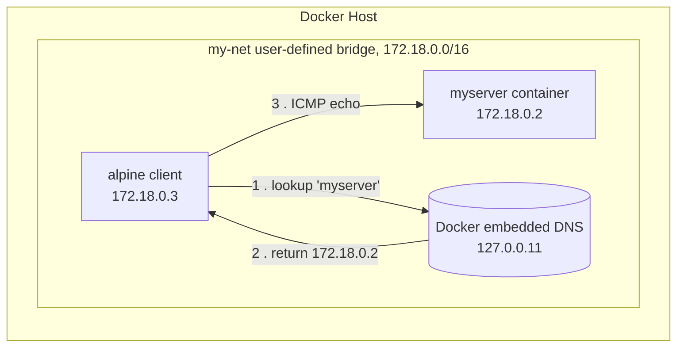

# Day 17: Docker Networking

> **Goal**: Use a user-defined bridge network so containers discover each other by name instead of by IP.
> **Prereqs**: Day 15–16 (`docker run`, images).

## 1. Scenario & Why It Matters

You have a `frontend` container that needs to call a `backend` container. The naive approach — inspect the backend, read its IP (`172.17.0.3`), hardcode it in frontend config — breaks the first time the backend restarts and gets `172.17.0.4`. This is exactly the problem DNS was invented to solve, and Docker ships a built-in DNS server for containers.

The catch: the *default* bridge network (`bridge`) does **not** have DNS-based service discovery. It's there for backwards compatibility and only supports discovery by legacy `--link` flags. Every real-world stack uses a **user-defined bridge network**, which enables automatic name-based DNS, better isolation, and per-network DNS policies.

In practice this is the same primitive Compose and Swarm build on top of. When you write `depends_on: - db` in a Compose file, Compose creates a user-defined bridge, joins every service to it, and registers each container under its service name. Understanding how that works at the `docker network` level makes Compose debugging obvious instead of magical.

## 2. Concept Deep-Dive

| Driver | Scope | DNS by name | Typical use |
|---|---|---|---|
| `bridge` (default) | single host | no | legacy only |
| user-defined `bridge` | single host | yes | dev / single-host prod |
| `host` | single host | n/a | bypass NAT, raw host ports |
| `overlay` | multi-host (Swarm/K8s) | yes | clusters |
| `none` | single host | n/a | airgap containers |



The embedded DNS resolver lives at `127.0.0.11` inside every container attached to a user-defined network. When you `ping myserver`, glibc's resolver hits that address, Docker answers with the current IP, and traffic flows over the bridge. If the server container restarts with a new IP, the DNS answer updates automatically — no config change needed.

## 3. Hands-On Mission

Create a user-defined bridge network:

```bash
docker network create my-net
```

Start a Nginx "server" on it:

```bash
docker run -d --name myserver --network my-net nginx
```

Inspect (optional):

```bash
docker network inspect my-net
```

## 4. Your Task — Answer

**Q:** Run this command and paste the output:

```bash
docker run --rm --network my-net alpine ping -c 4 myserver
```

**Sample answer**:

```
PING myserver (172.18.0.2): 56 data bytes
64 bytes from 172.18.0.2: seq=0 ttl=64 time=0.123 ms
64 bytes from 172.18.0.2: seq=1 ttl=64 time=0.081 ms
64 bytes from 172.18.0.2: seq=2 ttl=64 time=0.075 ms
64 bytes from 172.18.0.2: seq=3 ttl=64 time=0.079 ms

--- myserver ping statistics ---
4 packets transmitted, 4 packets received, 0% packet loss
round-trip min/avg/max = 0.075/0.089/0.123 ms
```

Notice that `myserver` resolved to a 172.18.x.x address — that's the `my-net` subnet, not the default bridge's 172.17.x.x. The alpine container only knows about the name because Docker's embedded DNS on 127.0.0.11 answered the lookup. If we had left out `--network my-net` and used the default bridge, the ping would have failed with `bad address 'myserver'`.

## 5. Q&A (Concepts Check)

**Q1: Why does name-based DNS not work on the default `bridge`?**
Historical reasons. The default bridge predates Docker's embedded DNS and supports only the legacy `--link` flag. Docker kept it around for compatibility but disabled auto-DNS on it. Always create your own.

**Q2: How does port mapping (`-p 8080:80`) differ from attaching to a network?**
`-p` publishes a container port to the **host's** network via iptables DNAT — it's how the outside world reaches the container. Joining a network lets containers on the same host reach each other *internally*, without a host port being occupied.

**Q3: Can a container be on multiple networks?**
Yes. Use `docker network connect <net> <container>` after `docker run`, or repeat `--network` in newer Docker. Common pattern: a reverse proxy on a `public` net plus each app's `private` net.

**Q4: What's an "overlay" network?**
A Swarm/Kubernetes-level driver that uses VXLAN encapsulation so containers across multiple hosts share a single L2 broadcast domain. Same DNS-by-name semantics, but the traffic is tunneled over UDP port 4789 between nodes.

**Q5: How would I debug "the app can't reach the DB by name"?**
Exec into the app: `docker exec -it app sh`. Run `cat /etc/resolv.conf` (should show `127.0.0.11`), `nslookup db`, then `nc -vz db 5432`. Ninety percent of the time the two containers are on different networks — `docker network inspect <net>` will confirm.

## 6. Further Reading

- [Docker networking overview](https://docs.docker.com/network/)
- [Embedded DNS server](https://docs.docker.com/network/#dns-services)
- Next: [Day 18: Volumes](./day18_volumes.md)
