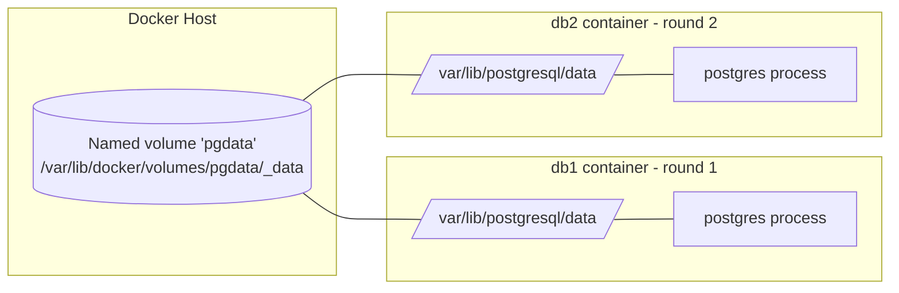

# Day 18: Volumes (Persistence)

> **Goal**: Make container data survive `docker rm` by mounting a named volume.
> **Prereqs**: Day 15–17 (images, networks).

## 1. Scenario & Why It Matters

Containers are **ephemeral** by design. Their filesystem is a thin writable layer on top of the immutable image; when the container is removed, that layer is discarded. For stateless apps (web servers, workers) this is wonderful — every restart is clean. For *stateful* workloads (Postgres, MySQL, Redis with AOF, uploaded user files) it is a ticking disaster.

The first time a junior engineer runs `docker-compose down` in production and realises the database volume was never configured, every row written since launch is gone. There is no undelete. The only defence is to put the data on a **volume** — a managed storage object whose lifecycle is *independent* of any container.

Docker supports two flavours: **named volumes** (managed by Docker under `/var/lib/docker/volumes/`, portable across containers) and **bind mounts** (a specific host path mounted into the container). Named volumes are the default for databases because Docker handles permissions, driver abstraction, and cross-platform quirks; bind mounts are better for live-reloading source code during development.

## 2. Concept Deep-Dive

| Mount type | Flag syntax | Managed by Docker? | Portable across hosts | Typical use |
|---|---|---|---|---|
| Named volume | `-v pgdata:/var/lib/postgresql/data` | yes | with driver plugins | databases, app state |
| Bind mount | `-v $(pwd)/src:/app/src` | no | no | dev hot-reload |
| tmpfs | `--tmpfs /tmp` | yes (RAM only) | n/a | secrets, scratch |



The volume is the constant. Containers come and go but the files on the host persist. When `db2` mounts the same `pgdata`, Postgres sees the data directory already initialised (WAL, tables, indexes) and picks up exactly where `db1` left off.

## 3. Hands-On Mission

Create the volume:

```bash
docker volume create pgdata
```

Start the database, mount the volume at Postgres's data directory:

```bash
docker run -d --name db1 \
  -e POSTGRES_PASSWORD=secret \
  -v pgdata:/var/lib/postgresql/data \
  postgres
```

Write data:

```bash
docker exec db1 psql -U postgres -c "CREATE TABLE important_stuff (id serial, name text);"
docker exec db1 psql -U postgres -c "INSERT INTO important_stuff (name) VALUES ('My Data Is Safe');"
```

Destroy the container:

```bash
docker rm -f db1
```

Start a **new** container with the **same** volume:

```bash
docker run -d --name db2 \
  -e POSTGRES_PASSWORD=secret \
  -v pgdata:/var/lib/postgresql/data \
  postgres
```

## 4. Your Task — Answer

**Q:** Check if the table exists in the new container:

```bash
docker exec db2 psql -U postgres -c "SELECT * FROM important_stuff;"
```

Paste the output.

**Sample answer**:

```
 id |      name
----+-----------------
  1 | My Data Is Safe
(1 row)
```

The row is there because Postgres's entire data directory — system catalogs, WAL, table heap files — lives on the `pgdata` volume, not inside the container's writable layer. When `db1` was removed, only the running process and its thin overlay were discarded. `db2` mounted the same volume at the same path, Postgres detected an initialised cluster, skipped initdb, and came up as a replica of the previous server's on-disk state.

## 5. Q&A (Concepts Check)

**Q1: Named volume vs bind mount — which for databases?**
Named volumes. Bind mounts tie you to a specific host path and often have UID/permissions mismatches on macOS/Windows. Named volumes are managed by Docker and portable across hosts with volume plugins.

**Q2: Where does data physically live on a Linux host?**
`/var/lib/docker/volumes/<name>/_data`. You can `sudo ls` there to see raw files, but prefer `docker run --rm -v <vol>:/data alpine ls /data` so you don't trip over root-only paths.

**Q3: What happens if I mount a volume into a non-empty image directory?**
On a *named* volume's first use, Docker copies the image's existing files into the volume so the app still finds its defaults. On subsequent mounts and for bind mounts, the host contents shadow the image contents — which is how you overwrite `nginx.conf` etc.

**Q4: How do I back up a volume?**
Run a throwaway container that tars the volume into a bind-mounted host path:

```bash
docker run --rm -v pgdata:/src -v $(pwd):/dst alpine \
  tar czf /dst/pgdata.tgz -C /src .
```

**Q5: Does `docker volume prune` delete my data?**
It deletes volumes *not referenced by any container* (including stopped ones). That includes orphaned named volumes. Always label important volumes and use `docker volume ls -f dangling=true` to preview before pruning.

## 6. Further Reading

- [Use volumes](https://docs.docker.com/storage/volumes/)
- [Storage drivers](https://docs.docker.com/storage/storagedriver/)
- Next: [Day 19: Docker Compose](./day19_docker-compose.md)
