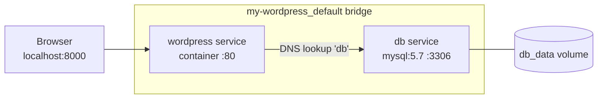

# Day 19: Docker Compose (The Orchestrator)

> **Goal**: Define a multi-container application declaratively in one YAML file and launch it with a single command.
> **Prereqs**: Day 15–18 (Dockerfiles, networks, volumes).

## 1. Scenario & Why It Matters

A real application is rarely one container. A typical stack has an app, a database, a cache, maybe a queue and a reverse proxy — five to ten moving pieces, each with its own flags, volumes, environment variables, and network connections. Starting them manually with `docker run` is tedious, error-prone, and non-reproducible; the next engineer to join the project has no way of knowing which flags you actually used.

Docker Compose solves this by making the *entire topology* a single declarative artifact: `docker-compose.yml`. You describe every service, its image (or build context), its ports, volumes, env vars, dependencies, and networks. Then `docker compose up` stands the whole thing up, creates a dedicated network, wires names to containers, and attaches logs. `docker compose down` tears it all back down.

Compose is the *local dev* and *small-team single-host* equivalent of Kubernetes. It doesn't scale across hosts (that's Swarm/K8s), but for 90% of developer workflows — running your app plus its infra dependencies on your laptop — it's the right tool, and its YAML shape is intentionally similar enough to K8s that skills transfer.

## 2. Concept Deep-Dive

A Compose file has three top-level keys that matter: `services`, `volumes`, and `networks`. Each service becomes one container (or more with `deploy.replicas`). Compose auto-creates a bridge network named `<project>_default` and registers every service under its key, so `wordpress` can reach the DB as simply `db:3306`.

| Compose concept | Equivalent `docker run` flag | Notes |
|---|---|---|
| `image:` / `build:` | `docker build && docker run <image>` | one or the other per service |
| `ports:` | `-p` | host:container |
| `volumes:` | `-v` | supports named, bind, tmpfs |
| `environment:` | `-e` / `--env-file` | supports `${VAR}` interpolation |
| `depends_on:` | ordering only | not a readiness check (see Day 20) |
| `restart:` | `--restart` | `no`, `always`, `on-failure`, `unless-stopped` |



Compose builds the image for any service with a `build:` key, pulls the rest, creates the named volumes and the bridge, then starts containers in dependency order.

## 3. Hands-On Mission

```bash
mkdir my-wordpress && cd my-wordpress
```

Create `docker-compose.yml`:

```yaml
version: '3.8'

services:
  db:
    image: mysql:5.7
    volumes:
      - db_data:/var/lib/mysql
    restart: always
    environment:
      MYSQL_ROOT_PASSWORD: somewordpress
      MYSQL_DATABASE: wordpress
      MYSQL_USER: wordpress
      MYSQL_PASSWORD: wordpress

  wordpress:
    depends_on:
      - db
    image: wordpress:latest
    ports:
      - "8000:80"
    restart: always
    environment:
      WORDPRESS_DB_HOST: db:3306
      WORDPRESS_DB_USER: wordpress
      WORDPRESS_DB_PASSWORD: wordpress
      WORDPRESS_DB_NAME: wordpress

volumes:
  db_data:
```

Launch the stack:

```bash
docker compose up -d
```

*(older Docker: `docker-compose up -d` with a hyphen).*

## 4. Your Task — Answer

**Q:** Run the stack, wait ~30 seconds for MySQL to initialize, then hit the site. Paste the output of `curl -I localhost:8000`.

**Sample answer**:

```
$ curl -I localhost:8000
HTTP/1.1 302 Found
Date: Sat, 18 Apr 2026 12:00:00 GMT
Server: Apache/2.4.57 (Debian)
X-Powered-By: PHP/8.2.10
Location: http://localhost:8000/wp-admin/install.php
Content-Type: text/html; charset=UTF-8
```

The `302 Found` to `/wp-admin/install.php` proves WordPress PHP is running *and* is able to connect to MySQL — if the DB connection failed, WordPress would return a 500 "Error establishing a database connection". Name resolution worked because Compose's auto-generated `my-wordpress_default` bridge registered the `db` service under that exact hostname, which is what `WORDPRESS_DB_HOST: db:3306` expects.

## 5. Q&A (Concepts Check)

**Q1: Why can I reach MySQL as `db` from the `wordpress` service but not from my laptop?**
Compose creates an internal bridge network where service names are DNS-resolvable. That network is not exposed to the host unless you add a `ports:` mapping. From your laptop you'd have to hit `localhost:3306` *and* publish port 3306 explicitly.

**Q2: What does `depends_on` actually guarantee?**
Only start ordering — `db` begins starting before `wordpress`. It does **not** wait for MySQL to be ready to accept queries, which is why many apps crash on the first boot. Day 20 fixes this with healthchecks.

**Q3: Where does the `db_data` volume live?**
Under `/var/lib/docker/volumes/my-wordpress_db_data/_data`. Compose prefixes volume names with the project (folder) name to avoid collisions between projects.

**Q4: Difference between `docker compose down` and `docker compose stop`?**
`stop` halts containers; `down` removes them, the network, and (optionally with `-v`) the volumes. Never run `down -v` on a production-like stack without a backup.

**Q5: Can I override values for different environments?**
Yes. Compose merges `docker-compose.yml` with `docker-compose.override.yml` automatically for local dev, or with `-f prod.yml` for explicit environments. Keep the base file generic and override ports/images per environment.

## 6. Further Reading

- [Compose file reference](https://docs.docker.com/compose/compose-file/)
- [Networking in Compose](https://docs.docker.com/compose/networking/)
- Next: [Day 20: Compose in Production](./day20_compose-production.md)
