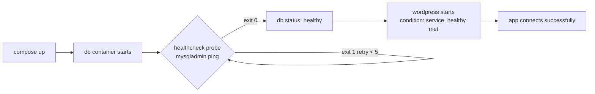

# Day 20: Compose for Production

> **Goal**: Harden a Compose stack with real readiness gates (healthchecks) and externalised secrets (`.env`).
> **Prereqs**: Day 19 (Compose basics, `depends_on`).

## 1. Scenario & Why It Matters

Day 19's stack works on your laptop and falls over the moment it hits a slightly slower machine. The reason: `depends_on` is a *start-order* hint, not a *readiness* gate. It waits for the DB container's process to begin, not for MySQL to finish `initdb`, read `ibdata1`, and open the TCP socket. If the app container starts polling before that (which it will — Compose is fast), it crashes on `Connection refused` and `restart: always` quietly papers over it until the DB catches up.

In production this race shows up as flapping containers on deploy, 60-second outages on node reboot, and unexplained alerts at 3 AM. The fix is to define a **healthcheck** on the database (a command that returns 0 only when MySQL answers queries), and change the app's dependency to `condition: service_healthy` so Compose blocks until the DB actually works.

The other production gap is secrets. The Day 19 file has `MYSQL_ROOT_PASSWORD: somewordpress` in plaintext YAML — which ends up in Git, logs, and `docker inspect`. The universal fix is to move every secret into a `.env` file (git-ignored) and reference it as `${MYSQL_ROOT_PASSWORD}` in the Compose file. This is the minimum bar; Swarm/K8s add first-class `secrets` primitives on top.

## 2. Concept Deep-Dive

A healthcheck is a probe Compose (or any container runtime) runs periodically inside the container. The container status becomes `starting` → `healthy` → `unhealthy` based on exit codes.

| Parameter | Meaning | Sensible default |
|---|---|---|
| `test` | Command to run | `["CMD", "mysqladmin", "ping", "-h", "localhost"]` |
| `interval` | Time between probes | 10s |
| `timeout` | How long to wait per probe | 5s |
| `retries` | Consecutive failures → unhealthy | 5 |
| `start_period` | Grace window at boot (no failures counted) | 30s for DBs |



For secrets, Compose auto-loads a file named `.env` from the project directory and substitutes `${VAR}` tokens. Values never appear in the YAML on disk, so commits are safe as long as `.env` is in `.gitignore`.

## 3. Hands-On Mission

`.env` (never commit this):

```bash
MYSQL_ROOT_PASSWORD=supersecretkey
MYSQL_USER=wordpress
MYSQL_PASSWORD=wordpress
```

`docker-compose.yml` (replaces Day 19's):

```yaml
version: '3.8'

services:
  db:
    image: mysql:5.7
    volumes:
      - db_data:/var/lib/mysql
    restart: always
    environment:
      MYSQL_ROOT_PASSWORD: ${MYSQL_ROOT_PASSWORD}
      MYSQL_DATABASE: wordpress
      MYSQL_USER: ${MYSQL_USER}
      MYSQL_PASSWORD: ${MYSQL_PASSWORD}
    healthcheck:
      test: ["CMD", "mysqladmin", "ping", "-h", "localhost"]
      interval: 10s
      timeout: 5s
      retries: 5

  wordpress:
    depends_on:
      db:
        condition: service_healthy
    image: wordpress:latest
    ports:
      - "8000:80"
    restart: always
    environment:
      WORDPRESS_DB_HOST: db:3306
      WORDPRESS_DB_USER: ${MYSQL_USER}
      WORDPRESS_DB_PASSWORD: ${MYSQL_PASSWORD}
      WORDPRESS_DB_NAME: wordpress

volumes:
  db_data:
```

Relaunch:

```bash
docker compose down
docker compose up -d
docker ps
```

## 4. Your Task — Answer

**Q:** Run `docker ps`. Look at the **STATUS** column for the `db` container. Initially it will say `(health: starting)`. Wait 10–20 seconds. Paste the output when it changes to `(health: healthy)`.

**Sample answer**:

```
CONTAINER ID   IMAGE              STATUS                   NAMES
3c8f1a2b9d44   wordpress:latest   Up 18s                   my-wordpress-wordpress-1
7a1e2f9c5b12   mysql:5.7          Up 22s (healthy)         my-wordpress-db-1
```

The `(healthy)` tag means Compose ran `mysqladmin ping` inside the DB container and it got `mysqld is alive` back — proving MySQL is accepting queries, not just that the process is alive. Only at that point was the `wordpress` service allowed to start (`condition: service_healthy`), which is why the app container's age (18s) is lower than the DB's (22s). In the old `depends_on` world those would have been flipped and the app would have hit `ECONNREFUSED` on first boot.

## 5. Q&A (Concepts Check)

**Q1: What's the practical difference between `depends_on: [db]` and `depends_on: db: condition: service_healthy`?**
The first only sequences start order; the app may hit a not-yet-ready DB. The second blocks the dependent service until the DB's healthcheck passes, so the app starts into a working environment. The latter requires the `db` service to declare a `healthcheck:`.

**Q2: Is `.env` a real secrets solution for production?**
No — it's the bare minimum to keep passwords out of Git. `.env` is still a plaintext file on disk readable by any process that can read your repo. Real production uses Docker Swarm secrets, Kubernetes Secrets + KMS, AWS Secrets Manager, or Vault, with the secret mounted as a tmpfs file or injected at runtime.

**Q3: Why `start_period` on a DB healthcheck?**
MySQL/Postgres can take 10–30 seconds to initialize on first boot. Without `start_period`, the first few failed probes count against `retries` and the container flips to `unhealthy` before it ever had a chance. `start_period: 30s` gives it a grace window where failures don't count.

**Q4: The app still crashes once a month when the DB restarts — why, and what fixes it?**
A running app doesn't re-consult `depends_on` after boot. If the DB disappears mid-request, the app sees connection errors. The fix is application-level retry/reconnect logic (e.g. a connection pool with retry) plus `restart: unless-stopped` on the app. Startup ordering ≠ runtime resilience.

**Q5: How would I know my healthcheck itself is broken?**
`docker inspect --format='{{json .State.Health}}' <container>` shows the last N probe exits and their stdout/stderr. If every probe is timing out, `timeout` is too short or the probe command is wrong (e.g. `mysqladmin` missing from the image).

## 6. Further Reading

- [Healthchecks in Compose](https://docs.docker.com/compose/compose-file/05-services/#healthcheck)
- [Environment files](https://docs.docker.com/compose/environment-variables/env-file/)
- Next: [Day 21: Weekly Challenge](./day21_weekly-challenge.md)
