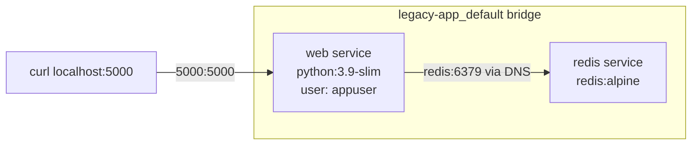

# Day 21: Weekly Challenge — The Legacy Migration

> **Goal**: Ship a "works on my laptop" Flask + Redis app as a secure, reproducible Docker Compose stack.
> **Prereqs**: All of Week 3 (Dockerfiles, multi-stage ideas, networking, volumes, Compose).

## 1. Scenario & Why It Matters

You just joined a startup. The lead engineer hands you a Python Flask app that "only runs on his laptop" and says: *"I need this running in Docker by end of day. It uses Redis to count hits. Make sure it's secure."* This is the single most common task a new DevOps hire is given in their first week — take something that works on one machine and make it work anywhere, for anyone, reproducibly.

The challenge combines every concept from Week 3. You need a `Dockerfile` that installs deps efficiently and drops root (Day 15). You need inter-container DNS so Flask can find Redis by hostname (Day 17). You need Compose to tie the two services together and recreate the stack with one command (Day 19). And implicitly you need to think about what *doesn't* need to persist (this counter is Redis-in-memory, so no volume) vs. what would.

The business value is not the 20 lines of Python. It's the consequence: next time the app needs to run on a teammate's machine, on CI, on a staging server, or on a prod node, the answer is `git clone && docker compose up`. That reproducibility is the entire reason containers exist.

## 2. Concept Deep-Dive

The target topology:



Key decisions for this stack:

| Concern | Choice | Why |
|---|---|---|
| Base image | `python:3.9-slim` | small, CVE-light, has pip |
| User | dedicated `appuser` | non-root per Day 15 |
| Service names | `web` and `redis` | Python code hardcodes `host='redis'` |
| Networking | Compose default bridge | auto DNS by service name |
| Persistence | none for Redis | counter is demo-only; add a volume if required |
| Build vs image | `build:` for web, `image:` for redis | web has our Dockerfile; redis is upstream |

## 3. Hands-On Mission

Create a folder `legacy-app` and put these files in it.

`requirements.txt`:

```
flask
redis
```

`app.py`:

```python
from flask import Flask
from redis import Redis
import os

app = Flask(__name__)
redis = Redis(host='redis', port=6379)

@app.route('/')
def hello():
    count = redis.incr('hits')
    return 'Hello World! I have been seen {} times.\n'.format(count)

if __name__ == "__main__":
    app.run(host="0.0.0.0", port=5000)
```

`Dockerfile`:

```dockerfile
FROM python:3.9-slim

RUN groupadd -r appgroup && useradd -r -g appgroup appuser

WORKDIR /app

COPY requirements.txt .
RUN pip install --no-cache-dir -r requirements.txt

COPY . .
RUN chown -R appuser:appgroup /app

USER appuser

EXPOSE 5000
CMD ["python", "app.py"]
```

`docker-compose.yml`:

```yaml
version: '3.8'

services:
  web:
    build: .
    ports:
      - "5000:5000"
    depends_on:
      - redis

  redis:
    image: redis:alpine
```

Build and launch:

```bash
docker compose up --build -d
curl localhost:5000
curl localhost:5000
```

## 4. Your Task — Answer

**Q:** Write `Dockerfile` and `docker-compose.yml`, run `docker compose up --build -d`, then hit the endpoint twice with `curl localhost:5000` to confirm the counter increments.

**Sample answer**:

```
$ curl localhost:5000
Hello World! I have been seen 1 times.
$ curl localhost:5000
Hello World! I have been seen 2 times.
```

The counter advancing proves four things at once:

1. Flask started inside the `web` container and published port 5000 to the host.
2. Docker Compose created the default bridge network and registered `redis` as a resolvable DNS name, so `Redis(host='redis', port=6379)` found the server.
3. Redis `INCR` persisted the key `hits` between requests (in-memory, but same process).
4. The `web` container is running as `appuser`, not root — verifiable with `docker compose exec web whoami`.

If you need the counter to survive `docker compose down`, add:

```yaml
  redis:
    image: redis:alpine
    command: ["redis-server", "--appendonly", "yes"]
    volumes:
      - redis_data:/data

volumes:
  redis_data:
```

## 5. Q&A (Concepts Check)

**Q1: Why does the Python code say `host='redis'` instead of `localhost` or an IP?**
Each container has its own network namespace — `localhost` inside `web` is `web` itself, not Redis. On the Compose bridge the service name `redis` resolves via Docker DNS to the current Redis container IP, which is resilient to restarts.

**Q2: Why `COPY requirements.txt .` before `COPY . .`?**
Layer-cache optimisation. If only app code changes, Docker reuses the cached `pip install` layer and rebuilds in seconds. If you copy everything first, every code change invalidates the install layer and forces a full reinstall.

**Q3: The challenge doesn't ask for a Redis volume — why?**
The demo counter is a visitor stat; losing it on restart is acceptable. A real app with important state in Redis (sessions, queues, cached user data with long TTLs) would need a named volume *and* `--appendonly yes` or RDB snapshots.

**Q4: What would change if we used `redis:latest` instead of `redis:alpine`?**
Image goes from ~40 MB to ~120 MB and base OS from Alpine (musl) to Debian (glibc). For Redis specifically there's no functional difference, so Alpine wins on pull speed and CVE count.

**Q5: How would I make this production-ready (beyond this challenge)?**
Pin image digests (`python:3.9-slim@sha256:…`), run `pip install` as a non-root build user, add a `healthcheck` on both services, move Flask behind `gunicorn` (`CMD ["gunicorn", "-b", "0.0.0.0:5000", "app:app"]`) so you're not serving prod traffic with the dev server, and put Redis credentials + TLS in front if it ever leaves localhost.

## 6. Further Reading

- [Awesome Compose examples](https://github.com/docker/awesome-compose)
- [12-factor app methodology](https://12factor.net/)
- Next: Week 4 — CI/CD foundations.
