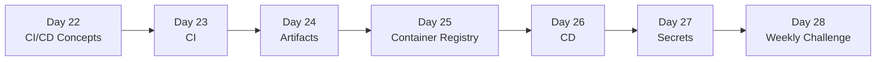

# Week 4 — CI/CD with GitHub Actions

> Continuous Integration + Continuous Delivery: every push runs tests, builds an artifact, and ships it automatically — with secrets handled safely.

## Roadmap

## Index

- [Day 22 — CI/CD Concepts (workflow, job, step, runner)](day22_cicd-concepts.md)
- [Day 23 — CI: Tests and Linting on Every Push](day23_ci.md)
- [Day 24 — Building Artifacts (wheel, jar, binary, tarball)](day24_building-artifacts.md)
- [Day 25 — Container Registry (GHCR, tags, immutability)](day25_container-registry.md)
- [Day 26 — CD: Deploying Automatically](day26_cd.md)
- [Day 27 — Secrets Management (GitHub Secrets, OIDC)](day27_secrets-management.md)
- [Day 28 — Weekly Challenge: Full Pipeline](day28_weekly-challenge.md)

## Related resources

Code for the weekly challenge lives in [`Resources/Week4/weekly_challenge/`](../../Resources/Week4/weekly_challenge/).
