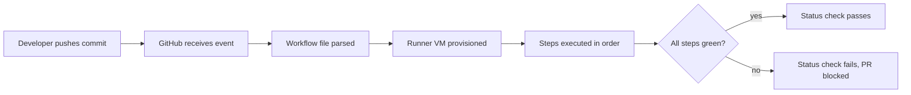

# Day 22: CI/CD Concepts & Your First GitHub Actions Workflow

> **Goal**: Understand the core vocabulary of CI/CD and ship a first GitHub Actions workflow that runs on every push.
> **Prereqs**: Git basics (Week 1), a GitHub account, and comfort editing YAML.

## 1. Scenario & Why It Matters

Every time a developer pushes code, two questions must be answered fast: "is this change safe to merge?" and "is this change safe to ship?". Doing that manually does not scale — humans forget steps, skip tests under deadline pressure, and introduce drift between what "works on my machine" and what actually runs in production. **CI (Continuous Integration)** automates the first question by running tests and quality gates on every commit. **CD (Continuous Delivery/Deployment)** automates the second by packaging and shipping the artifact to an environment.

GitHub Actions is the platform-native CI/CD engine on GitHub. Workflows live next to your code in `.github/workflows/*.yml`, version-controlled like everything else, so the pipeline evolves with the app. Pipelines are composed of a small, fixed vocabulary — **workflow**, **event**, **job**, **step**, and **runner** — and once you internalize those five words, every example you see on the internet becomes readable.

Today's mission is deliberately boring: a "hello world" workflow. Getting a trivial job to go green proves that your repo is wired correctly, teaches the file layout, and gives you a baseline to extend in the next six days.

## 2. Concept Deep-Dive

A **workflow** is a YAML file that GitHub reads when an **event** happens (push, pull_request, schedule, manual dispatch). The workflow contains one or more **jobs**; each job runs on a **runner** (a fresh VM that GitHub allocates) and executes an ordered list of **steps**. A step is either a shell command (`run:`) or a reusable action pulled from the marketplace (`uses:`).



Jobs by default run **in parallel**, isolated from each other. Sequencing is opt-in via `needs:`. Steps inside a job run **sequentially**, sharing the same filesystem and environment.

## 3. Hands-On Mission

Create a public repo `devops-lab`, clone it, and add the workflow.

```bash
mkdir -p .github/workflows
```

`.github/workflows/hello.yml`:

```yaml
name: First Pipeline

on: [push]

jobs:
  say-hello:
    runs-on: ubuntu-latest
    steps:
      - name: Checkout Code
        uses: actions/checkout@v3

      - name: Run a Script
        run: echo "Hello DevOps World! The date is $(date)"

      - name: List Files
        run: ls -la
```

Commit and push:

```bash
git add .
git commit -m "Add workflow"
git push origin main
```

Open the **Actions** tab on GitHub, click the run, and expand the "Run a Script" step.

## 4. Your Task — Answer

**Q:** Push the workflow, open Actions → First Pipeline → say-hello → "Run a Script", and paste the exact output text you see.

**Sample answer**: The log shows something like `Hello DevOps World! The date is Sat Apr 18 10:22:41 UTC 2026`. The string `$(date)` was evaluated by the runner's shell, not echoed literally, because `run:` uses `bash -c` by default, which performs command substitution before the `echo` executes.

## 5. Q&A (Concepts Check)

**Q1. What is the difference between a job and a step?**
A job is an isolated execution unit that gets its own runner VM. A step is an action or shell command that runs inside a job, sharing the runner's filesystem with sibling steps.

**Q2. Why does `actions/checkout` exist — isn't the code already there?**
No. The runner is a blank VM. `actions/checkout` clones your repo into the working directory so subsequent steps can read your source code.

**Q3. What does `on: [push]` do, and how would you also trigger on pull requests?**
`on:` defines the events that start the workflow. Use `on: [push, pull_request]` or the expanded form with `branches:` filters to scope it.

**Q4. If two jobs have no `needs:` relationship, what is their execution order?**
They run in parallel on separate runners. Order is not guaranteed.

**Q5. Why keep workflow files inside the repository instead of configuring them in a GitHub UI?**
Pipeline-as-code: the workflow is versioned, code-reviewed, branchable, and reproducible. Rolling back a bad pipeline change is just `git revert`.

## 6. Further Reading

- GitHub Actions documentation: [docs.github.com/actions](https://docs.github.com/actions)
- Next: [Day 23 — Continuous Integration](./day23_ci.md)
