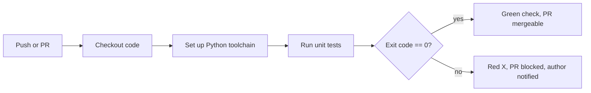

# Day 23: Continuous Integration — The Gatekeeper

> **Goal**: Make the pipeline actually useful by running unit tests and blocking bad code on failure.
> **Prereqs**: [Day 22](./day22_cicd-concepts.md) — workflow file layout and vocabulary.

## 1. Scenario & Why It Matters

Printing "hello" on every push is cute, but it does not protect the `main` branch. The real job of CI is to act as a **gatekeeper**: when someone opens a pull request or pushes a commit, the pipeline must run the test suite, and if anything fails the commit is marked red so the change cannot merge. This is how teams of 5, 50, or 500 engineers keep the build green without stepping on each other.

CI gives you a feedback loop measured in minutes instead of hours. A broken test failing in CI five minutes after the push is cheap to fix — the author still has the context in their head. The same bug caught a week later in staging is 10x more expensive, and caught in production 100x more. The whole discipline is about shortening that loop.

Today we simulate that loop end to end: we write a tiny Python function, add a test that is intentionally wrong, watch the pipeline turn red, fix the test, and watch it turn green.

## 2. Concept Deep-Dive

A CI job is an ordered pipeline of **gates**. The first gate that fails short-circuits the rest: if tests fail, don't bother linting; if linting fails, don't bother building. Each gate produces an **exit code** — zero means pass, non-zero means fail — and GitHub Actions treats any non-zero exit as a failed step, which fails the job, which fails the workflow, which turns the commit's status check red.



Classic CI stages: **checkout → install toolchain → install deps → lint → test → report**. The setup actions (`actions/setup-python`, `actions/setup-node`) provision a matching runtime on the runner. The test command must be chosen so a real failure returns a non-zero exit — `python -m unittest` does this for free.

## 3. Hands-On Mission

Create `app.py`:

```python
def add(a, b):
    return a + b
```

Create `test_app.py` — with a planted bug so we can watch CI fail:

```python
import unittest
from app import add

class TestApp(unittest.TestCase):
    def test_add(self):
        self.assertEqual(add(2, 3), 5)
        self.assertEqual(add(10, 10), 0)  # intentional bug
```

Replace `.github/workflows/hello.yml`:

```yaml
name: CI Pipeline

on: [push]

jobs:
  test-code:
    runs-on: ubuntu-latest
    steps:
      - name: Checkout Code
        uses: actions/checkout@v3

      - name: Set up Python
        uses: actions/setup-python@v4
        with:
          python-version: '3.9'

      - name: Run Tests
        run: python -m unittest test_app.py
```

Push, watch it go red, then fix `0` → `20` and push again.

```bash
git add . && git commit -m "Add tests" && git push origin main
```

## 4. Your Task — Answer

**Q:** After fixing the bug, paste the specific line from the final successful log that says how many tests ran (e.g. `Ran X tests in 0.00Xs`).

**Sample answer**: `Ran 1 tests in 0.000s`. `unittest` counts **test methods**, not assertions — the file has one method (`test_add`) that happens to hold two `assertEqual` calls, so the reported count is `1`. This is a common interview gotcha: coverage and test count are method-level, not assertion-level.

## 5. Q&A (Concepts Check)

**Q1. Why must a failing test produce a non-zero exit code?**
Because GitHub Actions (and every CI system) determines pass/fail purely from the step's exit code. A test framework that prints "FAIL" but exits zero would be silently ignored.

**Q2. What is the purpose of `actions/setup-python@v4`?**
It installs the requested Python version on the runner and puts it first in `PATH`. Without it you get whatever Python the Ubuntu image happens to ship with.

**Q3. When would you prefer `pytest` over the built-in `unittest`?**
`pytest` gives cleaner assertions (`assert x == y`), fixtures, parametrization, and rich plugin ecosystem (coverage, xdist, html reports). `unittest` wins when you need zero external dependencies.

**Q4. How do you make the CI status a required check before merging?**
In GitHub: Settings → Branches → Branch protection rules → `main` → require status checks → select the workflow's job name.

**Q5. Why run CI on both `push` and `pull_request` events?**
`pull_request` catches changes coming in from forks and shows status on the PR. `push` catches direct commits to branches. Many teams use both for full coverage.

**Q6. Your test passes locally but fails in CI. What are the top three suspects?**
Different language/dependency versions, environment variables not set on the runner, and files that exist locally but aren't committed (missing from the repo).

## 6. Further Reading

- `unittest` docs: [docs.python.org/3/library/unittest.html](https://docs.python.org/3/library/unittest.html)
- Next: [Day 24 — Building Artifacts](./day24_building-artifacts.md)
