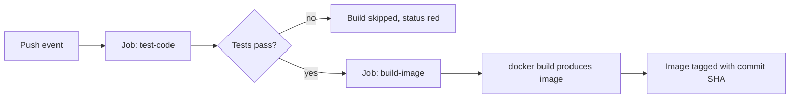

# Day 24: Building Artifacts — From Source to Shippable

> **Goal**: Extend the pipeline to produce a deployable Docker image after tests pass, using job dependencies.
> **Prereqs**: [Day 23](./day23_ci.md) — a green test job; basic Dockerfile knowledge (Week 3).

## 1. Scenario & Why It Matters

Tests passing is necessary but not sufficient: you cannot deploy a folder of `.py` files. Real deployment requires an **artifact** — a self-contained, versioned package you can hand to a runtime. Depending on the stack it might be a JAR, a tarball, a zipped bundle, or (most commonly today) a Docker image. Today we build a Docker image as the artifact.

The key architectural idea is **dependency between jobs**. Jobs in GitHub Actions run in parallel by default; that is great for speed but wrong for "build only if tests pass". The `needs:` keyword converts the DAG from parallel to sequential at specific edges. This gives you a cheap quality gate: if the test job is red, the build job is skipped entirely, saving minutes of runner time and — more importantly — preventing a broken artifact from being tagged with a commit SHA.

Tagging artifacts with `${{ github.sha }}` turns your registry into a time machine. Any deployed image can be traced back to the exact commit that produced it, which is essential for rollbacks, incident response, and audits.

## 2. Concept Deep-Dive

A GitHub Actions workflow is a **DAG of jobs**. Each job is an isolated runner with its own filesystem; artifacts do not flow automatically between them. If job B needs something job A produced, you either (a) rebuild it, (b) persist it to `actions/upload-artifact`, or (c) push it to an external store (registry, S3, etc.).



Two patterns worth knowing:

- **Fan-in**: `needs: [lint, test, typecheck]` — build only after three parallel gates pass.
- **Fan-out**: one build job feeds multiple deploy jobs for staging/prod/canary.

Today we use the simplest: a two-node chain, `test-code → build-image`.

## 3. Hands-On Mission

Create `Dockerfile`:

```dockerfile
FROM python:3.9-slim
WORKDIR /app
COPY app.py .
CMD ["python", "-c", "import app; print(app.add(5,5))"]
```

Overwrite `.github/workflows/hello.yml`:

```yaml
name: CI Pipeline

on: [push]

jobs:
  test-code:
    runs-on: ubuntu-latest
    steps:
      - name: Checkout
        uses: actions/checkout@v3
      - name: Setup Python
        uses: actions/setup-python@v4
        with:
          python-version: '3.9'
      - name: Run Tests
        run: python -m unittest test_app.py

  build-image:
    needs: test-code
    runs-on: ubuntu-latest
    steps:
      - name: Checkout
        uses: actions/checkout@v3

      - name: Build Docker Image
        run: docker build -t my-app:${{ github.sha }} .

      - name: Verify Build
        run: docker images
```

Push and watch the graph in the Actions tab show two connected circles.

## 4. Your Task — Answer

**Q:** Click into `build-image` → "Verify Build" and paste the size of the `my-app` image.

**Sample answer**: Around **125 MB**. The image is `python:3.9-slim` (~120 MB) plus a ~1 KB `app.py`, so the final size is dominated by the base image. Switching to `python:3.9-alpine` would drop it to roughly 50 MB at the cost of slower `pip install` for C-extension packages (no prebuilt wheels for musl).

## 5. Q&A (Concepts Check)

**Q1. What happens to an image built on the runner after the job ends?**
The runner VM is destroyed, and with it the image. That's why tomorrow's step is pushing to a registry.

**Q2. Why tag the image with `github.sha` instead of only `latest`?**
`latest` is mutable — it points at whatever was built most recently. A SHA tag is immutable, which lets you pin deployments, roll back to a known good build, and trace any running container to its source commit.

**Q3. What does `needs: test-code` actually enforce?**
It adds an edge in the workflow DAG: `build-image` will not even start until `test-code` reports success. If `test-code` fails, `build-image` is marked skipped.

**Q4. Why doesn't the `build-image` job see the Python packages installed by `test-code`?**
Because each job runs on a fresh, separate runner VM. Nothing is shared implicitly. If you need outputs between jobs, use `actions/upload-artifact` or push to external storage.

**Q5. How could you make the build step faster on repeated pushes?**
Enable Docker layer caching — either via `actions/cache` on the buildx cache directory or by using `docker/build-push-action` with its built-in cache-from/cache-to support.

## 6. Further Reading

- Dockerfile best practices: [docs.docker.com/develop/develop-images/dockerfile_best-practices](https://docs.docker.com/develop/develop-images/dockerfile_best-practices/)
- Next: [Day 25 — Container Registry](./day25_container-registry.md)
