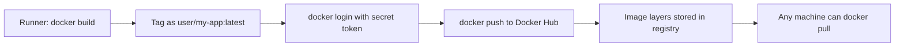

# Day 25: Container Registry — The Warehouse

> **Goal**: Push the image built by CI to Docker Hub so it survives the runner shutdown and can be deployed from anywhere.
> **Prereqs**: [Day 24](./day24_building-artifacts.md) — a working build job; a Docker Hub account.

## 1. Scenario & Why It Matters

Yesterday's pipeline built an image, but the image lived and died on the ephemeral runner VM. To deploy to a server, the server needs somewhere to **pull** the image from. That "somewhere" is a **container registry** — a network-accessible warehouse of immutable image layers addressed by `<registry>/<namespace>/<name>:<tag>`.

Docker Hub is the default public registry. In production you'd likely use GHCR, ECR, GCR, ACR, or a self-hosted Harbor/Artifactory — the workflow is identical, only the host and auth provider change. The registry is where the CI and CD halves of the pipeline meet: CI writes, CD reads.

The registry step is also your first encounter with **secrets in CI**. You cannot paste a password into a YAML file in a public repo — it would be scraped by bots within minutes. GitHub Secrets solve this by storing encrypted values that are injected into the runner as environment variables at run time, with the values automatically redacted (`***`) from logs.

## 2. Concept Deep-Dive

A registry push is three logical steps: **authenticate**, **tag the image with the registry path**, then **push**. Authentication for Docker Hub uses a username plus a **personal access token** (prefer tokens over your real password — they are scoped and revocable).



GitHub Secrets scope:

- **Repository secrets** — visible to workflows in that repo only.
- **Environment secrets** — gated behind an environment (e.g., `production`) with optional approvers.
- **Organization secrets** — shared across repos under policy.

Reference them in YAML as `${{ secrets.NAME }}`. The value is injected into the step's environment and scrubbed from logs, but it is **not** magic: if your script echoes a secret into a file and uploads it as an artifact, it will leak. Secrets protect transport, not misuse.

## 3. Hands-On Mission

**Set up secrets** in the repo: Settings → Secrets and variables → Actions → New repository secret.

- `DOCKER_USERNAME` — your Docker Hub username.
- `DOCKER_PASSWORD` — a Docker Hub access token (from hub.docker.com → Account Settings → Security).

Update `.github/workflows/hello.yml`:

```yaml
name: CI Pipeline

on: [push]

jobs:
  test-code:
    runs-on: ubuntu-latest
    steps:
      - name: Checkout
        uses: actions/checkout@v3
      - name: Setup Python
        uses: actions/setup-python@v4
        with:
          python-version: '3.9'
      - name: Run Tests
        run: python -m unittest test_app.py

  build-and-push:
    needs: test-code
    runs-on: ubuntu-latest
    steps:
      - name: Checkout
        uses: actions/checkout@v3

      - name: Login to Docker Hub
        uses: docker/login-action@v2
        with:
          username: ${{ secrets.DOCKER_USERNAME }}
          password: ${{ secrets.DOCKER_PASSWORD }}

      - name: Build and Push
        run: |
          docker build -t ${{ secrets.DOCKER_USERNAME }}/my-app:latest .
          docker push ${{ secrets.DOCKER_USERNAME }}/my-app:latest
```

Commit, push, wait for green, then visit `hub.docker.com` → Repositories.

## 4. Your Task — Answer

**Q:** After the workflow turns green, check Docker Hub for `my-app` and paste the "Last updated" time shown on the tag.

**Sample answer**: Something like `a few seconds ago` or `less than a minute ago`. The timestamp is driven by the image **manifest** upload completion, not the `docker build` time — so it reflects when the push finished, which lines up with when the workflow's final step succeeded.

## 5. Q&A (Concepts Check)

**Q1. Why use a Docker Hub access token instead of your account password?**
Tokens are scoped (read, write, delete) and individually revocable. If a runner is compromised, you revoke the one token without changing your account password or affecting other CI systems.

**Q2. What does `${{ secrets.DOCKER_PASSWORD }}` evaluate to in the log output?**
It is masked as `***`. GitHub scans step output for known secret values and replaces them. This is a safety net, not a guarantee — base64 or modified forms of the secret are not masked.

**Q3. Can a pull request from a fork access your repository secrets?**
No. For security, pull_request events from forks run with an empty secret context. That's why secret-using jobs are typically gated to `push` on trusted branches or to `pull_request_target` with care.

**Q4. What is the difference between an image tag and an image digest?**
A tag (`:latest`, `:v1.2`) is a mutable human-friendly label. A digest (`@sha256:abc...`) is an immutable hash of the manifest. Pinning deployments by digest prevents tag-moved-under-me surprises.

**Q5. Why is `docker/login-action` preferred over a raw `docker login -u -p` run step?**
The action handles credential helpers, multi-registry auth, and avoids putting the password on the command line (where it could leak into process listings or `set -x` output).

## 6. Further Reading

- Docker Hub access tokens: [docs.docker.com/security/for-developers/access-tokens](https://docs.docker.com/security/for-developers/access-tokens/)
- Next: [Day 26 — Continuous Deployment](./day26_cd.md)
