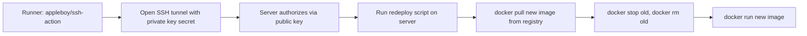

# Day 26: Continuous Deployment — Shipping to a Real Server

> **Goal**: Extend the pipeline to SSH into a target server and roll the new image into place automatically after it's pushed to the registry.
> **Prereqs**: [Day 25](./day25_container-registry.md) — image in a registry; SSH and Docker fluency.

## 1. Scenario & Why It Matters

The artifact is in the registry — now something has to actually update the server. In a hobby setup that might be you SSH'ing in and running `docker pull && docker run`. That works once; it does not scale to five environments, three regions, and a 2 AM incident. **Continuous Deployment** automates the last mile: on every green build, a robot picks up the new image and rolls it out.

Today's pattern is the simplest real-world CD: SSH from the runner to a single VM and run a redeploy script. It teaches the fundamental shape of any CD step — **authenticate to the target, pull the new version, stop the old version, start the new one, verify** — without needing Kubernetes or a PaaS. Every fancier deployment model (blue/green, canary, rolling) is a variation on this five-step dance.

The auth model is the interesting bit. The runner must act *as* a trusted user on the server without a human being present. That means key-based SSH: the runner holds the **private key** (as a GitHub secret), the server holds the **public key** in `authorized_keys`. No password is ever typed.

## 2. Concept Deep-Dive

The runner and the server are **mutually anonymous strangers**. SSH bridges them with asymmetric cryptography: the private key on the runner proves identity to the server, which trusts the matching public key it installed in advance.



The script itself is idempotent by design. Using `|| true` after `docker stop` and `docker rm` turns the "no container yet" first-run case from a fatal error into a no-op, so the very first deploy and the fiftieth deploy run the same code path. This is one of those tiny shell idioms that separates scripts that work exactly once from scripts that work forever.

For production you would add: a health check after `docker run`, automatic rollback if the check fails, concurrency guards so two deploys cannot collide, and logging to a central system so you can correlate "deploy X happened at Y" with incidents.

## 3. Hands-On Mission

Add these secrets in the repo:

- `SERVER_HOST` — the target IP (e.g., `1.2.3.4`).
- `SERVER_USER` — the SSH user (e.g., `ubuntu`).
- `SSH_PRIVATE_KEY` — the full contents of the matching private key file.

On the server, append the public key to `~/.ssh/authorized_keys` for `SERVER_USER`.

Append a `deploy` job to `.github/workflows/hello.yml`:

```yaml
  deploy:
    needs: build-and-push
    runs-on: ubuntu-latest
    steps:
      - name: Deploy to Server
        uses: appleboy/ssh-action@master
        with:
          host: ${{ secrets.SERVER_HOST }}
          username: ${{ secrets.SERVER_USER }}
          key: ${{ secrets.SSH_PRIVATE_KEY }}
          script: |
            docker stop my-app || true
            docker rm my-app || true

            docker login -u ${{ secrets.DOCKER_USERNAME }} -p ${{ secrets.DOCKER_PASSWORD }}

            docker pull ${{ secrets.DOCKER_USERNAME }}/my-app:latest

            docker run -d --name my-app -p 80:5000 ${{ secrets.DOCKER_USERNAME }}/my-app:latest
```

If you do not have a public server handy, read the YAML and trace the auth flow — the pattern is what matters.

## 4. Your Task — Answer

**Q:** Why do we append `|| true` to the `docker stop` and `docker rm` commands?

**Sample answer**: Because on the very first deploy there is no `my-app` container yet, and `docker stop my-app` would exit with a non-zero status. Shell scripts executed by `appleboy/ssh-action` abort on the first non-zero exit (just like `set -e`). `|| true` short-circuits the OR, forcing exit code `0`, so the script treats "nothing to stop" as a benign no-op. The deploy becomes **idempotent**: whether a container already exists or not, the script produces the same end state — exactly one running container on the latest image.

## 5. Q&A (Concepts Check)

**Q1. What is the difference between Continuous Delivery and Continuous Deployment?**
Continuous Delivery ends at a deployable artifact plus a manual approval button. Continuous Deployment takes that artifact and ships it to production automatically. Same first 90%, different last mile.

**Q2. Why keep the private key as a GitHub secret instead of baking it into the runner image?**
Secrets are encrypted at rest, injected just-in-time, redacted from logs, and revocable. A key baked into an image lives forever in every layer and every cache.

**Q3. What goes wrong if two pushes land within a second of each other?**
Two concurrent `deploy` jobs may race on the same server — one stops the container the other just started. The fix is GitHub Actions' `concurrency:` key, which serializes runs of the same workflow on a given group.

**Q4. Why is SSH-from-CI considered a weaker pattern than GitOps or a push-from-cluster model?**
It requires opening SSH to the internet (or a bastion), storing powerful keys in CI, and gives no declarative record of desired state. GitOps (ArgoCD, Flux) inverts the flow — the cluster pulls from git — eliminating both problems.

**Q5. How would you add a health check after `docker run`?**
Curl the container's healthcheck endpoint in a retry loop; if it fails after N seconds, re-`docker run` the previous tag and exit non-zero so the pipeline goes red.

**Q6. Why bind to `-p 80:5000` instead of the classic `-p 5000:5000`?**
The server is internet-facing on port 80, but the app listens internally on 5000. The `HOST:CONTAINER` mapping exposes the app on the standard HTTP port without the app needing root to bind below 1024.

## 6. Further Reading

- `appleboy/ssh-action`: [github.com/appleboy/ssh-action](https://github.com/appleboy/ssh-action)
- Next: [Day 27 — Secrets Management](./day27_secrets-management.md)
