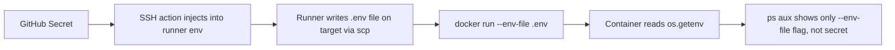

# Day 27: Secrets Management — Injecting, Not Baking

> **Goal**: Understand why secrets must never be baked into images or exposed in process arguments, and learn how to inject them safely at runtime.
> **Prereqs**: [Day 26](./day26_cd.md) — a working SSH deploy; Docker environment variable flags.

## 1. Scenario & Why It Matters

Hardcoded credentials are the single most common root cause of security incidents. "We committed the AWS key to GitHub" is such a predictable disaster that cloud providers run scanners to revoke leaked keys within minutes. But avoiding the `git push` of a secret is only half the battle — the other half is getting the secret into the running application without leaking it along the way.

Two tempting but wrong approaches: (1) bake the `.env` file into the Docker image — now every image layer on Docker Hub contains your prod password forever, including after you "remove" it; (2) pass secrets as `-e KEY=value` flags to `docker run` — now any unprivileged user on the host can read them with `ps aux` or `docker inspect`. Both feel private but are public in practice.

The right model is **inject, don't bake**: the image contains only code, the secret arrives at runtime from a trusted source (GitHub Secrets, Vault, AWS Secrets Manager, Kubernetes Secret mounted as a file), and it is never materialized anywhere a casual `ps` or `grep` could find it.

## 2. Concept Deep-Dive

There are three places a secret can live, each with a threat model:

| Location | Visible to | Safe? |
|---|---|---|
| Image layer (`COPY .env`) | Anyone with the image | No |
| Process argv (`docker run -e KEY=val`) | Any user who can `ps aux` | No |
| File mounted at runtime (`--env-file`) | Only processes with file access | Yes |
| OS keyring / Vault / KMS | Only authenticated callers | Yes (best) |



The application code side is stupidly simple: `os.getenv("MY_SECRET_KEY", default)`. That is the whole secret API. Everything else is plumbing concerned with getting the value into the process environment safely.

For production, level up to a dedicated secret manager (HashiCorp Vault, AWS Secrets Manager, GCP Secret Manager, Kubernetes + Sealed Secrets / External Secrets). They add rotation, audit logs, fine-grained IAM, and the ability to revoke a single secret without redeploying.

## 3. Hands-On Mission

Update `app.py` to read a secret from the environment:

```python
import os

def get_secret():
    return os.getenv("MY_SECRET_KEY", "DefaultValue")

if __name__ == "__main__":
    print(f"The secret is: {get_secret()}")
```

The **wrong** way (leaks via `ps aux`):

```bash
docker run -d \
  -e MY_SECRET_KEY='${{ secrets.APP_SECRET }}' \
  --name my-app my-user/my-app:latest
```

The **right** way (write a file on the server, then reference it):

```bash
cat > /home/ubuntu/app.env <<EOF
MY_SECRET_KEY=${{ secrets.APP_SECRET }}
EOF
chmod 600 /home/ubuntu/app.env

docker run -d \
  --env-file /home/ubuntu/app.env \
  --name my-app my-user/my-app:latest
```

Now `ps aux` shows only `--env-file /home/ubuntu/app.env` — the path, not the value. File permissions (`chmod 600`) restrict read access to the owner.

## 4. Your Task — Answer

**Q:** Passing `-e KEY=value` to `docker run` leaks the secret into the process list. What Docker flag reads environment variables from a file instead, and why is it safer?

**Sample answer**: **`--env-file`**. It takes a path to a `KEY=VALUE` file and loads each line into the container's environment. The safety comes from two things. First, `ps aux` and `/proc/<pid>/cmdline` show only the **path** of the env file on the command line, not its contents, so another user with shell access cannot read the secret from the process table. Second, filesystem permissions (`chmod 600`) let you restrict who can read the file at all, which `-e` cannot do. The secret still exists on disk, so at scale you want a proper secret manager, but `--env-file` is the minimum correct baseline.

## 5. Q&A (Concepts Check)

**Q1. Why is `COPY .env .` in a Dockerfile considered a security hole?**
The `.env` file becomes a permanent layer in the image. Anyone who pulls the image — including bots scanning public registries — can extract the layer and read the secret. Squashing or deleting in a later layer does not help; the original layer is still there.

**Q2. What does `docker inspect <container>` reveal?**
The container's full config including environment variables. Any user in the `docker` group (effectively root) can dump your secrets via inspect, so don't rely on `-e` as a protection boundary even against local users.

**Q3. Name three advantages of a dedicated secret manager over GitHub Secrets.**
Automatic rotation, fine-grained per-service IAM with audit trails, and dynamic short-lived credentials (e.g., Vault issuing a 10-minute DB password on demand).

**Q4. Why keep secret files out of the image even if the registry is private?**
Defense in depth. Registry permissions drift, backups leak, and images get copied across environments. Secrets in layers outlive any single access policy.

**Q5. What's the difference between a secret and a configuration value?**
A config is non-sensitive (feature flag, region name, log level) and can live in git. A secret is sensitive (API key, DB password) and must live in a secret store. The split affects where and how you manage each.

**Q6. In Kubernetes, what's the typical way to inject a secret into a pod?**
Mount a `Secret` resource as either environment variables (`envFrom: secretRef`) or as a file in a volume. Volume mounts are preferred because they support live rotation and keep the secret out of `kubectl exec ... env` output.

## 6. Further Reading

- Docker env-file docs: [docs.docker.com/reference/cli/docker/container/run/#env](https://docs.docker.com/reference/cli/docker/container/run/#env)
- HashiCorp Vault intro: [developer.hashicorp.com/vault/docs/what-is-vault](https://developer.hashicorp.com/vault/docs/what-is-vault)
- Next: [Day 28 — Weekly Challenge](./day28_weekly-challenge.md)
