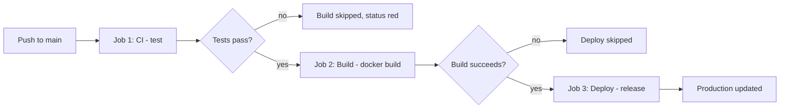

# Day 28: Weekly Challenge — The Full Build / Test / Ship Pipeline

> **Goal**: Combine everything from the week into a single `pipeline.yml` that runs tests, builds a Docker image, and simulates a deploy, with correct job ordering.
> **Prereqs**: Days 22–27 — workflow syntax, CI, artifacts, registries, deployment, secrets.

## 1. Scenario & Why It Matters

Your manager has seen enough demos. "Ship it." You need a pipeline that exercises the full **CI → Build → CD** cycle on every push to `main`, with the stages properly gated by `needs:` so that a broken test can never produce a tagged image and a broken build can never trigger a deploy.

This challenge is less about new syntax and more about **composition**. You have already seen every individual piece this week; today's work is wiring them into a single DAG that tells a coherent story at a glance when you open the Actions tab. That readability matters: on-call engineers during an incident skim the workflow graph first to figure out which stage the failure came from.

Keeping everything in one YAML also makes the pipeline itself a reviewable diff. If a teammate adds a new quality gate (security scan, image sign), it shows up as added nodes in the DAG, which is a much better review experience than chasing scripts spread across multiple repos.

## 2. Concept Deep-Dive

The canonical three-stage pipeline:



Key points:

- **Trigger scoping**: `on: push: branches: [main]` restricts runs so feature branches don't deploy to prod.
- **Gating with `needs:`**: explicit per-job dependency chain keeps the stages sequential.
- **SHA propagation**: `${{ github.sha }}` flows through tagging and deploy logs so every production container is traceable to a commit.
- **Simulation steps**: when real infrastructure isn't available, `echo` steps stand in for real commands. The shape of the pipeline is what's being validated.

## 3. Hands-On Mission

Create `.github/workflows/pipeline.yml`:

```yaml
name: Build-Test-Ship Pipeline

on:
  push:
    branches: [main]

jobs:
  ci-test:
    name: CI (Test)
    runs-on: ubuntu-latest
    steps:
      - name: Checkout
        uses: actions/checkout@v3

      - name: Set up Python
        uses: actions/setup-python@v4
        with:
          python-version: '3.9'

      - name: Run Tests
        run: echo "Running Tests... passed!"

  build:
    name: Build (Package)
    needs: ci-test
    runs-on: ubuntu-latest
    steps:
      - name: Checkout
        uses: actions/checkout@v3

      - name: Build Docker Image
        run: |
          echo "FROM busybox" > Dockerfile
          docker build -t my-app:${{ github.sha }} -t my-app:latest .
          docker images my-app

  deploy:
    name: Deploy (Release)
    needs: build
    runs-on: ubuntu-latest
    steps:
      - name: Release
        run: echo "Deploying version ${{ github.sha }} to Production Server..."
```

Push it, open the Actions tab, and watch three circles connect in a straight line.

## 4. Your Task — Answer

**Q:** Write a single `pipeline.yml` with three jobs — Test, Build, Deploy — that run on pushes to `main`, where Build runs only after Test passes and Deploy runs only after Build passes. Simulate where necessary.

**Sample answer**: The YAML above. The essential design choices:

1. **Trigger scoping** — `on: push: branches: [main]` ensures the pipeline only fires on the canonical branch, not every feature branch.
2. **Explicit dependency chain** — `build: needs: ci-test` and `deploy: needs: build` converts the default parallel DAG into a strict three-stage sequence, which is exactly the "test-before-build-before-deploy" invariant we want.
3. **SHA propagation** — tagging the image with `${{ github.sha }}` and echoing the same SHA in the deploy step gives you a single identifier that ties "what code shipped" to "what container is running" for every release, which is invaluable for rollback and incident forensics.

## 5. Q&A (Concepts Check)

**Q1. What happens if you forget `needs:` between the jobs?**
All three jobs run in parallel on separate runners. Deploy might complete before test finishes, which defeats the whole point of a gated pipeline.

**Q2. How would you add a manual approval before Deploy?**
Attach the deploy job to a GitHub **environment** (e.g., `production`) configured with required reviewers. The job pauses until an approver clicks "approve" in the UI.

**Q3. How would you extend this pipeline to deploy to `staging` first, then `production`?**
Add two deploy jobs: `deploy-staging` with `needs: build`, and `deploy-prod` with `needs: deploy-staging`. Gate `deploy-prod` on a `production` environment with reviewers.

**Q4. Why is it valuable to tag images with both `latest` and `${{ github.sha }}`?**
`latest` gives humans and scripts a moving pointer to the newest build. The SHA tag gives you an immutable handle for reproducibility and rollback — you can redeploy any past commit by pulling its SHA tag.

**Q5. What runs if only the Build job fails?**
Everything up to and including Build executes. Deploy is marked **skipped** because its `needs:` dependency did not succeed. The overall workflow status is failure.

**Q6. If you wanted the pipeline to also run on pull requests (for CI) but only deploy on `main` pushes, how would you structure it?**
Use `on: [push, pull_request]` at the top, then gate only the deploy job with `if: github.event_name == 'push' && github.ref == 'refs/heads/main'`. The test and build jobs run on every event; deploy runs only on qualifying pushes.

## 6. Further Reading

- GitHub Actions expressions: [docs.github.com/actions/learn-github-actions/expressions](https://docs.github.com/actions/learn-github-actions/expressions)
- GitHub Environments and approvals: [docs.github.com/actions/deployment/targeting-different-environments](https://docs.github.com/actions/deployment/targeting-different-environments)
- Next: Week 5 — Infrastructure as Code with Terraform.
