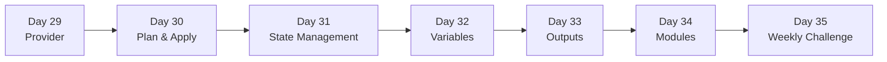

# Week 5 — Terraform (Infrastructure as Code)

> Click-ops is a liability. Terraform turns your cloud into a reviewable Git repo: `plan`, `apply`, `destroy`, reproducible forever.

## Roadmap

## Index

- [Day 29 — Providers (AWS, config, version pinning)](day29_provider.md)
- [Day 30 — Plan & Apply (the core loop)](day30_plan-and-apply.md)
- [Day 31 — State Management (remote backend, locking)](day31_state-management.md)
- [Day 32 — Variables (input, types, validation)](day32_variables.md)
- [Day 33 — Outputs (feeding other stacks)](day33_outputs.md)
- [Day 34 — Modules (reusable blocks)](day34_modules.md)
- [Day 35 — Weekly Challenge: End-to-End Stack](day35_weekly-challenge.md)

## Related resources

Code for the weekly challenge lives in [`Resources/Week5/weekly_challenge/`](../../Resources/Week5/weekly_challenge/).
