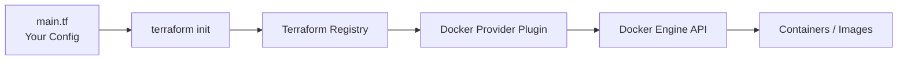

# Day 29: The Provider

> **Goal**: Install Terraform, declare the Docker provider, and initialize a working directory so Terraform can talk to Docker on your machine.
> **Prereqs**: Week 2/3 Docker basics (you can run `docker ps` and pull images locally).

## 1. Scenario & Why It Matters

Clicking around the AWS console works for one server. It falls apart the moment you need ten identical environments, a reproducible demo, or a new hire who needs the same setup by Monday. Terraform solves this with **declarative Infrastructure as Code**: you describe the desired state, Terraform computes the diff against reality, and a **provider** plugin makes the API calls.

To avoid cloud bills while learning, we use the community **Docker provider**. It lets Terraform manage containers, networks, and volumes on your laptop exactly the way it would manage EC2 instances in AWS. The mental model transfers 1:1; only the provider block changes when you move to a real cloud.

## 2. Concept Deep-Dive

A Terraform project has three moving parts at init time:

- **Configuration** (`.tf` files): what you want.
- **Provider plugin**: a binary Terraform downloads that knows how to talk to a specific API (Docker, AWS, GCP, Kubernetes, GitHub...).
- **`.terraform/` directory + lock file**: where plugins and version pins live after `terraform init`.



The `required_providers` block pins the provider source and version so the same code produces the same plugin next month. The `provider "docker" {}` block configures credentials or the API endpoint — empty braces mean "use the local Docker socket".

## 3. Hands-On Mission

1. Install Terraform.
   - macOS: `brew tap hashicorp/tap && brew install hashicorp/tap/terraform`
   - Windows: `choco install terraform`
   - Linux (Debian/Ubuntu): `sudo apt-get install terraform`
2. Create a working folder: `mkdir tf-lab && cd tf-lab`.
3. Create `main.tf`:

```hcl
terraform {
  required_providers {
    docker = {
      source  = "kreuzwerker/docker"
      version = "~> 3.0.1"
    }
  }
}

provider "docker" {}

resource "docker_image" "nginx" {
  name         = "nginx:latest"
  keep_locally = false
}

resource "docker_container" "nginx" {
  image = docker_image.nginx.image_id
  name  = "tutorial"
  ports {
    internal = 80
    external = 8000
  }
}
```

4. Initialize the working directory so Terraform downloads the Docker plugin:

```bash
terraform init
```

5. Peek inside `.terraform/providers/` to see the plugin binary that was fetched.

## 4. Your Task — Answer

**Q:** Run `terraform init`. Paste the green success message you see at the bottom.

**Sample answer:**

```
Terraform has been successfully initialized!

You may now begin working with Terraform. Try running "terraform plan" to see
any changes that are required for your infrastructure.
```

**Why:** That message confirms three things in one shot: the `kreuzwerker/docker` plugin matched the version constraint, it was downloaded into `.terraform/`, and `.terraform.lock.hcl` was written so future runs stay reproducible. Without a successful init, every later command (`plan`, `apply`, `destroy`) will fail because Terraform has no provider to call.

## 5. Q&A (Concepts Check)

**Q1: What is a Terraform provider, in one sentence?**
A plugin that translates Terraform resource types into API calls against a specific platform (AWS, Docker, GitHub, etc.).

**Q2: Why do we pin `version = "~> 3.0.1"` instead of leaving it open?**
Pinning prevents a surprise breaking change from a new major version. `~> 3.0.1` allows `3.0.x` patch updates but blocks `3.1.0` until you explicitly bump it.

**Q3: What does `terraform init` actually do?**
It reads `required_providers`, downloads matching plugin binaries into `.terraform/`, writes `.terraform.lock.hcl` to record exact versions and checksums, and prepares the backend for state storage.

**Q4: Why is `provider "docker" {}` empty here but an AWS provider usually is not?**
The Docker provider defaults to the local UNIX socket on your machine, which needs no config. AWS needs a region, and often credentials or an assumed role, so its block has fields.

**Q5: If a teammate clones the repo, what do they need to run before `terraform apply` will work?**
`terraform init` in the same folder — providers live in a per-directory `.terraform/` and are not committed to git.

## 6. Further Reading

- Terraform docs: [Providers](https://developer.hashicorp.com/terraform/language/providers)
- Terraform Registry: [kreuzwerker/docker](https://registry.terraform.io/providers/kreuzwerker/docker/latest/docs)
- HashiCorp tutorial: [Build infrastructure with Docker](https://developer.hashicorp.com/terraform/tutorials/docker-get-started)
- Dependency lock file: [Lock file docs](https://developer.hashicorp.com/terraform/language/files/dependency-lock)
