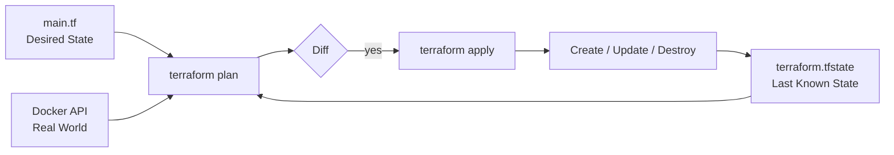

# Day 30: Plan and Apply

> **Goal**: Turn the `main.tf` from Day 29 into running infrastructure by learning the two-step `plan` / `apply` workflow.
> **Prereqs**: Day 29 (Terraform installed, Docker provider initialized).

## 1. Scenario & Why It Matters

The single most common infrastructure outage is "I ran a command and it did more than I expected." Terraform was designed around that fear. It never mutates the world from config alone; it mutates from a **plan**, which is a diff you can read and review before anything happens.

This is why teams put `terraform plan` output into pull request comments: the PR review is effectively a change review. Understanding the plan/apply loop is the difference between using Terraform as a glorified `docker run` and using it as a safe production change tool.

## 2. Concept Deep-Dive

Terraform has three sources of truth it compares on every run:

- **Config** — the `.tf` files (desired state).
- **State** — `terraform.tfstate` (what Terraform last created).
- **Real world** — what the provider API reports right now.

`plan` computes the diff. `apply` executes that diff and writes the new state.



Plan symbols to memorize:

- `+` create
- `-` destroy
- `~` update in place
- `-/+` destroy and recreate (the attribute cannot be changed in place)

## 3. Hands-On Mission

1. From the `tf-lab` folder (still holding the Day 29 `main.tf`), run the dry run:

```bash
terraform plan
```

Look for `+ resource "docker_image" "nginx"` and `+ resource "docker_container" "nginx"`. The footer should read `Plan: 2 to add, 0 to change, 0 to destroy`.

2. Execute the plan:

```bash
terraform apply
```

Terraform prints the plan again and pauses with `Do you want to perform these actions?`. Type `yes` and press Enter.

3. Verify Terraform did not lie:

```bash
docker ps
terraform show
```

4. Inspect the state file (do not edit by hand):

```bash
ls -la terraform.tfstate
```

## 4. Your Task — Answer

**Q:** Run `plan` and `apply`, then check `docker ps`. What specific host port is mapped to the container (e.g. `0.0.0.0:???? -> 80/tcp`)?

**Sample answer:** `8000`

**Why:** The `docker_container.nginx` resource declares `ports { internal = 80, external = 8000 }`. The `external` value becomes the host-side port in the Docker publish mapping, so `docker ps` shows `0.0.0.0:8000->80/tcp`. If you changed `external` in the config, the plan would show `-/+` (destroy + recreate) because port mappings on a running container cannot be edited in place.

## 5. Q&A (Concepts Check)

**Q1: Why does Terraform separate `plan` from `apply`?**
To make infrastructure changes reviewable. The plan is a human-readable diff that can be attached to a PR, pasted in Slack, or saved to a file with `-out=plan.tfplan` and applied later exactly as shown.

**Q2: What is the difference between `~` and `-/+` in a plan?**
`~` means Terraform can update the attribute in place via an API call. `-/+` means the attribute is immutable on the provider side, so Terraform must destroy and recreate the resource to change it.

**Q3: You run `apply` twice in a row with no config change. What happens the second time?**
Terraform refreshes state, computes the diff against the world, finds no drift, and reports `No changes. Your infrastructure matches the configuration.` This idempotency is a core design property.

**Q4: When is it safe to use `terraform apply -auto-approve`?**
In CI pipelines that already gated on an approved plan artifact (`-out=plan.tfplan`) or in throwaway sandboxes. Never on a shared prod run you are driving interactively.

**Q5: If `docker ps` shows the container but `terraform.tfstate` was deleted, what will the next `plan` say?**
Terraform will think nothing exists and try to create a duplicate container. The apply will then fail because Docker rejects the duplicate name. This is the "amnesia" failure mode that motivates Day 31 (state management).

## 6. Further Reading

- Terraform CLI: [plan](https://developer.hashicorp.com/terraform/cli/commands/plan) and [apply](https://developer.hashicorp.com/terraform/cli/commands/apply)
- [Saving plan files](https://developer.hashicorp.com/terraform/cli/commands/plan#out-filename) for CI workflows
- [Terraform core workflow](https://developer.hashicorp.com/terraform/intro/core-workflow)
