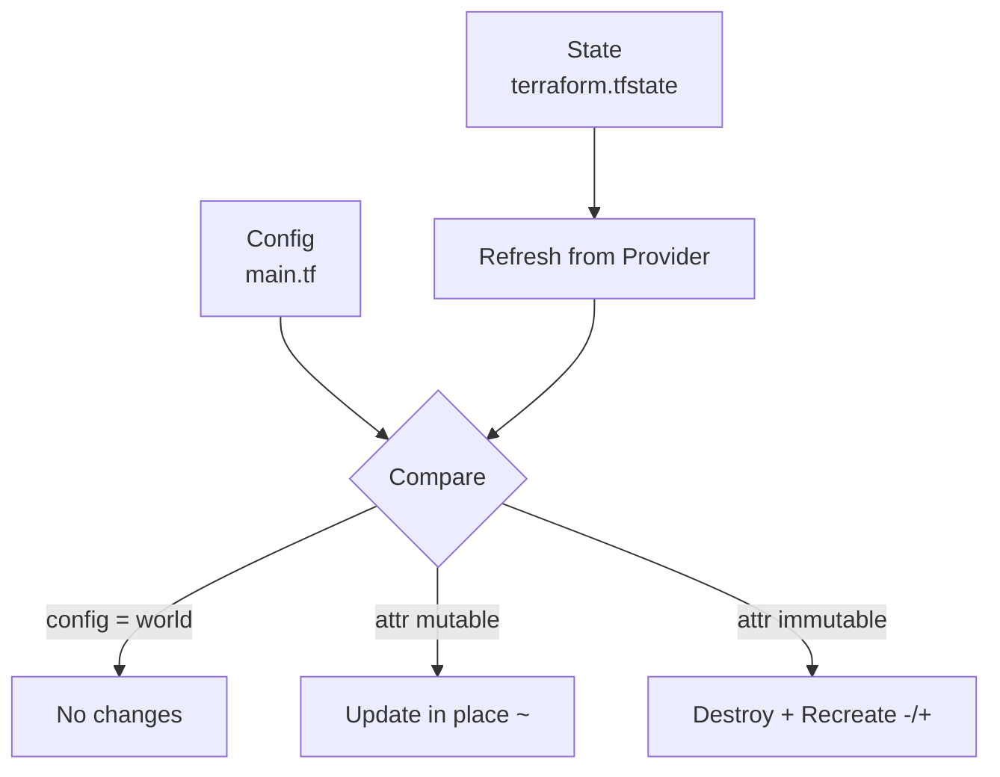

# Day 31: State Management

> **Goal**: Understand why `terraform.tfstate` exists, what it tracks, and how Terraform uses it to compute minimal changes such as a port update.
> **Prereqs**: Day 30 (you successfully applied the nginx container).

## 1. Scenario & Why It Matters

Terraform is stateless until it is not. The moment it creates a real resource it must remember a mapping between your config (`docker_container.nginx`) and the real-world ID (`ff3a...`). That mapping lives in `terraform.tfstate`. Without it, Terraform cannot tell the difference between "I need to create a new container" and "I already created this container and just need to tweak it."

State is also the unit of collaboration. On a real team, state is stored remotely (S3, Terraform Cloud, Azure Blob) with locking, so two engineers running `apply` at the same time cannot race each other. Corrupting or losing state is the single fastest way to break a Terraform project.

## 2. Concept Deep-Dive

`terraform.tfstate` is a JSON file. Each resource block in the state holds:

- Its address (`docker_container.nginx`).
- The provider that manages it.
- The real-world ID.
- A full snapshot of its attributes (so future diffs are fast and offline-capable).

On every `plan`, Terraform does three things: **refresh** (ask the provider what the resource actually looks like now), **compare** against config, and **produce a diff**.



Key rules:

- Do not edit state by hand. Use `terraform state mv`, `terraform state rm`, `terraform import`.
- Never commit `terraform.tfstate` to git — it can contain secrets.
- On a team, use a remote backend with locking.

## 3. Hands-On Mission

1. Port 8000 is "occupied". Open `main.tf` and change the external port to 8080:

```hcl
resource "docker_container" "nginx" {
  image = docker_image.nginx.image_id
  name  = "tutorial"
  ports {
    internal = 80
    external = 8080 # changed from 8000
  }
}
```

2. Inspect what Terraform currently believes exists:

```bash
terraform state list
terraform state show docker_container.nginx
```

3. Run a plan and read the symbols carefully:

```bash
terraform plan
```

4. Apply the change and verify with `docker ps` that the new host port is 8080.

## 4. Your Task — Answer

**Q:** Run `terraform plan` after changing the port. Find the specific line that shows the port changing (look for `~` or `-/+`). Paste it.

**Sample answer:**

```
~ external = 8000 -> 8080 # forces replacement
```

And the surrounding header typically shows:

```
# docker_container.nginx must be replaced
-/+ resource "docker_container" "nginx" {
```

**Why:** The Docker API cannot re-map a published port on a running container, so the `external` attribute is marked "ForceNew" by the provider. Terraform sees the diff, consults the provider schema, and correctly decides the only legal path is destroy + recreate. That is why you see `-/+` on the resource and `# forces replacement` on the specific attribute.

## 5. Q&A (Concepts Check)

**Q1: What exactly is stored in `terraform.tfstate`?**
A JSON mapping of every managed resource to its real-world ID plus a snapshot of its attributes, the providers used, and metadata like the serial and lineage for detecting conflicts.

**Q2: Why is a remote backend almost mandatory for team projects?**
It gives you (a) shared state so teammates see the same world, (b) locking so two applies cannot race, and (c) encryption and versioning so a bad apply is recoverable.

**Q3: You deleted `terraform.tfstate` by mistake. What happens on the next `apply`?**
Terraform thinks nothing exists and plans to create everything. The apply likely errors on name or ID collisions. Recovery is `terraform import` to rebuild the mapping, or restoring the state from backend versioning.

**Q4: What is the difference between `terraform refresh` and `terraform apply`?**
`refresh` updates state to match the real world without changing config or infrastructure. `apply` changes infrastructure to match config. `plan` and `apply` both refresh automatically by default.

**Q5: When would you use `terraform state rm`?**
When you want Terraform to stop managing a resource without destroying it — for example, migrating a resource into a different module or handing it over to another tool.

## 6. Further Reading

- [State overview](https://developer.hashicorp.com/terraform/language/state)
- [Remote state and backends](https://developer.hashicorp.com/terraform/language/backend)
- [State locking](https://developer.hashicorp.com/terraform/language/state/locking)
- [`terraform state` CLI](https://developer.hashicorp.com/terraform/cli/commands/state)
