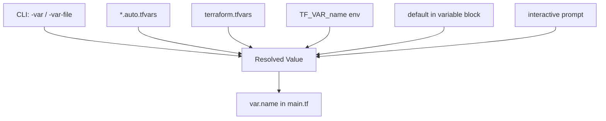

# Day 32: Variables

> **Goal**: Parameterize the container config so the same Terraform code can produce dev, staging, and prod stacks without being copy-pasted.
> **Prereqs**: Day 31 (you understand state and can change resources safely).

## 1. Scenario & Why It Matters

Hardcoded values are the enemy of reuse. The moment you want a second environment — staging alongside dev, or a per-engineer sandbox — you end up forking the file and maintaining two almost-identical copies. That is where drift and bugs live.

Variables are the Terraform equivalent of function parameters. You declare inputs once, and callers (CLI flags, `.tfvars` files, environment variables, or parent modules) supply values at runtime. The same code becomes a template that can produce many stacks.

## 2. Concept Deep-Dive

Terraform resolves a variable by checking sources in this precedence order (highest wins):

1. `-var` and `-var-file` flags on the CLI.
2. `*.auto.tfvars` files, then `terraform.tfvars`.
3. `TF_VAR_<name>` environment variables.
4. The `default` declared in `variable {}`.
5. Interactive prompt if still unset and no default.



A variable block supports `type` (string, number, bool, list, map, object), `default`, `description`, `sensitive = true` (hides from CLI output), and `validation` blocks for guard rails.

## 3. Hands-On Mission

1. Create `variables.tf` in the `tf-lab` folder:

```hcl
variable "container_name" {
  description = "Name for the Docker container"
  type        = string
  default     = "tutorial_v2"
}

variable "internal_port" {
  description = "Port the app listens on inside the container"
  type        = number
  default     = 80
}
```

2. Edit `main.tf` to consume them with `var.<name>`:

```hcl
resource "docker_container" "nginx" {
  image = docker_image.nginx.image_id
  name  = var.container_name
  ports {
    internal = var.internal_port
    external = 8080
  }
}
```

3. Override from the CLI at apply time:

```bash
terraform apply -var="container_name=custom_app_prod"
```

4. Verify:

```bash
docker ps
```

## 4. Your Task — Answer

**Q:** After running `terraform apply -var="container_name=custom_app_prod"` and confirming with `yes`, what is the NAME of the container now running?

**Sample answer:** `custom_app_prod`

**Why:** The CLI `-var` flag is the highest-precedence source, so it beats the `default = "tutorial_v2"` declared in `variables.tf`. Terraform sees the new desired name, realizes the Docker `name` attribute cannot be changed in place, destroys the old container, and recreates it with the overridden value. `docker ps` then shows `custom_app_prod` as the container name.

## 5. Q&A (Concepts Check)

**Q1: What is variable precedence, and which source wins?**
Highest to lowest: CLI `-var`/`-var-file`, `*.auto.tfvars`, `terraform.tfvars`, `TF_VAR_*` env vars, `default`, then interactive prompt. CLI always wins.

**Q2: When should you use `sensitive = true` on a variable?**
For secrets like DB passwords or API tokens. Terraform will redact the value in CLI output and plan diffs, which reduces the chance of leaking it into logs or PR comments.

**Q3: What is the difference between `variable` and `locals`?**
`variable` is an **input** set from outside the module. `locals` are named **internal** expressions computed inside the module. Locals are not overridable from outside.

**Q4: How do you pass variables in CI without using the CLI?**
Set `TF_VAR_container_name=custom_app_prod` as an environment variable in the pipeline. Terraform picks it up automatically, which avoids putting values into the command string.

**Q5: Why is a `validation` block useful?**
It fails `plan` early with a clear error if someone passes an invalid value (e.g., a port outside 1-65535), instead of failing later inside the provider with a cryptic API error.

## 6. Further Reading

- [Input variables](https://developer.hashicorp.com/terraform/language/values/variables)
- [Variable definition precedence](https://developer.hashicorp.com/terraform/language/values/variables#variable-definition-precedence)
- [`terraform.tfvars` and `*.auto.tfvars`](https://developer.hashicorp.com/terraform/language/values/variables#variable-definitions-tfvars-files)
- [Local values](https://developer.hashicorp.com/terraform/language/values/locals)
