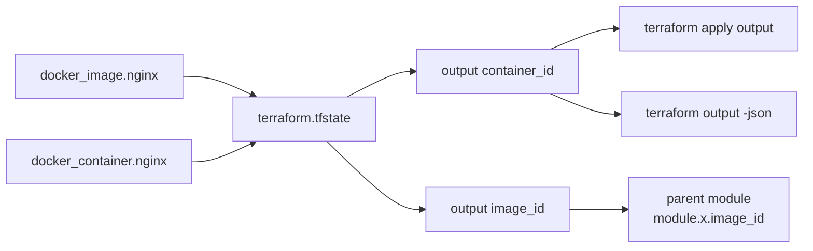

# Day 33: Outputs

> **Goal**: Surface attributes Terraform learns at apply time (IDs, IPs, DNS names) so humans and scripts downstream can consume them.
> **Prereqs**: Day 32 (variables in place, comfortable with `terraform apply`).

## 1. Scenario & Why It Matters

Most useful infrastructure values — a load balancer DNS, an RDS endpoint, a container ID — are only known **after** the provider creates the resource. If Terraform did not expose them, you would have to screen-scrape `terraform show` or poke the cloud console every time. That does not scale.

Outputs solve two concrete problems at once:

- **Human visibility**: `terraform apply` prints them at the end so you can copy the URL straight into your browser or curl.
- **Machine wiring**: they become the public API of a module (Day 34) and can be consumed by CI (`terraform output -json`), by other stacks (`terraform_remote_state`), or by a parent module via `module.foo.bar`.

## 2. Concept Deep-Dive

An `output` block is declarative, lazy, and computed from resource attributes:

```hcl
output "container_id" {
  description = "ID of the Docker container"
  value       = docker_container.nginx.id
  sensitive   = false
}
```



Useful knobs:

- `sensitive = true` redacts the value in CLI output (state still stores it).
- `depends_on` forces evaluation order when Terraform cannot infer it.
- `terraform output -json` emits a machine-readable payload for CI pipelines.
- Outputs live in state, so `terraform output container_id` works even without re-applying.

## 3. Hands-On Mission

1. Create `outputs.tf` alongside `main.tf` and `variables.tf`:

```hcl
output "container_id" {
  description = "ID of the Docker container"
  value       = docker_container.nginx.id
}

output "image_id" {
  description = "ID of the Docker image"
  value       = docker_image.nginx.id
}
```

2. Apply to refresh state and render the outputs:

```bash
terraform apply -auto-approve
```

`-auto-approve` skips the `yes` prompt. Safe here in a sandbox, dangerous in prod.

3. Query outputs without re-applying:

```bash
terraform output
terraform output container_id
terraform output -json
```

## 4. Your Task — Answer

**Q:** Paste the first 4 characters of the `container_id` printed at the bottom of the `apply` output (e.g. `a1b2`).

**Sample answer:** `a1b2` (yours will differ — Docker assigns a random 64-char ID per container).

**Why:** Docker generates a fresh cryptographic container ID every time a container is created. The Docker provider writes that ID into the `id` attribute on `docker_container.nginx`, and your `output "container_id"` block reads that attribute out of state. Because the value is created by the provider — not by you — the only way to learn it is through state, which is exactly the use case outputs exist for.

## 5. Q&A (Concepts Check)

**Q1: Why can you not know most output values before `apply`?**
Many attributes (IDs, IPs, certificate ARNs) are computed by the provider API during creation. They do not exist in config; they are learned after the provider responds.

**Q2: What does `sensitive = true` do on an output?**
It tells Terraform to hide the value in CLI output and plan diffs to avoid leaking secrets into logs. The value is still stored in state in plain text, so the state backend must also be secured.

**Q3: How do you read an output from another Terraform project?**
Either `terraform output -json` in CI and pipe it, or use a `terraform_remote_state` data source that points at the other project's backend to read its outputs programmatically.

**Q4: When running `terraform output container_id`, does Terraform hit the provider API?**
No. It reads the cached value from `terraform.tfstate`. That is why outputs are fast and can be used in shell pipelines.

**Q5: What is the difference between a module output and a root output?**
A root output appears on the CLI after `apply`. A module output is only visible to the **parent** that called the module, accessed as `module.<name>.<output>`. Root outputs are essentially module outputs of the top-level module.

## 6. Further Reading

- [Output values](https://developer.hashicorp.com/terraform/language/values/outputs)
- [`terraform output` CLI](https://developer.hashicorp.com/terraform/cli/commands/output)
- [`terraform_remote_state` data source](https://developer.hashicorp.com/terraform/language/state/remote-state-data)
- [Sensitive outputs](https://developer.hashicorp.com/terraform/language/values/outputs#sensitive-suppressing-values-in-cli-output)
