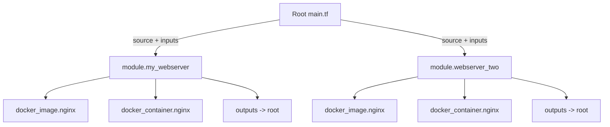

# Day 34: Modules

> **Goal**: Refactor the flat `tf-lab` config into a reusable `webserver` module, then call it from a new root `main.tf`.
> **Prereqs**: Day 33 (variables and outputs wired up).

## 1. Scenario & Why It Matters

A 500-line `main.tf` is a code smell. It is the Terraform equivalent of a class that does everything: impossible to reuse, painful to review, scary to change. Modules are how you impose structure.

A module is simply a folder containing `.tf` files with `variable` blocks (inputs) and `output` blocks (outputs). Any folder can be a module — the only thing that changes is **who calls it**. That symmetry is what lets you ship a `webserver` module once and instantiate it for dev, staging, and prod from a tiny root file.

## 2. Concept Deep-Dive

A module has three interfaces:

- **Inputs**: `variable` blocks — the public API callers fill in.
- **Outputs**: `output` blocks — values the caller can read back.
- **Internals**: resources, data sources, locals — caller does not see these.



Sources can be local paths (`./modules/webserver`), a git URL, the Terraform Registry, or S3. Local paths are perfect for intra-repo structure; the registry is how you consume community modules like `terraform-aws-modules/vpc/aws`.

Rules of thumb:

- Every module deserves a `variables.tf`, `main.tf`, and `outputs.tf`.
- A module should do one thing (a VPC, a web server, a database) so it composes.
- Run `terraform init` whenever you add, move, or change a module source.

## 3. Hands-On Mission

1. Move the existing files into a module folder:

```bash
mkdir -p modules/webserver
mv main.tf variables.tf outputs.tf modules/webserver/
```

The root `tf-lab/` should now be empty except for `modules/` and any `.terraform*` directories.

2. Create a fresh root `main.tf` in `tf-lab/` that **calls** the module:

```hcl
terraform {
  required_providers {
    docker = {
      source  = "kreuzwerker/docker"
      version = "~> 3.0.1"
    }
  }
}

provider "docker" {}

module "my_webserver" {
  source = "./modules/webserver"

  container_name = "modular_nginx"
  internal_port  = 80
}
```

3. Remove the `terraform {}` and `provider {}` blocks from the module's internal `main.tf` — providers are inherited from the caller.

4. Re-initialize and apply:

```bash
terraform init
terraform apply -auto-approve
docker ps
```

## 4. Your Task — Answer

**Q:** If you wanted a second web server listening on port 9090 (assuming you added `external_port` as a variable in the module), what code would you add to the root `main.tf`?

**Sample answer:**

```hcl
module "webserver_two" {
  source = "./modules/webserver"

  container_name = "modular_nginx_2"
  external_port  = 9090
}
```

**Why:** Every `module "<name>" {}` block is an independent **instance** of the module. Terraform creates a separate set of resources per instance, tracked under distinct state addresses (`module.my_webserver.docker_container.nginx` vs `module.webserver_two.docker_container.nginx`). Because the two instances pass different `container_name` and `external_port` values, they do not collide on the Docker side either. This is the core reuse benefit: one module folder, N stacks, zero copy-paste.

## 5. Q&A (Concepts Check)

**Q1: What is the minimum that makes a folder a "module"?**
Any folder containing `.tf` files is a module. The distinction between "root" and "child" is purely about who called it with a `module {}` block.

**Q2: Why did we delete the provider block from the child module?**
Providers are configured once in the root and inherited by children. Putting a `provider "docker" {}` in a child creates a redundant, potentially conflicting configuration and makes the module harder to reuse in projects that use a different provider alias.

**Q3: How do you read a module's output from the root?**
`module.<name>.<output_name>`. Example: `module.my_webserver.container_id`. This is how modules compose, for example passing a VPC id from a VPC module into a subnet module.

**Q4: When should you create a module vs. leave code in root?**
Create a module when (a) the same pattern is used more than once, (b) you want to version or share it, or (c) it has a clean input/output contract. Do not pre-factor — it is easy to extract later.

**Q5: What does `terraform init` do differently when modules are involved?**
On top of downloading providers, it resolves module sources: it copies local modules into `.terraform/modules/` and downloads remote ones (git, registry, S3). You must re-run `init` after changing a module's `source`.

## 6. Further Reading

- [Module basics](https://developer.hashicorp.com/terraform/language/modules)
- [Module sources](https://developer.hashicorp.com/terraform/language/modules/sources)
- [Terraform Registry modules](https://registry.terraform.io/browse/modules)
- [Standard module structure](https://developer.hashicorp.com/terraform/language/modules/develop/structure)
