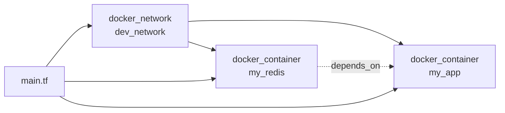

# Day 35: Weekly Challenge — The Full Stack

> **Goal**: Provision a two-tier dev stack (Redis + Python app) wired over a private Docker network, all from one `main.tf`.
> **Prereqs**: Days 29-34 (provider, plan/apply, state, variables, outputs, modules).

## 1. Scenario & Why It Matters

You are the lead cloud engineer. The team needs a reproducible dev stack: a **Redis** database and a **Python backend**, connected by a private network so only the two services can reach each other. The app must not start until Redis is up, otherwise the first connection fails and the pod crashloops.

Everything you have learned this week collapses into this challenge: a provider, multiple resources, inter-resource references, explicit dependencies, and a single `apply` that brings up a whole environment. This is the smallest realistic shape of a Terraform PR at a real company.

## 2. Concept Deep-Dive

Three new ideas converge:

- **Cross-resource references** are implicit dependencies. `docker_network.dev_network.name` tells Terraform the network must exist first.
- **`depends_on`** creates an **explicit** dependency when you need ordering that Terraform cannot infer from references — for example, "do not start the app until Redis is up."
- **`networks_advanced`** inside `docker_container` is how the Docker provider attaches a container to a user-defined network, the equivalent of `docker network connect`.



Terraform builds a DAG from these references. Resources at the same level are created in parallel; dependencies (implicit or explicit) serialize them. On destroy, the DAG runs in reverse.

## 3. Hands-On Mission

1. Create a fresh folder, e.g. `tf-challenge/`, with a single `main.tf`.
2. Declare the Docker provider, one network, one Redis container, and one Python app container.
3. Attach both containers to the network via `networks_advanced`.
4. Use `depends_on` to force the app to wait for Redis.
5. `terraform init && terraform apply -auto-approve`, then `docker network inspect dev_network` to confirm both containers are attached.

Reference snippet for attaching the network:

```hcl
networks_advanced {
  name = docker_network.dev_network.name
}
```

## 4. Your Task — Answer

**Q:** Write the full `main.tf` that sets up Docker provider + `dev_network` + `my_redis` + `my_app` with the required `depends_on` and network attachment.

**Sample answer:**

```hcl
terraform {
  required_providers {
    docker = {
      source  = "kreuzwerker/docker"
      version = "~> 3.0.1"
    }
  }
}

provider "docker" {}

resource "docker_network" "dev_network" {
  name = "dev_network"
}

resource "docker_image" "redis" {
  name         = "redis:alpine"
  keep_locally = true
}

resource "docker_container" "my_redis" {
  name  = "my_redis"
  image = docker_image.redis.image_id

  networks_advanced {
    name = docker_network.dev_network.name
  }
}

resource "docker_image" "python" {
  name         = "python:3.9-slim"
  keep_locally = true
}

resource "docker_container" "my_app" {
  name    = "my_app"
  image   = docker_image.python.image_id
  command = ["python3", "-m", "http.server", "5000"]

  networks_advanced {
    name = docker_network.dev_network.name
  }

  depends_on = [
    docker_container.my_redis,
  ]
}
```

**Why:** Each block has a specific job. `docker_network` creates the isolated bridge so only these containers can talk. `docker_image` resources pre-pull both images. Both containers attach to `dev_network` through `networks_advanced`, using `docker_network.dev_network.name` — an **implicit** dependency that guarantees the network exists first. The `depends_on = [docker_container.my_redis]` on the app is an **explicit** dependency: Terraform has no way to know the app logically needs Redis up before it starts, so you tell it. Running `terraform apply` on this file builds the whole two-tier stack with a single command, and `terraform destroy` tears it down in reverse order.

## 5. Q&A (Concepts Check)

**Q1: Why use `depends_on` here instead of relying on implicit dependencies?**
The app container does not reference any attribute of the Redis container, so Terraform has no implicit edge in its DAG. Without `depends_on`, Terraform would create both in parallel and the app could come up before Redis.

**Q2: What does `docker_network.dev_network.name` do for the dependency graph?**
It creates an implicit edge. Terraform knows the value cannot be computed until the network is created, so it orders the network before any container that references it.

**Q3: How would you parameterize this for multiple environments (dev, staging)?**
Wrap the whole stack in a module under `./modules/stack/` taking a `name_prefix` variable, then call it twice from a root `main.tf` with `name_prefix = "dev"` and `name_prefix = "staging"`, or use Terraform workspaces with a single root.

**Q4: `terraform destroy` on this stack — what order do resources go in?**
Reverse of create. Terraform deletes `my_app` first (depends on Redis), then `my_redis`, then `dev_network`, and finally removes the image resources. Networks cannot be removed while containers are attached, so ordering matters.

**Q5: The app logs show "Connection refused" to Redis on first boot despite `depends_on`. Why?**
`depends_on` only guarantees the Redis **container** was created, not that the Redis **process** is accepting TCP yet. The real fix is retry-with-backoff in the app, or a healthcheck + `depends_on = { condition = "service_healthy" }` in Docker Compose. Terraform stays out of application-level readiness.

## 6. Further Reading

- [Resource dependencies and `depends_on`](https://developer.hashicorp.com/terraform/language/meta-arguments/depends_on)
- [`docker_network` resource](https://registry.terraform.io/providers/kreuzwerker/docker/latest/docs/resources/network)
- [`docker_container` resource](https://registry.terraform.io/providers/kreuzwerker/docker/latest/docs/resources/container)
- [Terraform graph](https://developer.hashicorp.com/terraform/cli/commands/graph) for visualizing the DAG
