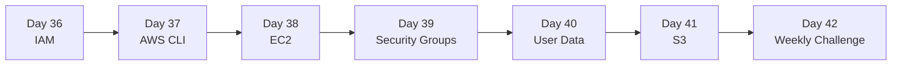

# Week 6 — AWS Fundamentals

> The cloud primitives every DevOps engineer touches: identity, compute, networking, storage. By the end, you can stand up a working mini-stack and tear it down with `terraform destroy`.

## Roadmap

## Index

- [Day 36 — IAM (users, groups, roles, policies)](day36_iam.md)
- [Day 37 — AWS CLI (profiles, regions, JSON output)](day37_aws-cli.md)
- [Day 38 — EC2 (AMIs, instance types, key pairs)](day38_ec2.md)
- [Day 39 — Security Groups (stateful firewalls)](day39_security-groups.md)
- [Day 40 — User Data (bootstrap scripts)](day40_user-data.md)
- [Day 41 — S3 (buckets, versioning, lifecycle)](day41_S3.md)
- [Day 42 — Weekly Challenge: Mini Cloud Stack](day42_weekly-challenge.md)

## Related resources

Code for the weekly challenge lives in [`Resources/Week6/weekly_challenge/`](../../Resources/Week6/weekly_challenge/).
