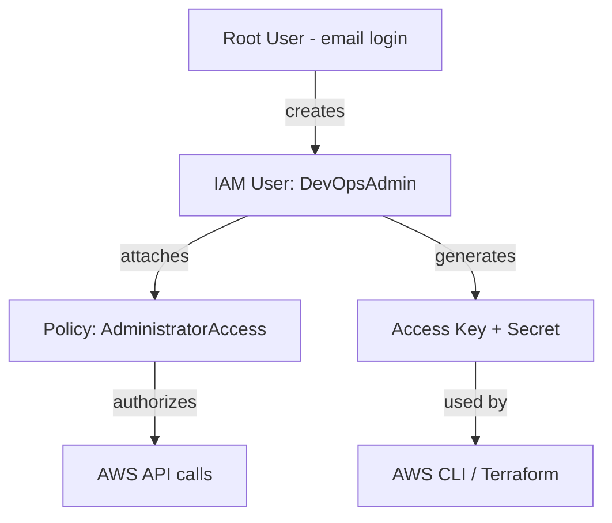

# Day 36: IAM (Identity & Access Management)

> **Goal**: Create a dedicated IAM admin user and stop using the AWS root account for daily work.
> **Prereqs**: An AWS account with root (email) login available.

## 1. Scenario & Why It Matters

The Root User (the email you signed up with) is the most dangerous identity in AWS. It has unrestricted access to billing, account closure, and every service. If those credentials leak, an attacker can spin up expensive resources on your credit card or lock you out entirely.

The industry rule is simple: **never use root for daily work**. Instead, create an IAM (Identity and Access Management) user with an explicit permission policy attached. You will log in as that user from now on, and later issue Access Keys to this user so tools like the AWS CLI and Terraform can act on your behalf.

IAM is the foundation of AWS security. Every API call — whether launching an EC2 instance or uploading to S3 — is authenticated against an IAM principal and authorized against an IAM policy.

## 2. Concept Deep-Dive

IAM has four core building blocks:

- **User** — A long-lived identity for a human or a single machine. Has a password (console) and/or access keys (CLI/SDK).
- **Group** — A bucket of users that share a set of policies. Useful for "all developers get this access".
- **Role** — A temporary identity assumed by a service (e.g., an EC2 instance) or a federated user. No static keys.
- **Policy** — A JSON document listing which `Actions` are `Allow`ed or `Denied` on which `Resources`.



Policies are evaluated on every API call. An explicit `Deny` always wins over `Allow`. Best practice is **least privilege** — grant only what is needed — but for learning we attach the managed `AdministratorAccess` policy to avoid permission rabbit holes.

## 3. Hands-On Mission

1. Log into the AWS Console with your **root email**. Search for **IAM** in the top bar.
2. Go to **Users → Create user**.
   - User name: `DevOpsAdmin`.
   - Check **Provide user access to the AWS Management Console**.
   - Choose **I want to create an IAM user** and set a password (uncheck "force change on next sign-in").
3. On the permissions step, pick **Attach policies directly** and select `AdministratorAccess`.
4. Finish the wizard. On the success page, **save the Console sign-in URL**.
5. Open the new user → **Security credentials** tab → **Create access key** → choose **CLI** → download the `.csv`. This is the only time the secret is shown.
6. Sign out of root and sign back in with `DevOpsAdmin` at the sign-in URL.

## 4. Your Task — Answer

**Q:** After logging in as `DevOpsAdmin`, look at the top-right of the AWS console. Paste the identity string shown there.

**Sample answer:**

```
DevOpsAdmin @ 123456789012
```

**Why:** The top-right badge shows `<IAM user name> @ <12-digit account ID>`. Seeing `DevOpsAdmin` there (and not your root email) confirms you are no longer operating as root. The numeric suffix is your AWS account ID, which you'll reference in ARNs and cross-account policies later.

## 5. Q&A (Concepts Check)

**Q1: Why shouldn't you generate access keys for the root user?**
Root access keys cannot be scoped down and cannot be revoked by policy — only by deleting them. A leak means full account compromise, including billing. IAM user keys can be rotated, disabled, or constrained by policy.

**Q2: What is the difference between an IAM user and an IAM role?**
A user has permanent credentials (password/access keys) and represents a specific person or service account. A role has no long-term credentials; it is assumed to obtain temporary security credentials (STS tokens) and is the preferred mechanism for EC2, Lambda, and cross-account access.

**Q3: How does AWS evaluate a request when multiple policies apply?**
AWS starts with an implicit deny, then evaluates all attached identity and resource policies. An explicit `Allow` grants access, but an explicit `Deny` anywhere in the chain overrides any allow.

**Q4: Why is `AdministratorAccess` considered poor practice in production?**
It grants `*:*` — every action on every resource. If those credentials leak or a user makes a mistake, the blast radius is the entire account. Production workloads use least-privilege policies scoped to specific services and resource ARNs.

**Q5: What is an ARN and why is it important?**
An Amazon Resource Name uniquely identifies any AWS resource, e.g., `arn:aws:iam::123456789012:user/DevOpsAdmin`. Policies reference ARNs in their `Resource` field to scope permissions precisely.

## 6. Further Reading

- AWS docs: [IAM Best Practices](https://docs.aws.amazon.com/IAM/latest/UserGuide/best-practices.html)
- AWS docs: [How IAM Works](https://docs.aws.amazon.com/IAM/latest/UserGuide/intro-structure.html)
- AWS docs: [Policy Evaluation Logic](https://docs.aws.amazon.com/IAM/latest/UserGuide/reference_policies_evaluation-logic.html)
- AWS Well-Architected: [Security Pillar — Identity](https://docs.aws.amazon.com/wellarchitected/latest/security-pillar/identity-management.html)
