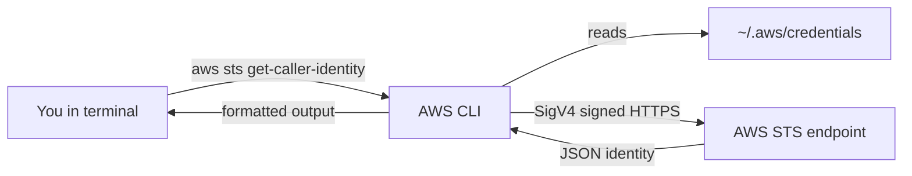

# Day 37: The AWS CLI (The Bridge)

> **Goal**: Install and configure the AWS CLI so your terminal (and Terraform) can call AWS APIs as your IAM user.
> **Prereqs**: Day 36 — an IAM user with a downloaded Access Key ID and Secret Access Key.

## 1. Scenario & Why It Matters

You now have two secrets: an Access Key ID (`AKIA…`) and a Secret Access Key. These are your non-human credentials — they let programs sign HTTPS requests to AWS as your IAM user.

Before Terraform, Kubernetes, CI pipelines, or any SDK can touch AWS, you need a local tool that:

1. Stores those credentials in a predictable place.
2. Signs every request with AWS Signature Version 4.
3. Lets you sanity-check "who am I?" without writing code.

That tool is the **AWS CLI (`aws`)**. It reads from `~/.aws/credentials` and `~/.aws/config`, and almost every other AWS tool follows the same convention — so configuring the CLI once wires up your whole toolchain.

## 2. Concept Deep-Dive

The CLI is a thin client around the AWS public API. When you run `aws <service> <command>`, it:

1. Loads credentials from a resolver chain (env vars → shared file → IAM role → SSO).
2. Builds an HTTPS request for the chosen service endpoint in the chosen region.
3. Signs the request with your secret key.
4. Parses the JSON response and prints it in the chosen output format.



Key files after `aws configure`:

- `~/.aws/credentials` — the `aws_access_key_id` and `aws_secret_access_key`.
- `~/.aws/config` — default region and output format.

Both files support multiple named **profiles** (`[default]`, `[work]`, `[prod]`), which you select with `--profile` or `AWS_PROFILE`.

## 3. Hands-On Mission

**1. Install the CLI**

- macOS: `brew install awscli`
- Windows: `winget install Amazon.AWSCLI`
- Linux (Debian/Ubuntu): `sudo apt install awscli`

Verify with `aws --version`.

**2. Configure credentials**

```bash
aws configure
```

Answer the four prompts using the `.csv` from Day 36:

- **AWS Access Key ID**: `AKIA…`
- **AWS Secret Access Key**: the long secret string
- **Default region name**: `us-east-1`
- **Default output format**: `json`

**3. Prove the connection works**

```bash
aws sts get-caller-identity
```

STS (Security Token Service) echoes back the identity AWS sees — a round-trip proof that signing and authentication both worked.

## 4. Your Task — Answer

**Q:** Run `aws sts get-caller-identity` and paste the output.

**Sample answer:**

```json
{
  "UserId": "AIDAZ6S4XEXAMPLEID",
  "Account": "123456789012",
  "Arn": "arn:aws:iam::123456789012:user/DevOpsAdmin"
}
```

**Why:** `UserId` is the unique IAM user ID, `Account` is your 12-digit account, and `Arn` is the full resource identifier. Seeing `user/DevOpsAdmin` (not `root`) confirms the CLI is using the IAM user's keys — exactly what Terraform will also use.

## 5. Q&A (Concepts Check)

**Q1: Where does the AWS CLI look for credentials, in what order?**
Environment variables (`AWS_ACCESS_KEY_ID`, `AWS_SECRET_ACCESS_KEY`), then the shared credentials file (`~/.aws/credentials`), then the shared config file, then container credentials, and finally the EC2 instance metadata service (IMDS). The first match wins.

**Q2: What does `aws sts get-caller-identity` actually do?**
It calls the STS `GetCallerIdentity` action, which requires no specific permissions and returns the IAM principal AWS resolved from your signed request. It's the canonical "am I authenticated?" health check.

**Q3: What's the difference between a region and an endpoint?**
A region is a geographic cluster of data centers (e.g., `us-east-1`). An endpoint is a specific URL the CLI hits, usually `<service>.<region>.amazonaws.com`. Your default region determines which endpoint is used when none is specified.

**Q4: How do you switch between multiple AWS accounts on the same laptop?**
Use named profiles: add `[work]` and `[personal]` sections in `~/.aws/credentials`, then run `aws s3 ls --profile work` or export `AWS_PROFILE=work`.

**Q5: Why is it dangerous to commit `~/.aws/credentials` into a git repo?**
Those keys grant whatever the IAM user can do. Public GitHub is continuously scraped by bots; leaked AWS keys are typically abused within minutes (mining, spam). Always add `.aws/` and `*.csv` to `.gitignore` and prefer short-lived credentials from SSO or IAM roles.

## 6. Further Reading

- AWS CLI docs: [Configuration basics](https://docs.aws.amazon.com/cli/latest/userguide/cli-configure-files.html)
- AWS CLI docs: [Named profiles](https://docs.aws.amazon.com/cli/latest/userguide/cli-configure-profiles.html)
- AWS docs: [Credentials provider chain](https://docs.aws.amazon.com/sdkref/latest/guide/standardized-credentials.html)
- AWS docs: [AWS Signature Version 4](https://docs.aws.amazon.com/general/latest/gr/signing_aws_api_requests.html)
