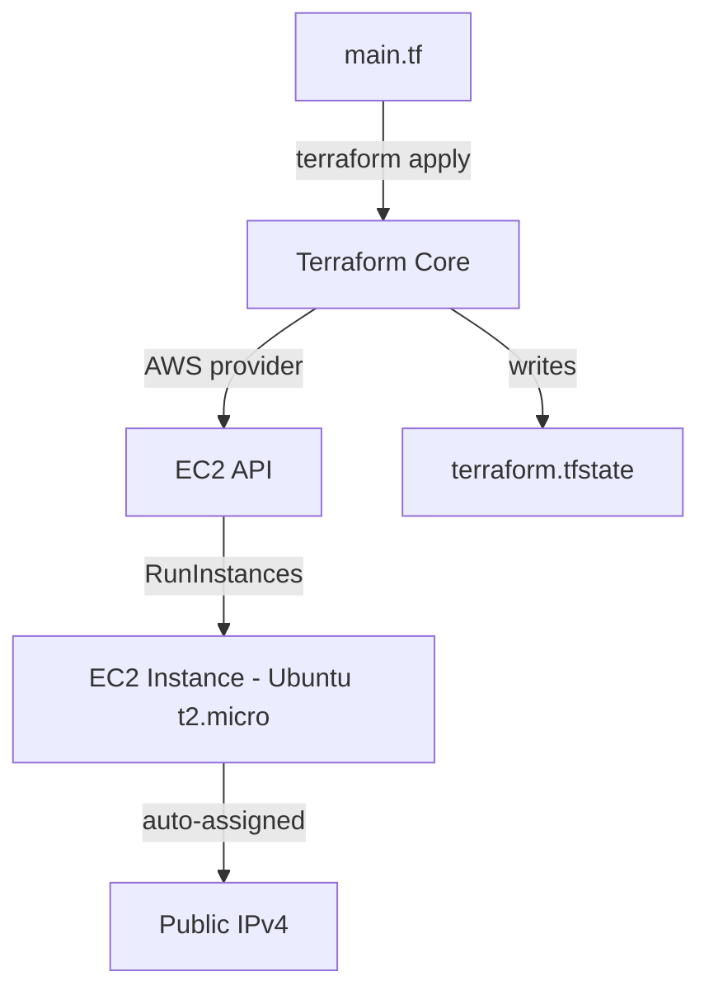

# Day 38: Your First Cloud Server (EC2)

> **Goal**: Provision an Ubuntu EC2 instance in `us-east-1` with Terraform and capture its public IP.
> **Prereqs**: Days 36–37 — IAM admin user and a working AWS CLI (`aws sts get-caller-identity` succeeds).

## 1. Scenario & Why It Matters

You have credentials; now you need compute. **EC2 (Elastic Compute Cloud)** is AWS's virtual machine service — the cloud equivalent of "a Linux box on the internet". Almost every higher-level service (EKS nodes, RDS, Elastic Beanstalk) is built on EC2 under the hood.

Rather than click through the AWS Console, we'll declare the server in Terraform. This gives us:

- **Reproducibility** — the same `main.tf` produces the same server in `dev`, `staging`, and `prod`.
- **Version control** — infrastructure changes live in git alongside code.
- **Automation** — `terraform apply` from a CI job can do what used to take a ticket.

Today we keep the stack minimal: one provider, one resource, one output. No SSH yet (that's Day 39), no firewall rules (Day 39), no bootstrap script (Day 40).

## 2. Concept Deep-Dive

Three Terraform ideas matter here:

- **Provider** — a plugin (`hashicorp/aws`) that knows how to talk to AWS APIs. It reads credentials from the same chain the AWS CLI uses.
- **Resource** — a declaration like `aws_instance "my_server"` that maps 1:1 to a cloud object. Terraform diff-tracks these in its state file.
- **Output** — a value (e.g., `public_ip`) Terraform prints after apply, useful for chaining or for humans.

An EC2 instance needs at minimum:

- **AMI (Amazon Machine Image)** — the disk image/OS to boot (Ubuntu, Amazon Linux, Windows, …). AMI IDs are region-specific.
- **Instance type** — the hardware size (`t2.micro` = 1 vCPU, 1 GiB RAM, Free Tier eligible).



The state file records which real-world object maps to which resource address, so the next `apply` knows whether to create, update, or destroy.

## 3. Hands-On Mission

**1. Scaffold the project**

```bash
mkdir aws-lab && cd aws-lab
touch main.tf
```

**2. Declare the provider**

```hcl
terraform {
  required_providers {
    aws = {
      source  = "hashicorp/aws"
      version = "~> 5.0"
    }
  }
}

provider "aws" {
  region = "us-east-1"
}
```

**3. Declare the server**

```hcl
resource "aws_instance" "my_server" {
  ami           = "ami-0c7217cdde317cfec" # Ubuntu 22.04 LTS (us-east-1)
  instance_type = "t2.micro"

  tags = {
    Name = "DevOps-Day38"
  }
}

output "public_ip" {
  value = aws_instance.my_server.public_ip
}
```

**4. Init and apply**

```bash
terraform init
terraform apply
```

Type `yes` and wait ~60 seconds.

**5. Destroy immediately** once you've captured the IP:

```bash
terraform destroy -auto-approve
```

Free Tier covers 750 instance-hours/month, but leaving things running is the #1 way new learners rack up bills. **Always clean up your lab.**

## 4. Your Task — Answer

**Q:** Run `terraform apply`, capture the `public_ip` output, then destroy. Paste what Terraform printed.

**Sample answer:**

```
Apply complete! Resources: 1 added, 0 changed, 0 destroyed.

Outputs:

public_ip = "54.196.22.105"
```

**Why:** The `Apply complete!` line confirms Terraform successfully called `RunInstances`. The `public_ip` output is AWS's auto-assigned public IPv4 address — the only way (today) to reach the box from the internet. It's useless right now (no firewall hole, no key) but it proves the machine is alive in AWS's network.

## 5. Q&A (Concepts Check)

**Q1: Why are AMI IDs region-specific?**
An AMI is stored as snapshots in a specific region's storage. The same Ubuntu 22.04 image has a different AMI ID in `us-east-1` vs `eu-west-1`. Always look up the AMI for the region your provider is configured with.

**Q2: What does `terraform init` do that `apply` doesn't?**
`init` downloads provider plugins into `.terraform/`, initializes the backend for state storage, and creates the dependency lock file. It's a one-time (per-project-per-config) setup step.

**Q3: What is `terraform.tfstate` and why must you protect it?**
It is the source of truth mapping your resource declarations to real cloud object IDs. It can contain sensitive values (passwords, private keys). Losing it means Terraform no longer knows what it manages; leaking it can expose secrets. In teams, store it remotely (S3 + DynamoDB lock) and never commit it to git.

**Q4: Why does `t2.micro` qualify for Free Tier but `t3.small` doesn't?**
Free Tier is a marketing SKU, not a technical property. AWS chose specific instance types and caps (750 hours/month of `t2.micro` or `t3.micro` in some regions). Anything outside the published list bills at the on-demand rate.

**Q5: What would change if you ran `terraform apply` a second time without editing `main.tf`?**
Terraform compares desired state (the `.tf` files) with actual state (the `.tfstate` plus a refresh call to AWS). If nothing drifted, you'd see `No changes. Your infrastructure matches the configuration.` This idempotency is the whole point of declarative IaC.

## 6. Further Reading

- Terraform registry: [aws_instance resource](https://registry.terraform.io/providers/hashicorp/aws/latest/docs/resources/instance)
- AWS docs: [EC2 instance types](https://aws.amazon.com/ec2/instance-types/)
- AWS docs: [Finding an Ubuntu AMI](https://cloud-images.ubuntu.com/locator/ec2/)
- Terraform docs: [State](https://developer.hashicorp.com/terraform/language/state)
