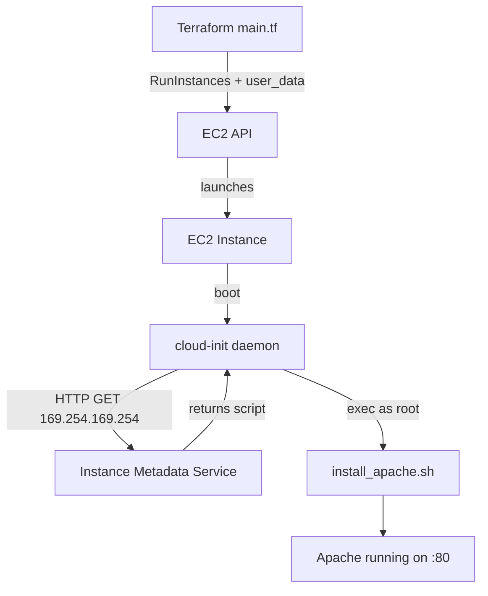

# Day 40: User Data (The Automator)

> **Goal**: Bootstrap a web server automatically at instance launch using an EC2 User Data script.
> **Prereqs**: Day 39 — an EC2 instance with a key pair and a security group allowing ports 22 and 80.

## 1. Scenario & Why It Matters

SSH-ing into a fresh box and typing `apt-get install` is fine for one server. For ten, it's tedious. For an auto-scaling group that spawns new instances at 3 AM, it's impossible.

AWS solves this with **User Data**: a string (often a shell script) that you pass to `RunInstances`. The first time the instance boots, **cloud-init** picks up the script from the instance metadata service and executes it as `root`. Subsequent reboots do **not** re-run it by default.

This is the simplest form of configuration management. Use it to:

- Install packages (`apache2`, `docker`, the CloudWatch agent).
- Pull a private artifact (after attaching an IAM role).
- Drop configuration files or register with service discovery.
- Pass dynamic values from Terraform into the instance via string interpolation.

## 2. Concept Deep-Dive

Under the hood:

1. Terraform sends the `user_data` string in the `RunInstances` API call.
2. AWS stores it in the **Instance Metadata Service (IMDS)** at `http://169.254.169.254/latest/user-data`.
3. On first boot, **cloud-init** (shipped with Ubuntu/Amazon Linux) fetches it and executes it. If the first line is `#!/bin/bash`, cloud-init runs it as a shell script.
4. Logs go to `/var/log/cloud-init-output.log` on the instance — the first place to look when bootstrap "didn't work".



Important properties:

- **Runs once.** Changing `user_data` on an existing instance has no effect unless you replace it (Terraform will show `forces replacement`).
- **Size limit: 16 KB** (base64-encoded). For bigger payloads, fetch from S3 inside a small script.
- **Not secret.** Any process on the instance can read IMDS. Never embed passwords directly — use Secrets Manager/SSM Parameter Store.

## 3. Hands-On Mission

**1. Create `install_apache.sh`** in `aws-lab/`:

```bash
#!/bin/bash
apt-get update
apt-get install -y apache2
systemctl start apache2
systemctl enable apache2
echo "<h1>Deployed via Terraform on $(date)</h1>" > /var/www/html/index.html
```

**2. Add `user_data` to your instance** in `main.tf`:

```hcl
resource "aws_instance" "my_server" {
  ami           = "ami-0c7217cdde317cfec"
  instance_type = "t2.micro"

  key_name               = aws_key_pair.deployer.key_name
  vpc_security_group_ids = [aws_security_group.allow_ssh_http.id]

  user_data = file("${path.module}/install_apache.sh")

  tags = {
    Name = "DevOps-Day40"
  }
}
```

**3. Apply and wait**

```bash
terraform apply -auto-approve
```

Terraform will report `forces replacement` — the old instance is destroyed and a new one created. Give it ~60 seconds after apply completes (cloud-init + `apt update` takes time).

**4. Test** by visiting `http://<YOUR_PUBLIC_IP>` in a browser.

**5. Destroy** when you're done.

## 4. Your Task — Answer

**Q:** Visit the public IP in a browser. Paste the text you see.

**Sample answer:**

```
Deployed via Terraform on Wed Feb 4 02:15:43 +07 2026
```

**Why:** That exact sentence was baked into `/var/www/html/index.html` by the User Data script. Seeing it in your browser proves the full chain worked: Terraform passed the script → IMDS served it → cloud-init executed it as root → `apache2` installed and started → the SG allowed port 80 inbound. The timestamp is evaluated on the instance at boot, so it reflects when cloud-init ran.

## 5. Q&A (Concepts Check)

**Q1: Does User Data re-run if you reboot the instance?**
No. By default cloud-init marks User Data as "done" after the first boot. You can force re-runs with `cloud-init clean` or by customizing the cloud-init config, but production usually treats instances as immutable: replace them instead of mutating.

**Q2: Where do you look if the bootstrap silently fails?**
SSH in and read `/var/log/cloud-init.log` (cloud-init's own log) and `/var/log/cloud-init-output.log` (stdout/stderr of your script). `systemctl status cloud-final` is also useful.

**Q3: Why shouldn't you put database passwords directly into `user_data`?**
User Data is visible to any process on the instance via IMDS and is stored unencrypted in the instance description (visible to anyone with `ec2:DescribeInstances`). Use Secrets Manager/SSM Parameter Store and an IAM instance profile to fetch secrets at runtime.

**Q4: What is the relationship between User Data and IMDSv2?**
IMDSv2 adds a session-token requirement to IMDS requests, mitigating SSRF attacks. Cloud-init on modern AMIs speaks IMDSv2 transparently. If you write custom scripts that hit `169.254.169.254`, fetch a token with a `PUT` first and include it as an `X-aws-ec2-metadata-token` header.

**Q5: When is User Data the wrong tool?**
For complex or drift-prone configuration, use a real config management tool (Ansible, Chef) or better — bake an AMI with Packer so the instance boots already-configured. User Data shines for tiny bootstrappers (5–20 lines) that just kick things off.

## 6. Further Reading

- AWS docs: [Run commands on your Linux instance at launch](https://docs.aws.amazon.com/AWSEC2/latest/UserGuide/user-data.html)
- cloud-init docs: [Official documentation](https://cloudinit.readthedocs.io/)
- AWS docs: [Instance metadata and IMDSv2](https://docs.aws.amazon.com/AWSEC2/latest/UserGuide/configuring-instance-metadata-service.html)
- HashiCorp: [Packer for building AMIs](https://developer.hashicorp.com/packer/tutorials/aws-get-started)
