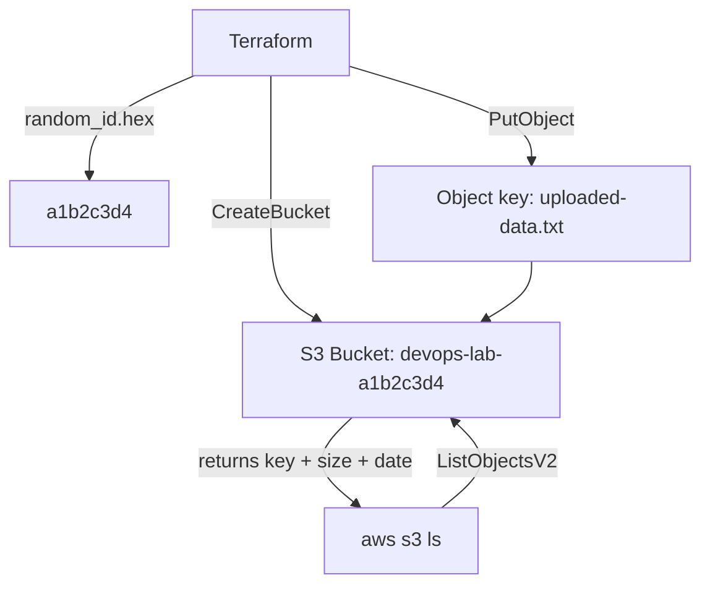

# Day 41: S3 (The Infinite Hard Drive)

> **Goal**: Create a uniquely-named S3 bucket with Terraform, upload a file to it, and verify with the AWS CLI.
> **Prereqs**: Day 37 (AWS CLI) and a working Terraform + AWS provider setup.

## 1. Scenario & Why It Matters

EC2 instance disks are **ephemeral** — terminate the instance and the data is gone unless you manually preserve an EBS volume. That's the wrong store for user uploads, database backups, build artifacts, static websites, or log archives.

**Amazon S3 (Simple Storage Service)** is AWS's object store: a key/value blob service with effectively unlimited capacity, 11 nines of durability, and global accessibility over HTTPS. Almost every AWS service integrates with it — CloudFront serves S3 objects to the edge, Athena queries them as SQL, Lambda is packaged from them, and Terraform itself often stores its state there.

Two things make S3 special:

- **Bucket names are globally unique** across *all* AWS accounts (like a DNS name). `my-bucket` was taken in 2006. Hence the "random suffix" pattern.
- **Storage is cheap but requests cost too.** ~$0.023/GB-month for Standard, plus per-request fees. Easy to fit in Free Tier for learning; watch it in production.

## 2. Concept Deep-Dive

S3's object model:

- **Bucket** — a top-level namespace in a region (objects live in one region even though the API is global).
- **Object** — the actual blob. Identified by a **key** (looks like a path: `photos/2026/cat.jpg`).
- **Key** — a string, not a folder. S3 has no true directories; "folders" are a UI convention based on `/` prefixes.
- **Metadata + tags** — HTTP-style headers attached to each object (content type, cache control, custom `x-amz-meta-*`).



In Terraform we use three resources:

- `random_id` — generates a hex suffix so the bucket name is unique.
- `aws_s3_bucket` — creates the bucket.
- `aws_s3_object` — uploads a local file as an object. (For large/many files, prefer `aws s3 sync` outside Terraform — tfstate isn't a file manifest.)

## 3. Hands-On Mission

**1. Create a local file** `my-data.txt` in `aws-lab/`:

```
This is critical data saved in the cloud.
```

**2. Append to `main.tf`**:

```hcl
resource "random_id" "bucket_suffix" {
  byte_length = 4
}

resource "aws_s3_bucket" "my_bucket" {
  bucket = "devops-lab-${random_id.bucket_suffix.hex}"

  tags = {
    Name        = "My bucket"
    Environment = "Dev"
  }
}

resource "aws_s3_object" "file_upload" {
  bucket = aws_s3_bucket.my_bucket.id
  key    = "uploaded-data.txt"
  source = "${path.module}/my-data.txt"
}

output "bucket_name" {
  value = aws_s3_bucket.my_bucket.id
}
```

**3. Init and apply** (re-init because we added the `random` provider):

```bash
terraform init
terraform apply -auto-approve
```

**4. Verify with the CLI:**

```bash
aws s3 ls s3://<YOUR_BUCKET_NAME>
```

**5. Clean up.** Empty the bucket first, then destroy:

```bash
aws s3 rm s3://<YOUR_BUCKET_NAME> --recursive
terraform destroy -auto-approve
```

Terraform can't destroy a non-empty bucket unless `force_destroy = true` is set — a safety feature.

## 4. Your Task — Answer

**Q:** Run `aws s3 ls s3://<YOUR_BUCKET_NAME>` and paste the output.

**Sample answer:**

```
2026-03-02 22:43:44         41 uploaded-data.txt
```

**Why:** The CLI made a `ListObjectsV2` API call against your bucket and returned one object:

- `2026-03-02 22:43:44` — last-modified timestamp.
- `41` — object size in bytes (matches the length of `"This is critical data saved in the cloud.\n"`).
- `uploaded-data.txt` — the S3 key you set via `aws_s3_object.key`, not the local filename.

Seeing this line proves: the bucket exists in your account, your IAM user has `s3:ListBucket`, and the file transfer during `apply` succeeded.

## 5. Q&A (Concepts Check)

**Q1: Why must S3 bucket names be globally unique?**
Buckets are addressable via DNS (e.g., `my-bucket.s3.amazonaws.com`). DNS is a global namespace, so two AWS accounts can't own the same bucket name simultaneously.

**Q2: What's the difference between S3 Standard and S3 Glacier?**
Standard is hot storage — millisecond retrieval, higher per-GB cost. Glacier tiers (Instant, Flexible, Deep Archive) are cold storage — pennies per GB-month but retrieval latency ranges from milliseconds (Instant) to hours (Deep Archive). Choose via `storage_class` on the object or via a lifecycle policy.

**Q3: Is S3 strongly consistent?**
Yes (since December 2020). Reads after a `PUT`/`DELETE` return the new state immediately, including list operations. Before that, S3 was eventually consistent for overwrite-PUTs and deletes.

**Q4: Why is `aws_s3_object` a bad fit for uploading a whole website?**
Each object becomes a Terraform-managed resource in tfstate, so 10,000 files means 10,000 state entries and very slow plans/applies. Use `aws s3 sync` (outside Terraform) or a build-time step; let Terraform only create the bucket and policies.

**Q5: How do you make a bucket serve a static website publicly?**
Enable `aws_s3_bucket_website_configuration`, turn off `BlockPublicAcls`/`BlockPublicPolicy`, and attach a bucket policy allowing `s3:GetObject` on `arn:aws:s3:::<bucket>/*` to `Principal: "*"`. For production, put CloudFront in front of a *private* bucket with an Origin Access Control instead.

## 6. Further Reading

- AWS docs: [S3 core concepts](https://docs.aws.amazon.com/AmazonS3/latest/userguide/Welcome.html)
- AWS docs: [S3 storage classes](https://aws.amazon.com/s3/storage-classes/)
- AWS docs: [S3 bucket naming rules](https://docs.aws.amazon.com/AmazonS3/latest/userguide/bucketnamingrules.html)
- Terraform registry: [aws_s3_bucket](https://registry.terraform.io/providers/hashicorp/aws/latest/docs/resources/s3_bucket)
