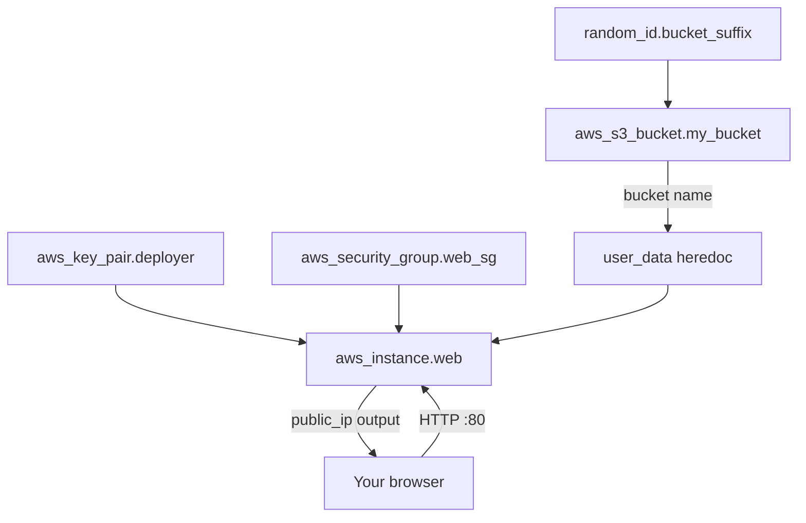

# Day 42: Weekly Challenge — The Connected Stack

> **Goal**: Provision an EC2 web server and an S3 bucket in one Terraform apply, and have the server's landing page dynamically reference the bucket's name.
> **Prereqs**: Days 36–41 — IAM, AWS CLI, EC2, Security Groups, User Data, S3.

## 1. Scenario & Why It Matters

You're prototyping a photo-processing app. The architecture is intentionally tiny:

- A **web server** (EC2) that will eventually accept uploaded photos.
- A **storage bucket** (S3) where those photos land.

The interesting part is not the individual resources — you've built each one this week. The new skill is **gluing them together**: the EC2 instance needs to know the S3 bucket's name, but that name is randomly suffixed and only known after the bucket is created.

This is the core value-proposition of Infrastructure as Code: **resource attributes flow between resources via the dependency graph, not via copy/paste**. In Terraform, `aws_s3_bucket.my_bucket.id` is a real reference — Terraform builds a DAG, creates the bucket first, then passes its name into the instance's `user_data`.

Mastering this pattern unlocks every multi-tier architecture you'll build later: RDS endpoints fed to app servers, load balancer DNS names fed to Route 53, IAM role ARNs fed to Lambda environments, etc.

## 2. Concept Deep-Dive

Two Terraform features do the heavy lifting:

- **Implicit dependencies** — when you write `${aws_s3_bucket.my_bucket.id}` inside any argument of another resource, Terraform automatically puts the bucket *before* that resource in the dependency graph. No `depends_on` needed.
- **Heredoc strings (`<<-EOF`)** — multi-line string literals that preserve newlines. The `-` strips leading whitespace based on the closing `EOF`, letting you indent the block naturally. Inside heredocs, Terraform's `${}` interpolation still works, which is how we inject the bucket name.



**Gotcha with heredocs and shell syntax:** Terraform parses `${…}` first. If you want a *literal* dollar expression for the shell (e.g., `$(date)`), escape it as `$${...}` or `$$(date)` to keep Terraform from trying to resolve it.

## 3. Hands-On Mission

Write one `main.tf` in `aws-lab/` that provisions the full stack. Reuse the `mykey.pub` from Day 39.

```hcl
terraform {
  required_providers {
    aws = {
      source  = "hashicorp/aws"
      version = "~> 5.0"
    }
    random = {
      source  = "hashicorp/random"
      version = "~> 3.5"
    }
  }
}

provider "aws" {
  region = "us-east-1"
}

resource "random_id" "bucket_suffix" {
  byte_length = 4
}

resource "aws_s3_bucket" "photos" {
  bucket = "devops-lab-${random_id.bucket_suffix.hex}"

  tags = {
    Name        = "photo-uploads"
    Environment = "Dev"
  }
}

resource "aws_key_pair" "deployer" {
  key_name   = "deployer-key"
  public_key = file("${path.module}/mykey.pub")
}

resource "aws_security_group" "web_sg" {
  name        = "day42-web-sg"
  description = "Allow SSH and HTTP"

  ingress {
    from_port   = 22
    to_port     = 22
    protocol    = "tcp"
    cidr_blocks = ["0.0.0.0/0"]
  }

  ingress {
    from_port   = 80
    to_port     = 80
    protocol    = "tcp"
    cidr_blocks = ["0.0.0.0/0"]
  }

  egress {
    from_port   = 0
    to_port     = 0
    protocol    = "-1"
    cidr_blocks = ["0.0.0.0/0"]
  }
}

resource "aws_instance" "web" {
  ami           = "ami-0c7217cdde317cfec" # Ubuntu 22.04 (us-east-1)
  instance_type = "t2.micro"

  key_name               = aws_key_pair.deployer.key_name
  vpc_security_group_ids = [aws_security_group.web_sg.id]

  user_data = <<-EOF
    #!/bin/bash
    apt-get update
    apt-get install -y apache2
    systemctl start apache2
    systemctl enable apache2
    echo "<h1>Upload to: ${aws_s3_bucket.photos.id}</h1>" > /var/www/html/index.html
  EOF

  tags = {
    Name = "DevOps-Day42-Web"
  }
}

output "public_ip" {
  value = aws_instance.web.public_ip
}

output "bucket_name" {
  value = aws_s3_bucket.photos.id
}
```

Deploy:

```bash
terraform init
terraform apply -auto-approve
```

Wait ~60 seconds, then open `http://<public_ip>`. The page should read `Upload to: devops-lab-<random-hex>`, and that hex should match the `bucket_name` output.

Clean up:

```bash
aws s3 rm s3://$(terraform output -raw bucket_name) --recursive
terraform destroy -auto-approve
```

## 4. Your Task — Answer

**Q:** Write a single `main.tf` that deploys the stack described above, where the EC2 User Data script injects the randomly-suffixed S3 bucket name into `/var/www/html/index.html`. Paste your `main.tf`.

**Sample answer:** See the full `main.tf` in section 3. The critical line is:

```
echo "<h1>Upload to: ${aws_s3_bucket.photos.id}</h1>" > /var/www/html/index.html
```

**Why:** Because `aws_s3_bucket.photos.id` appears inside the instance's `user_data`, Terraform builds a dependency edge from `aws_instance.web` → `aws_s3_bucket.photos` → `random_id.bucket_suffix`. On `apply`, Terraform creates the random ID, then the bucket, then materializes the actual name (e.g., `devops-lab-a1b2c3d4`) into the heredoc, then launches the instance with the fully-rendered User Data. When cloud-init runs the script, the literal bucket name is already baked in — no runtime lookup, no metadata API call, no hardcoded guess. This is the standard way Terraform wires cloud resources together.

## 5. Q&A (Concepts Check)

**Q1: How does Terraform know to create the S3 bucket *before* the EC2 instance?**
Through the **implicit dependency graph**. The expression `${aws_s3_bucket.photos.id}` inside `user_data` references another resource, so Terraform adds an edge from `aws_instance.web` to `aws_s3_bucket.photos` in the DAG and orders `apply` accordingly.

**Q2: What is the difference between `<<EOF` and `<<-EOF`?**
Both are heredoc delimiters. The `-` variant strips the *common leading whitespace* from every line (based on the indentation of the closing `EOF`). Without `-`, every space in your indented Terraform file becomes part of the string — which often breaks shell scripts.

**Q3: If you wanted the User Data to use a shell variable like `$(date)`, how would you write it?**
Escape the dollar so Terraform leaves it alone: `$$(date)`. Terraform's interpolation parser treats `$$` as a literal `$`, so the rendered script contains `$(date)` and the shell expands it at runtime.

**Q4: Why is it a bad idea to bake the bucket name into `/var/www/html/index.html` via User Data in real production?**
User Data runs only once. If the bucket is replaced (new random suffix) or you want to rotate it, existing instances still display the old name. Production patterns pass configuration at runtime: environment variables, SSM Parameter Store, Secrets Manager, or a service discovery layer.

**Q5: How would you let the EC2 instance actually *upload* to the bucket (instead of just displaying its name)?**
Create an IAM role with an S3 policy (`s3:PutObject` on `arn:aws:s3:::<bucket>/*`), wrap it in an `aws_iam_instance_profile`, and attach it to the instance via `iam_instance_profile`. The instance then obtains temporary STS credentials from IMDS — no static keys, no credentials in User Data.

## 6. Further Reading

- Terraform docs: [Resource dependencies](https://developer.hashicorp.com/terraform/language/resources/behavior)
- Terraform docs: [Heredoc strings](https://developer.hashicorp.com/terraform/language/expressions/strings#heredoc-strings)
- AWS docs: [IAM roles for EC2](https://docs.aws.amazon.com/AWSEC2/latest/UserGuide/iam-roles-for-amazon-ec2.html)
- AWS blog: [Terraform on AWS — common patterns](https://aws.amazon.com/blogs/apn/terraform-beyond-the-basics-with-aws/)
