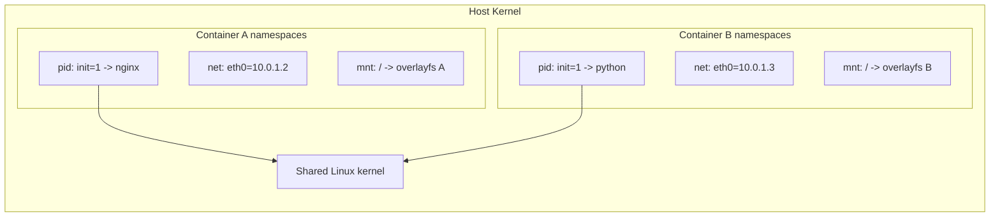
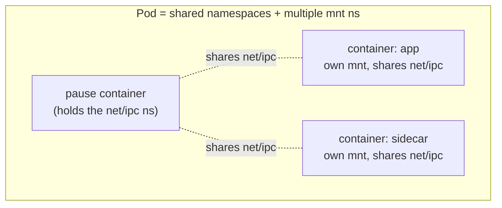

# Day 42-1: Linux Namespaces — How Containers "See" Their Own World

> **Goal**: Understand the Linux kernel feature that makes containers possible.
> **Prereqs**: Week 3 (Docker basics).

## 1. Scenario & Why It Matters

A "container" is not a VM. There is no hypervisor, no guest kernel. When you run `docker run nginx`, you are just launching an ordinary Linux process that shares the host's kernel. So what makes it feel isolated — its own `ps`, its own network interfaces, its own hostname?

The answer is **Linux namespaces**: a kernel feature that gives a process its own private view of a given system resource (PIDs, mounts, network, etc.). Kubernetes stands on top of this. You cannot reason confidently about Pods, CNI, or security contexts without understanding namespaces first.

## 2. Concept Deep-Dive

A namespace wraps a global system resource in an abstraction so that processes inside the namespace see an isolated instance of it. Linux has seven namespace types (as of kernel 5.6+):

| Namespace | Isolates | Example effect |
|-----------|----------|----------------|
| `pid` | Process IDs | Inside the container, your app is PID 1 |
| `mnt` | Mount points | Container sees its own `/`, can't see host filesystem |
| `net` | Network stack | Own interfaces, routing tables, firewall rules, ports |
| `uts` | Hostname + domain | `hostname` returns the container's name |
| `ipc` | SysV IPC, POSIX msg queues | Shared memory segments are isolated |
| `user` | UIDs and GIDs | Root in container can map to unprivileged UID on host |
| `cgroup` | cgroup root | Container can't see the host's cgroup hierarchy |

Every process on Linux belongs to one namespace of each type. Processes in the same namespace see the same resource view.



### Three syscalls run the show

- `clone(CLONE_NEW*)` — create a new process **in** new namespaces.
- `unshare` — leave current namespaces, join new ones, without forking.
- `setns(fd)` — attach the current process to an **existing** namespace (this is how `docker exec` works: it opens the target's `/proc/<pid>/ns/net` and joins it).

### Where do K8s Pods fit in?

A **Pod** is a set of containers that share the **net**, **ipc**, and (optionally) **pid** namespaces, but each container has its **own** `mnt` namespace (its own root filesystem from its image).



The tiny **pause container** exists only to hold the shared namespaces alive while the "real" containers come and go during restarts.

## 3. Hands-On Mission

Inspect namespaces on your host (Linux or inside a Docker Desktop VM):

```bash
ls -l /proc/$$/ns
```

Each entry is a symlink to an inode like `net:[4026531993]`. Two processes pointing to the same inode are in the same namespace.

Create a fresh UTS namespace and change the hostname inside it:

```bash
sudo unshare --uts /bin/bash
# inside the new shell:
hostname experiment
hostname                # "experiment"
# in another terminal on the host:
hostname                # unchanged
```

Inspect a running container's namespaces from the host:

```bash
docker run -d --name nginx-demo nginx:alpine
PID=$(docker inspect -f '{{.State.Pid}}' nginx-demo)
sudo ls -l /proc/$PID/ns
```

Enter the container's network namespace without entering the container itself:

```bash
sudo nsenter -t $PID -n ip addr
```

You will see the container's `eth0`, not the host's.

## 4. Your Task — Answer

**Q:** What command lets you see a process's namespace inode IDs, and how do you compare two processes to tell if they share a namespace?

**Sample answer**: Run `ls -l /proc/<pid>/ns/` for each process. Compare the target of the symlink (for example `net:[4026531993]`). If the inode numbers match for a namespace type, the two processes share that namespace. Two containers in the same Pod will have the same `net` and `ipc` inodes but different `mnt`.

## 5. Q&A (Concepts Check)

**Q: If I run a process as root inside a container and the container escapes, does it have root on the host?**
A: It depends on the **user namespace**. Without user namespaces (the historical Docker default), root in the container is UID 0 on the host — a container escape gives full root. With user namespaces enabled, container UID 0 is mapped to a high, unprivileged UID (like 100000) on the host, so the escape is neutered. Kubernetes supports this via `securityContext.runAsUser` and Pod Security Standards.

**Q: Why do all containers in a Pod share the same IP?**
A: Because they share a single **net namespace**. Only one `eth0`, one `lo`, one routing table — so `localhost:8080` from one container reaches another container in the same Pod.

**Q: What happens when PID 1 in a PID namespace dies?**
A: The kernel tears down the entire namespace and sends `SIGKILL` to every other process in it. This is why your app needs proper signal handling when it runs as PID 1 (or why you use `tini` / the `--init` flag as a PID-1 reaper).

**Q: Does `mount` inside a container affect the host?**
A: No — each container has its own **mnt namespace**. Bind mounts from the host into the container are set up at container creation via shared subtrees; they do not leak back.

**Q: How does Kubernetes turn off network isolation for a Pod that needs direct host access?**
A: `spec.hostNetwork: true` — the Pod's containers join the **host's** net namespace instead of their own. Useful for node agents like `kube-proxy` and `cni` daemons, dangerous for user apps.

## 6. Further Reading

- `man 7 namespaces` (the definitive reference).
- "A Deep Dive into Kubernetes Networking" — Kristen Jacobs.
- Next: [Day 42-2 — cgroups, CPU, Memory](day42-2_cgroups-cpu-memory.md).
