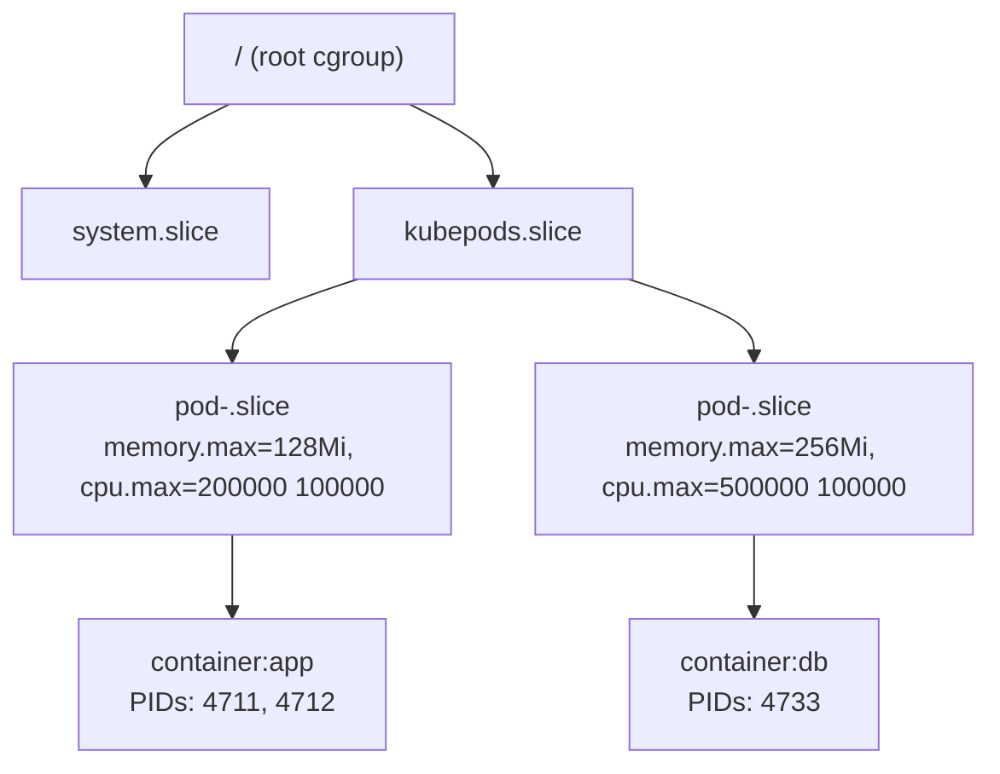
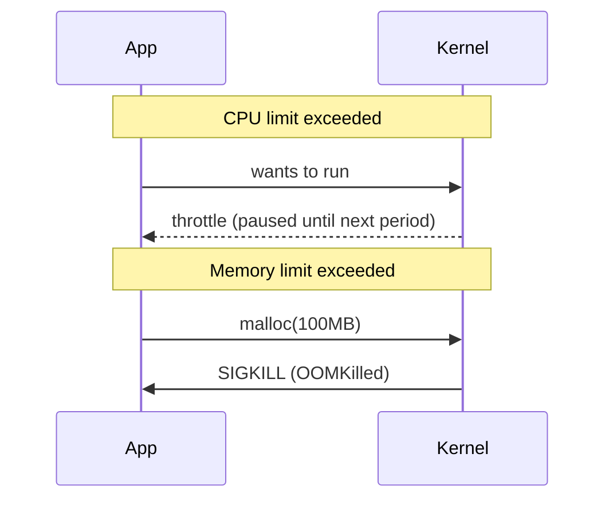

# Day 42-2: cgroups, CPU & Memory — How the Kernel Enforces "Fair Share"

> **Goal**: Understand how Linux limits and accounts for resources per container.
> **Prereqs**: [Day 42-1 — Linux Namespaces](day42-1_linux-namespaces.md).

## 1. Scenario & Why It Matters

Namespaces give a container its own **view** of the system. But a container with no limits can still consume every CPU cycle and every byte of memory on the host, starving its neighbors. **cgroups** (control groups) are the complementary kernel feature that **accounts for and caps resource usage** per process group. When you later set `resources.requests` and `resources.limits` in a Pod spec, you are talking directly to cgroups.

## 2. Concept Deep-Dive

A cgroup is a node in a hierarchy. Each cgroup can have child cgroups, and every running process belongs to exactly one cgroup in each **controller** (cpu, memory, io, pids, etc.). The kernel charges every allocation to the appropriate cgroup.



Modern systems use **cgroup v2** (unified hierarchy under `/sys/fs/cgroup`). Key files inside a cgroup directory:

| File | Meaning |
|------|---------|
| `cpu.max` | `"max 100000"` = unlimited; `"50000 100000"` = 50ms per 100ms period (half a core) |
| `cpu.weight` | Relative share when CPU is contended (default 100, range 1–10000) |
| `memory.max` | Hard cap in bytes; exceeding it triggers OOM-kill |
| `memory.high` | Soft cap; kernel throttles allocations above this instead of killing |
| `pids.max` | Maximum number of processes |
| `io.max` | Bandwidth and IOPS caps per block device |

### How Kubernetes maps its spec to cgroups

```yaml
resources:
  requests:
    cpu: "100m"
    memory: "64Mi"
  limits:
    cpu: "500m"
    memory: "256Mi"
```

- `requests.cpu: 100m` → sets `cpu.weight` (scheduler also uses this to pick a node).
- `limits.cpu: 500m` → sets `cpu.max = 50000 100000` (half a core per 100ms quota).
- `requests.memory: 64Mi` → scheduling signal only; no enforcement file.
- `limits.memory: 256Mi` → sets `memory.max = 268435456`.

### CPU throttling vs memory OOM — different failure modes



CPU over-usage is **elastic**: the kernel just pauses you. Memory over-usage is **fatal**: the kernel picks the fattest process in the cgroup and kills it (`dmesg` shows `Memory cgroup out of memory`).

### QoS classes (how K8s picks who dies first)

| QoS | Condition | Eviction order under node pressure |
|-----|-----------|------------------------------------|
| `Guaranteed` | Every container has `requests == limits` for CPU **and** memory | Last to be evicted |
| `Burstable` | At least one resource has `requests < limits` (or only requests) | Middle |
| `BestEffort` | No requests and no limits anywhere | First to be killed |

## 3. Hands-On Mission

On a Linux host (or Docker Desktop's Linux VM):

```bash
# Look at your own cgroup
cat /proc/self/cgroup

# List the kubepods slice (on a k8s node)
ls /sys/fs/cgroup/kubepods.slice/ | head

# Inspect a specific container's memory limit
docker run -d --name mem-demo --memory 128m nginx:alpine
CID=$(docker inspect -f '{{.Id}}' mem-demo)
cat /sys/fs/cgroup/system.slice/docker-$CID.scope/memory.max
# 134217728  (= 128 MiB)
```

Trigger an OOMKill:

```bash
docker run --rm --memory 64m polinux/stress stress --vm 1 --vm-bytes 100M --timeout 20s
# Container exits with 137 (SIGKILL from OOM)
```

## 4. Your Task — Answer

**Q:** Given `limits.cpu: "500m"` on cgroup v2, what values does the kernel write to `cpu.max`?

**Sample answer**: `"50000 100000"`. The second number is the scheduling **period** in microseconds (100ms by default). The first is the **quota**: how many CPU-microseconds the cgroup may use per period. `500m` means "500 milli-cores" = half a core = 50ms of CPU time per 100ms of wall-clock time.

## 5. Q&A (Concepts Check)

**Q: Why does `kubectl top pod` show usage that exceeds `requests` but never exceeds `limits`?**
A: `requests` is a scheduling reservation; the kernel does not cap you at it. You are free to burst above requests if the node has spare capacity, right up to `limits`, which is the real ceiling enforced by cgroups.

**Q: My container keeps getting OOMKilled but `kubectl top` shows usage well under the limit. Why?**
A: `kubectl top` polls every ~60 seconds; cgroups enforce instantaneously. A spike that lasts 3 seconds can kill you before metrics-server ever sees it. Use `kubectl describe pod` and look at `Last State: Terminated, Reason: OOMKilled, Exit Code: 137`.

**Q: What's the difference between memory `requests` and memory `limits`?**
A: `requests` influences scheduling (the scheduler places the Pod only on nodes with at least that much "allocatable" memory free). `limits` influences the kernel (cgroup `memory.max`). Setting them equal puts your Pod in QoS class `Guaranteed` — the safest class under node pressure.

**Q: Why does high CPU usage just slow my app instead of killing it, while memory spikes kill it outright?**
A: The kernel can always **reclaim** CPU by scheduling less often. It cannot reclaim memory once allocated — the only tools it has are swap (often disabled on K8s nodes) and OOM-kill.

**Q: What is a "Guaranteed" pod and why would I want one?**
A: A Pod where every container has `requests == limits` for every resource. These Pods are the last to be evicted under node pressure, may get exclusive CPU cores with `cpuManagerPolicy=static`, and never surprise the scheduler by bursting.

## 6. Further Reading

- `man 7 cgroups`, kernel docs `Documentation/admin-guide/cgroup-v2.rst`.
- Kubernetes: "Assign CPU Resources to Containers and Pods".
- Next: [Day 42-3 — Container Runtime](day42-3_container-runtime.md).
