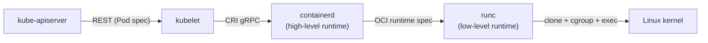
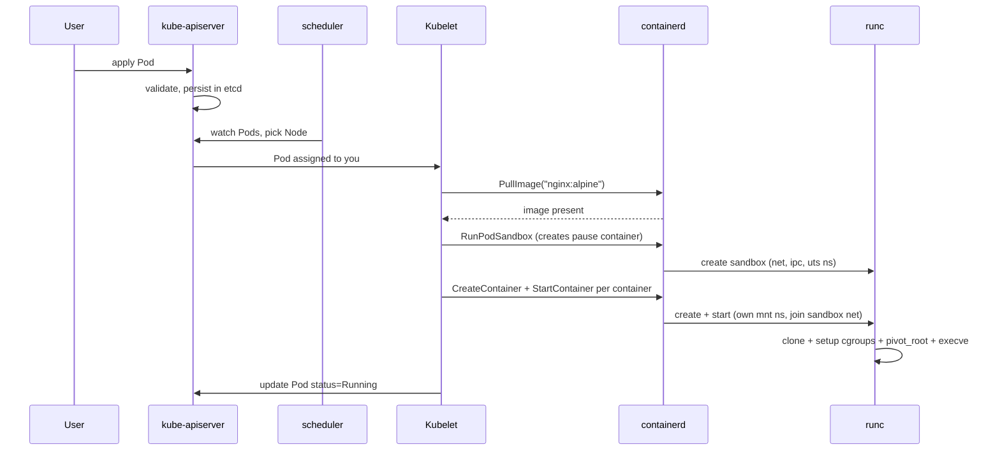

# Day 42-3: The Container Runtime — From `kubectl apply` to a Running Process

> **Goal**: Follow a Pod from the API server down to a process on a node.
> **Prereqs**: [Day 42-1 — Namespaces](day42-1_linux-namespaces.md), [Day 42-2 — cgroups](day42-2_cgroups-cpu-memory.md).

## 1. Scenario & Why It Matters

"Kubernetes doesn't run containers" — a surprising sentence that is literally true. Kubernetes tells a **container runtime** to do that. When you debug `ImagePullBackOff`, `CreateContainerError`, or mysterious `Error: cannot find cgroup`, you are almost always looking at a runtime problem, not a K8s problem. You need to know who actually does the work.

## 2. Concept Deep-Dive

There are **three layers**:



**Low-level runtime** (`runc`, `crun`, `kata-runtime`): takes an OCI bundle (rootfs + `config.json`) and actually calls the kernel syscalls — `clone`, `unshare`, cgroup setup, mount, `execve`. It creates a single container and exits.

**High-level runtime** (`containerd`, `CRI-O`): manages the lifecycle. Pulls images from registries, unpacks layers into an overlayfs rootfs, writes the OCI `config.json`, invokes the low-level runtime, handles restarts, streams logs, supervises the container with a helper process (`containerd-shim-runc-v2`).

**Kubelet**: the Kubernetes agent on every node. It talks to the high-level runtime via the **CRI** (Container Runtime Interface, a gRPC protocol over a local Unix socket like `/run/containerd/containerd.sock`).

### End-to-end: `kubectl apply -f pod.yaml`



### The pause container (the quiet hero)

Every Pod starts with a tiny `pause` container that does nothing but `sleep` forever. Its purpose: **own the network/IPC/UTS namespaces** for the Pod. All real containers in the Pod join those namespaces via `setns`. If an app container dies, the namespaces survive (because pause is still alive), so the replacement container gets the same Pod IP. Without the pause container, the first container crash would tear down the Pod's network identity.

### Images are not magic — they are tarballs + JSON

An OCI image is just:

- A `manifest.json` (list of layers, config digest).
- A `config.json` (environment, entrypoint, labels).
- One or more layer tarballs (incremental filesystem diffs).

`containerd` unpacks layers in order using **overlayfs**: each layer is a read-only directory, and the container gets a read-write "upper" layer on top. Copy-on-write means changes to `/etc/...` don't touch the base image.

## 3. Hands-On Mission

Inspect the CRI socket on a node running containerd (Minikube, kind, or a real cluster):

```bash
minikube ssh
sudo crictl info | head -30          # runtime info
sudo crictl ps                        # list containers
sudo crictl pods                      # list pod sandboxes
sudo crictl inspect <container-id>    # full OCI config
```

See the pause container:

```bash
sudo crictl ps -a | grep pause
```

Trace a container's overlayfs layers:

```bash
sudo ctr -n k8s.io containers info <container-id> | jq .Snapshotter
sudo ctr -n k8s.io snapshots tree
```

## 4. Your Task — Answer

**Q:** Which Unix socket does kubelet talk to in a containerd-based cluster, and what is the name of the RPC API?

**Sample answer**: The socket is `/run/containerd/containerd.sock` (or `/var/run/containerd/containerd.sock` depending on distro), and the API is the **Container Runtime Interface (CRI)**, a gRPC service with two endpoints — `RuntimeService` (pods, containers, exec, logs) and `ImageService` (pull, list, remove images).

## 5. Q&A (Concepts Check)

**Q: Docker was removed from Kubernetes. Did my containers break?**
A: No. K8s 1.24 removed the built-in `dockershim` (the adapter from CRI to Docker Engine's API). Almost all clusters now use `containerd` or `CRI-O` directly, which speak CRI natively. Images are still OCI-compatible, so every Docker image still runs.

**Q: What's the difference between `runc` and `crun`?**
A: Both implement the OCI runtime spec. `runc` is written in Go (the Reference implementation, used by Docker and containerd). `crun` is written in C, starts ~2x faster, and has a smaller memory footprint. `kata-runtime` goes further and boots a micro-VM per container for stronger isolation.

**Q: Why does every Pod have a `pause` container even though I didn't define it?**
A: The pause container is created by the runtime, not by you, to own the shared Pod namespaces (net, ipc, uts). It is what keeps the Pod's IP stable across container restarts. You see it as a second container if you run `crictl ps --name pause`.

**Q: My Pod is stuck in `ContainerCreating`. What layer is failing?**
A: Describe the Pod. Common causes: (a) image pull failure — the **high-level runtime** can't fetch the image (auth, bad name); (b) volume mount failure — kubelet can't mount the PVC; (c) network setup failure — the CNI plugin returned an error. Runtime errors will show in `crictl` logs on the node, not in the Pod's own logs.

**Q: What's an "init container" at the runtime level?**
A: Just another container in the same Pod sandbox. kubelet runs them sequentially **before** any of the `containers:`. From the runtime's perspective they are identical to main containers; it's kubelet that enforces the ordering.

## 6. Further Reading

- CRI spec: `kubernetes/cri-api` repo on GitHub.
- OCI Runtime Spec: `opencontainers/runtime-spec`.
- Next: [Day 42-4 — Cluster DNS](day42-4_cluster-dns.md).
