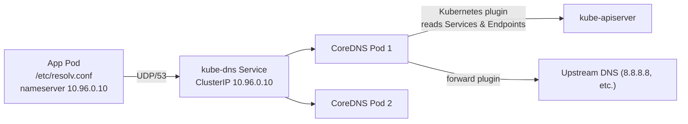
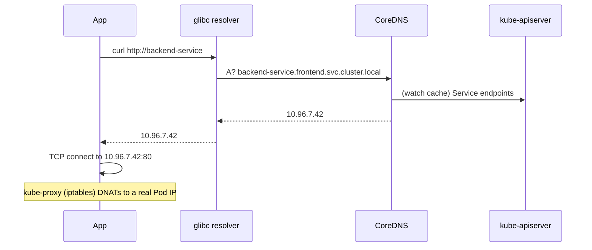

# Day 42-4: Cluster DNS — How `http://backend-service` Actually Resolves

> **Goal**: Trace a DNS query from a Pod to CoreDNS to the Service's virtual IP.
> **Prereqs**: [Day 42-1 — Namespaces](day42-1_linux-namespaces.md).

## 1. Scenario & Why It Matters

Every Kubernetes book says "Pods talk to Services by name" and moves on. But the day you have a Pod that can curl `http://backend-service:80` from one namespace but not another, or a Headless Service that returns multiple A records, you need to know exactly where the resolution happens and which file configures it.

## 2. Concept Deep-Dive

Cluster DNS is **just a regular Kubernetes Deployment**. It runs **CoreDNS** as a Pod (usually 2 replicas) in the `kube-system` namespace. A ClusterIP Service called `kube-dns` (virtual IP `10.96.0.10` by convention) fronts them. Every user Pod is configured so its `/etc/resolv.conf` points at that IP.



### `/etc/resolv.conf` inside every Pod

```
nameserver 10.96.0.10
search <pod-ns>.svc.cluster.local svc.cluster.local cluster.local
options ndots:5
```

The `search` list is what lets you write `backend-service` instead of the full FQDN. With `ndots:5`, any name with fewer than 5 dots is tried against every search suffix first. So `backend-service` becomes:

1. `backend-service.<pod-ns>.svc.cluster.local` — match!
2. `backend-service.svc.cluster.local`
3. `backend-service.cluster.local`
4. `backend-service` (plain)

### DNS names Kubernetes guarantees

| Kind | DNS name |
|------|----------|
| Normal Service | `<svc>.<ns>.svc.cluster.local` → single A record = ClusterIP |
| Headless Service | `<svc>.<ns>.svc.cluster.local` → N A records, one per ready Pod |
| Pod behind a StatefulSet | `<pod-name>.<svc>.<ns>.svc.cluster.local` → A record = Pod IP |
| ExternalName | CNAME to the external hostname |

### What happens for a cross-namespace call

If a Pod in namespace `frontend` calls `backend-service.api`, resolution order:

1. `backend-service.api.frontend.svc.cluster.local` — fails.
2. `backend-service.api.svc.cluster.local` — ClusterIP of the Service in namespace `api`. 

That's why `<service>.<namespace>` works everywhere.

### The life of a query (end to end)



Note the handoff at the end: DNS gets you the **virtual** ClusterIP. `kube-proxy` (next topic) rewrites it to an actual Pod IP.

## 3. Hands-On Mission

Inside any Pod:

```bash
kubectl run dns-debug --rm -it --image=busybox:1.36 --restart=Never -- sh
/ # cat /etc/resolv.conf
/ # nslookup kubernetes.default
/ # nslookup kube-dns.kube-system.svc.cluster.local
```

Examine CoreDNS configuration from your laptop:

```bash
kubectl -n kube-system get configmap coredns -o yaml
kubectl -n kube-system get pods -l k8s-app=kube-dns
kubectl -n kube-system logs -l k8s-app=kube-dns | tail
```

The ConfigMap holds the `Corefile`, roughly:

```
.:53 {
    errors
    health
    kubernetes cluster.local in-addr.arpa ip6.arpa {
        pods insecure
        fallthrough in-addr.arpa ip6.arpa
    }
    forward . /etc/resolv.conf
    cache 30
    loop
    reload
    loadbalance
}
```

`kubernetes` plugin → talk to the API server to answer `*.cluster.local`. `forward .` → send everything else upstream.

## 4. Your Task — Answer

**Q:** Inside a Pod running in namespace `frontend`, which hostname is tried **first** when you run `curl http://backend-service`?

**Sample answer**: `backend-service.frontend.svc.cluster.local` — the `search` list in `/etc/resolv.conf` prepends the Pod's own namespace first, because of the order `<pod-ns>.svc.cluster.local` in the `search` directive combined with `ndots:5`.

## 5. Q&A (Concepts Check)

**Q: Why `ndots:5`? It seems aggressive.**
A: It guarantees that service names without dots (like `backend-service`) traverse the full search list before being tried as-is. The cost is that external hostnames with fewer than 5 dots (like `api.github.com` — 2 dots) trigger several failed internal lookups first. This is a known DNS latency source; fix it with `dnsConfig.options: [{ name: "ndots", value: "2" }]` in the Pod spec for latency-sensitive apps.

**Q: What is the difference between `kube-dns` and CoreDNS?**
A: `kube-dns` was the legacy Go + dnsmasq implementation. CoreDNS replaced it as the default since K8s 1.13. The **Service** is still named `kube-dns` for backward compatibility, but the Pods behind it are CoreDNS.

**Q: A Headless Service has no ClusterIP. What does CoreDNS return?**
A: Instead of a single A record, CoreDNS returns **one A record per ready endpoint** (Pod IP). For a StatefulSet it also returns per-Pod A records under `<pod-name>.<svc>.<ns>.svc.cluster.local`. This is how databases discover individual peers.

**Q: I see intermittent DNS failures. Where should I look?**
A: First, CoreDNS Pod health (`kubectl -n kube-system top pods`). Second, UDP packet loss — CoreDNS uses UDP/53 by default, and busy nodes drop packets. Enabling `NodeLocal DNSCache` (a per-node caching daemon) solves most of these because it answers from the local node over TCP upstream.

**Q: How do I give a Pod a custom resolver without changing the whole cluster?**
A: Set `spec.dnsPolicy: None` and provide your own `spec.dnsConfig` with `nameservers`, `searches`, and `options`. Or, more commonly, keep `dnsPolicy: ClusterFirst` and override specific entries via `spec.hostAliases`.

## 6. Further Reading

- CoreDNS docs: coredns.io.
- `Services and Pods DNS` — kubernetes.io/docs/concepts/services-networking/dns-pod-service/.
- Next: [Day 42-5 — CNI and kube-proxy](day42-5_cni-and-kube-proxy.md).
