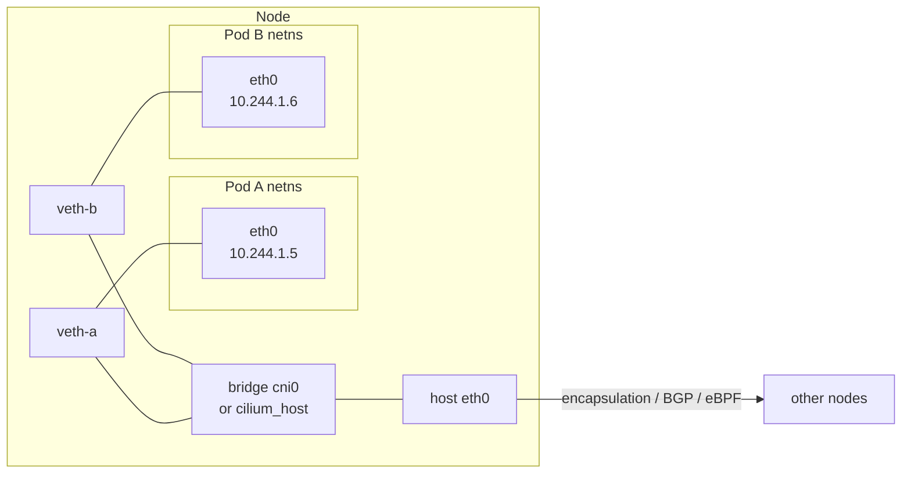
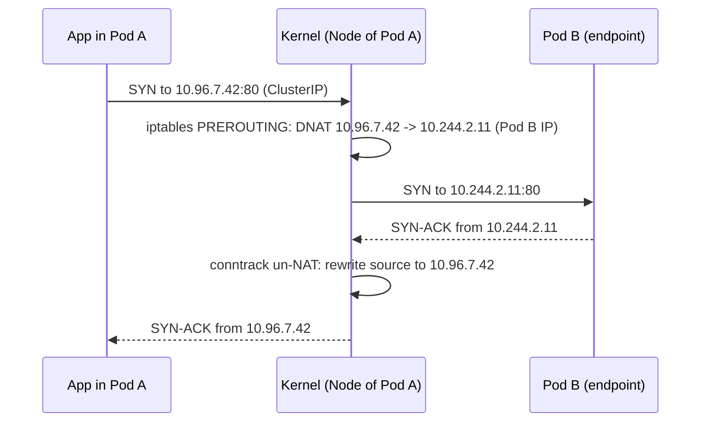

# Day 42-5: CNI and kube-proxy — How Packets Actually Reach Your Pod

> **Goal**: Understand Pod networking at the IP level, not the abstraction level.
> **Prereqs**: [Day 42-1 — Namespaces](day42-1_linux-namespaces.md), [Day 42-4 — Cluster DNS](day42-4_cluster-dns.md).

## 1. Scenario & Why It Matters

You ran `kubectl expose deployment nginx --port 80`. You curl the ClusterIP and it works. But that ClusterIP is not bound to any interface anywhere. No process is listening on it. How is the packet not dropped? The magic happens at two layers: **CNI** (how each Pod got an IP) and **kube-proxy** (how a virtual Service IP gets rewritten to a real Pod IP). Every networking bug you ever hit lives here.

## 2. Concept Deep-Dive

### CNI — Container Network Interface

When kubelet creates a Pod sandbox, it calls a **CNI plugin** (binary on disk, configured in `/etc/cni/net.d/`). The plugin is responsible for:

1. Creating a network namespace for the Pod (already done by the runtime).
2. Creating a **veth pair**: one end goes inside the Pod (`eth0`), the other stays in the host's root namespace (`veth1234...`).
3. Assigning an IP from the node's Pod CIDR.
4. Programming routes so packets leaving `eth0` can reach other Pods and Services.



The specific mechanism depends on the plugin:

| Plugin | How cross-node traffic works |
|--------|-------------------------------|
| **Flannel (VXLAN)** | Wraps Pod packets in UDP + VXLAN headers, tunnels between nodes |
| **Calico (BGP)** | Each node announces its Pod CIDR via BGP; packets routed natively (no encap) |
| **Cilium (eBPF)** | eBPF programs in the kernel rewrite packets; can skip iptables entirely |
| **AWS VPC CNI** | Attaches extra ENIs to the node; Pod IPs are real VPC IPs |

### kube-proxy — Service IP → Pod IP translation

A ClusterIP is a **virtual** IP. No device owns it. kube-proxy watches the API server for Services and Endpoints and programs the node's kernel so that traffic to a ClusterIP gets DNAT'd (destination-NATed) to one of the backing Pods.

Three modes, historically:

| Mode | Mechanism | Scaling |
|------|-----------|---------|
| `iptables` (default) | One DNAT rule per endpoint, random selection | Slows down with thousands of Services |
| `ipvs` | In-kernel L4 load balancer with round-robin, least-conn, etc. | Much faster at scale |
| `nftables` (v1.31+) | Successor to iptables, cleaner rules | Becoming default |



Conntrack makes the round trip work: the kernel remembers the translation for the life of the flow so replies get rewritten on the way back.

### Four networks every Pod interacts with

1. **Pod network** (`10.244.0.0/16` typical) — every Pod gets an IP here.
2. **Service network** (`10.96.0.0/12` typical) — virtual ClusterIPs, intercepted by kube-proxy.
3. **Node network** — the real IPs of your nodes (EC2 private IPs, for example).
4. **External** — Internet, on-prem, the outside world.

## 3. Hands-On Mission

See the Pod IP and its veth on the host:

```bash
minikube ssh
ip addr show | grep 10.244             # Pod IPs bound to veths
ip route | grep 10.244                 # routes to other pod CIDRs on the node
```

Dump the kube-proxy rules for a Service:

```bash
sudo iptables -t nat -L KUBE-SERVICES -n | grep backend-service
sudo iptables -t nat -L KUBE-SVC-XXXXX -n      # chain for that service
sudo iptables -t nat -L KUBE-SEP-YYYYY -n      # chain per endpoint
```

Switch kube-proxy mode (in a local cluster):

```bash
kubectl -n kube-system edit configmap kube-proxy
# change mode: "ipvs"
kubectl -n kube-system rollout restart daemonset kube-proxy
```

## 4. Your Task — Answer

**Q:** In the default kube-proxy mode, when a Pod opens a TCP connection to a ClusterIP, which kernel subsystem rewrites the destination IP, and which one remembers the translation for the reply?

**Sample answer**: **`iptables`** (specifically the `nat` table in the `PREROUTING`/`OUTPUT` hooks) performs the DNAT from the ClusterIP to a Pod IP. **`conntrack`** (connection tracking) remembers the translation in its state table so that packets coming back from the Pod get their source IP rewritten back to the ClusterIP.

## 5. Q&A (Concepts Check)

**Q: Why does a Service with 0 endpoints return "connection refused" immediately instead of timing out?**
A: When there are no endpoints, kube-proxy replaces the DNAT rule with a `REJECT` rule that returns ICMP port-unreachable. The client sees that as "connection refused" right away. This is why readiness probes matter — an unready Pod is removed from endpoints, and you get fast failures instead of hung clients.

**Q: What's the difference between `ClusterIP`, the Service IP field, and `spec.clusterIP: None`?**
A: A normal Service gets a ClusterIP allocated from the service CIDR, and kube-proxy programs rules for it. `clusterIP: None` tells the API server "don't allocate" — there is no virtual IP, no kube-proxy rules. Clients must resolve the DNS name to get individual Pod IPs (this is a **Headless Service**).

**Q: Why do I need a CNI plugin at all — can't the container runtime just do networking?**
A: The runtime can create the netns, but it has no opinion on IP allocation, routing between nodes, network policies, or encryption. CNI is a plug-in interface so you can choose a plugin suited to your environment (AWS, bare metal, on-prem with BGP, etc.).

**Q: My cross-node Pod-to-Pod traffic is slow. What's a likely culprit?**
A: Encapsulation overhead. Flannel VXLAN wraps every packet in ~50 bytes of headers and can halve throughput on small packets. Calico with BGP, Cilium with eBPF/direct routing, or AWS VPC CNI (native VPC IPs) usually solve this.

**Q: What does `NetworkPolicy` actually do at the kernel level?**
A: Kubernetes itself doesn't enforce policies — the **CNI plugin** does. Calico/Cilium translate NetworkPolicy YAML into iptables or eBPF rules on each node. If your CNI doesn't implement NetworkPolicy (vanilla Flannel, for example), policies are silently ignored.

## 6. Further Reading

- CNI spec: `containernetworking/cni` on GitHub.
- "Kubernetes Services by example" — Learnk8s.
- Cilium eBPF datapath docs: docs.cilium.io.
- Next: [Day 42-6 — Cluster Architecture Overview](day42-6_architecture-overview.md).
